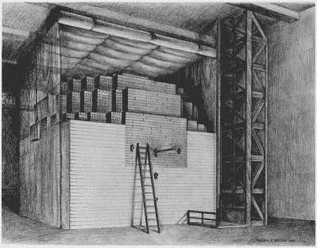
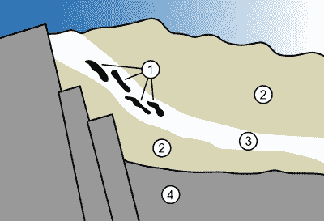

# 最古老的核反应堆？大自然 20 亿年前的实验

> 原文：<https://hackaday.com/2020/01/07/the-oldest-nuclear-reactor-natures-2-billion-year-old-experiment/>

第一个核反应堆是什么时候建成的？你可能会认为这是 1942 年恩利克·费密在芝加哥大学看台下建造的 CP-1 堆。然而，你将会偏离——哦——大约 20 亿年。

大约 20 亿年前，第一个核反应堆在现在的西非加蓬自然形成。这需要几个因素的共同作用:天然铀矿，该地区合适的地质条件，以及铀的生命周期。这种情况发生了 17 次，这些天然反应堆的平均输出功率估计约为 100 千瓦——与现代人造反应堆的数百或数千兆瓦相差甚远。

反应堆在耗尽燃料之前已经运行了大约一百万年。核废料？是的，但是它被安全地保存在地下，已经有 20 亿年了。

## 裂变反应堆的基础

任何裂变反应堆的工作原理都是一样的。像铀或钚这样的不稳定原子分裂，产生快速中子。这些中子有可能会撞击附近不稳定的原子，导致它们分裂。然而，因为这些中子速度很快，统计上这不会经常发生。然而，如果像水或石墨这样的减速物质使中子减速，它们就有更多的时间与其他不稳定的原子相互作用，所以更多的原子会分解。

如果你正确地平衡它，原子分裂将会引起连锁反应来维持它自己。也就是中子撞击原子，释放出更多的中子，中子撞击更多的原子。释放的热量是巨大的，我们通常用它来制造蒸汽来驱动发电机。

## 核燃料曾经要好得多

 最初的 CP-1 反应堆使用的是天然铀，因此需要大量燃料，因为普通铀相对稳定。如果铀被提炼成更高浓度的特定同位素，用更少的燃料就可能发生更强烈的反应。

铀有三种同位素:铀 238、铀 235 和铀 234。铀会自然衰变，高活性同位素现在供应不足。显然，无论是什么过程创造了地球上的铀，它都是在同一时间出现的(并且一直在衰变)，因为无论你在哪里开采铀，它的铀-238 含量都是 99.275%。

铀-235 更适合用于反应堆，但目前仅占地下产出量的 0.72%。我们对铀进行人工浓缩，得到大约 3%的铀 235 作为燃料。科学家认为，当地球形成时，U-235 是地壳铀的 30%。当然，这个数字一直在下降，20 亿年前，这个比例大约是 3.6%——刚好适合核燃料。

## 当开采出来的铀变得“轻”时

1972 年，一个在加蓬开采铀矿的法国团队注意到了一些奇怪的现象。这种矿石没有预期的 0.72%的铀 235，而是 0.717%。这听起来有点小——确实如此——但是铀 235 的含量在世界各地都非常一致(在月球上也是如此)。进一步的调查证实，失踪的 U-235 是在一个天然核反应堆中裂变出来的。特别是，你所期望的五种裂变产物都被找到了。滞留在反应堆中的氙气量使得计算反应堆的运行周期成为可能。

最终，他们会找到 17 个这样的天然反应堆。你可能想知道为什么没有更古老的自然反应堆。毕竟，如果 3.6%是个好燃料，5%或 10%不是更好吗？

条件必须恰到好处。20 多亿年前，地球大气层中没有多少氧气，这使得铀难以浓缩。因此，要得到一个天然反应堆，你需要一个铀 235 含量高的浓度。还需要有合适的材料几何形状，像水一样的缓和剂，并且在该区域没有中子吸收材料。

[Gabon Geology Oklo](https://commons.wikimedia.org/wiki/File:Gabon_Geology_Oklo.svg) by MesserWoland CC-BY-SA 2.5

你可以在图中看到铀矿石(3)被多孔砂岩(2)包围，它们都在花岗岩层(4)上。黑色区域(1)代表一些自然裂变区域。

足够的水分会渗透到砂岩中，并引起反应，在半小时内将水分蒸发掉。然后反应将停止，直到足够的水再次渗入，产生 3 小时的总循环时间。这使得反应堆非常稳定，似乎已经让反应堆运行了大约一百万年。

可能会有更多的反应堆尚未被发现，或者已经运行，但在这 20 亿年间没有存活下来，让我们去发现。加蓬的条件也正好适合保存反应堆。

## 现代

如果你担心这会发生在今天，不要烦恼。今天的铀-235 含量不足以让这种情况再次自然发生。然而，科学家们已经研究了废物是如何被控制的，因为这可能会导致我们更好地储存我们正在产生的核废料。

作为一个有趣的旁注，有一个有争议的理论:大约 45 亿年前，月球被地球地幔边缘的另一个自然反应堆吹出了地球。虽然这还没有被证明是错误的，但据我们所知，大多数科学家似乎都认为月球的形成是由于[对早期地球](https://en.wikipedia.org/wiki/Giant-impact_hypothesis?)的撞击。