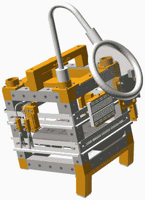

# 开放创客魔方:有黑客，会旅行

> 原文：<https://hackaday.com/2019/12/03/the-open-makers-cube-have-hack-will-travel/>

别否认了，我们知道你的工作台一团糟。一堆杂乱的电线、工具和未完成的项目是任何硬件黑客的标准装饰。事实上，如果你的工作区域一尘不染，我们甚至会对你在这个领域的资历产生怀疑。但这并不是说我们对某种控制电子垃圾的方式不感兴趣，也许是类似于由[technoez] 创建的 [Open Makers Cube。](https://github.com/technoez/open-makers-cube)

 这个一体化硬件黑客站使用 DIN 导轨和 3D 打印安装硬件，允许用户将各种工具、小工具和电路板连接到易于接触的外表面。OpenSCAD 设计包括常见的可疑安装，如 Raspberry Pi、Arduino Uno 和通用试验板。当然，您自己的定制挂载只需要几行代码。

该立方体还包括一个柔性臂上的发光放大镜，这样你就可以放大你正在做的事情，一个简单的“助手”附件，以及内部 USB 电源的供应。它甚至具有倾斜的脚，因此立方体的正面可以以更舒适的角度观看。所有这些都由一个由方形铝管制成的轻型便携式框架连接在一起。

如果您对将您所有的工具和项目安装到一个活泼的小立方体上的想法有所怀疑，我们可以理解。但是，即使移动工作空间的概念还没有定论，有一件事是肯定的:开放创客立方无疑是我们近年来看到的最好的记录项目之一。得益于 NopSCADlib，[technoez]能够为项目的每个子组件生成分解视图和物料清单。如果你曾经需要[证明 NopSCADlib 值得一试](https://hackaday.com/2019/06/15/try-nopscadlib-for-your-next-openscad-project/)，这就是了。