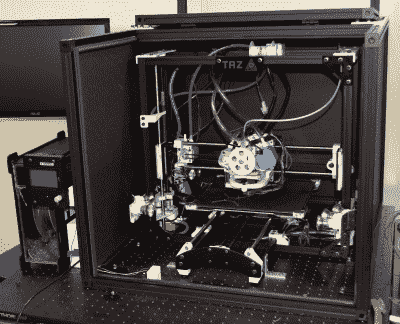

# LulzBot 的过去、现在和不确定的未来

> 原文：<https://hackaday.com/2019/11/12/the-past-present-and-uncertain-future-of-lulzbot/>

考虑到它只存在了大约十年，商用桌面 3D 打印市场已经出现了异常高的营业额。但是，谁会拒绝投资一个可能改变世界的行业呢？毫无疑问，MakerBot 纸杯蛋糕是第一台“大众市场”桌面 3D 打印机，在 Kickstarter 上线的同一个月发布。我们早就数不清在这之间的几年里出现的失败的 3D 打印机公司了。这是一个只剩下少数老兵的行业。

LulzBot 是少数几个从那些令人兴奋的早期就和我们在一起的公司之一，它是由母公司 Aleph Objects 于 2011 年创立的。它们的完全开源的主力以其健壮的设计和可靠性而闻名，尽管它们的高价格在很大程度上使它们远离了个人黑客的工作台。LulzBot 从未对催生当前这一代低于 200 美元打印机的底层竞争感兴趣。他们的硬件一直被定位为 Ultimaker 和 MakerBot 等产品的竞争对手，在这些产品中，质量和支持高于一切。

NASA’s modified LulzBot

虽然 LulzBot 打印机从未对入门级市场产生影响，但仍有机构愿意不计成本购买高度可靠的美国制造的 3D 打印机。[美国海军陆战队使用 LulzBot 打印机](https://www.lulzbot.com/learn/case-studies/us-marines-are-using-lulzbot-3d-printers-improvise-adapt-and-overcome)在战场上生产替换的悍马门把手，为了满足他们的严格要求，一些必要的修改最终导致了打印机消费版的更新。美国国家航空航天局使用高度改良的 LulzBot TAZ 4 在高达 500 摄氏度的温度下打印 PEI，生产的零件比以前在桌面 3D 打印机上制造的任何东西都要坚固。

然而，尽管有如此幸运的顾客，LulzBot 还是陷入了困难时期。消费者已经非常明确地表示，他们不愿意为一台台式打印机支付超过 1，000 美元的价格，超过这个价格点的竞争尤其激烈。上个月，我们开始在举报热线中听到传言说，LulzBot 的绝大多数员工都将被解雇，我们很快从当地媒体那里得到了证实和确切的数字。在该公司的 113 名员工中，只有 22 人会留在公司维持日常运营。他们的旗舰车型将继续生产，尽管速度有所放缓，所有现有的保修都将得到遵守。但员工的减少和有限的现金流意味着未来产品的开发，如 LulzBot 生物组织打印机，将被搁置。

LulzBot 并没有完全死去，但是很难把这看作是走向破产的一步。我们采访的一些内部人士表示，他们听说了收购的预期，今天我们可以报告说，Aleph Objects 出售给 Fargo Additive Manufacturing Equipment 3D(FAME 3D)是正式的。目前 LulzBot 模型的生产预计将继续，91 名被解雇的员工中的一些可能会被重新雇用，但继续 Aleph Objects 首席执行官格兰特·弗拉哈迪表示，细节仍在最后确定。

由风险资本家提供的这种新的资金支持当然是个好消息。但如果认为这是 LulzBot 麻烦的终结，那就太天真了。市场已经说话了，除非该公司愿意推出价格低廉得多的打印机来吸引入门级客户，就像 Prusa Research 最近所做的那样，目前还不清楚注入现金除了推迟不可避免的事情之外还能做什么。

值得一提的是，我们希望 LulzBot 能找到某种方式发展壮大。构建完全开源打印机的理想是 Hackaday 的核心，但在失去 PrintrBot 之后，我们都敏锐地意识到美国小公司在现代 3D 打印市场上竞争是多么困难。