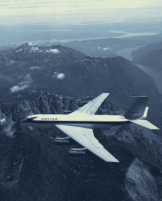
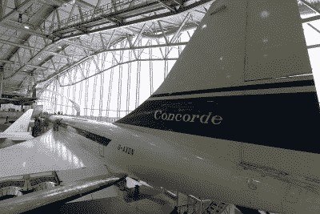

# 超音速飞行的政治:协和(e)

> 原文：<https://hackaday.com/2021/01/25/the-politics-of-supersonic-flight-the-concorde/>

每个国家都有民族自豪感的象征:一个体育明星，一项太空任务，或者一件建筑。通常它们浓缩了一个国家的精神，因此公民们可以从沉闷的生活中抬起头来，说“现在这是我可以引以为豪的事情了！“协和式超音速客机因其跨越大西洋而受到 20 世纪后期精英们的喜爱，是真正的英国工程图标。

但作为民族自豪感的象征，这个图标是独一无二的，因为我们与法国人共享它。每一架英国航空公司的协和式飞机从伦敦飞往大西洋，就有另一架从巴黎飞来，每一架英国设计或制造的协和式飞机部件，就有另一架来自法国。这一意想不到的国际合作给了我们世界上最成功的超音速客机，考虑到围绕其酝酿的政治操纵，它能飞上天是一个小小的奇迹。

## 超音速旅行的光明前景

Boeing’s Dash 80 prototype sets the template for today’s jet airliners. Boeing Dreamscape, [Public domain](https://commons.wikimedia.org/wiki/File:Air_to_air_photo_of_the_Dash_80_FA239925.jpg)

20 世纪 50 年代，第一代四引擎喷气式客机奠定了战后航空的发展方向。德哈维兰彗星、图波列夫 TU-104、Sud Aviation Caravelle 和波音 Dash-80 原型机等飞机是当今客机的可见祖先，但正如喷气式战斗机的未来取决于超音速设计一样，人们也预见到了民用航空的未来。

到 20 世纪 80 年代，我们将以两倍于音速的速度在世界各地飞驰，自然，当时的飞机制造商也想在这个市场分一杯羹。世界各国政府和主要制造商让他们的设计师研究将超音速军用飞机的设计元素转化为民用客机的可行性。到 20 世纪 50 年代末，法国 Sud 航空公司和英国 BAC 公司已经发展到 1960 年调查合资企业的程度，并惊讶地发现彼此的设计已经达到基本相似的形状和配置。

双方商定了一个共同的设计，各自的政府考虑签署一项正式的条约。此时，英国政府正被法国阻止加入欧洲共同体，并寻求任何有利于他们最终加入的东西。因此，他们推动了一项协议，并在 1962 年的条约中加入了违反协议的惩罚条款。这种飞机将由两国合作建造，由两国政府出资开发，期望在装备 20 世纪 70 年代的航空公司方面领先于美国。

## 额外“E”的战斗

出现的飞机有熟悉的薄机身和长弧形三角翼，机翼下安装了四台劳斯莱斯奥林巴斯 593 涡轮喷气发动机，这些发动机来自 Avro Vulcan 轰炸机上使用的发动机。为了在超音速时使用，这些发动机有特殊的进气道，用来将空气速度降低到亚音速。尽管它们安装了加力燃烧室用于爬升到巡航高度，但这些进气口赋予了协和式飞机“超巡航”的能力，即在没有加力燃烧室的情况下以 2 马赫的超音速巡航。

One of the prototype Concorde aircraft complete with “e” is in the Imperial War Museum, Duxford. Ronnie Macdonald from Chelmsford, United Kingdom, [CC BY 2.0](https://commons.wikimedia.org/wiki/File:Concorde_G-AXDN_(36253045144).jpg)

这是不可避免的，这样一个项目，在什么是可能的边缘，将招致重大超支。协和飞机也不例外。最初估计的 7000 万飙升至 10 亿甚至更多。这个项目幸存下来，完全是因为那个惩罚性条款导致的退出成本。

这两个国家的政治领导人之间有时不稳定的关系反映在它的名字上，法语拼写为“协和”，英语拼写为“协和”。带“e”的版本最终被采用。

两架原型机于 1969 年进行了首次飞行，图卢兹的法国协和式飞机是第一架。这两架飞机飞入了与 20 世纪 50 年代设想的不同的环境。对噪音和污染的担忧，以及 20 世纪 70 年代初的石油危机，导致航空公司对超音速豪华旅行的兴趣逐渐消失，到第一架量产飞机开始生产时，只有两家国家航空公司仍然存在。这两个国家的政府花费了令人眼红的资金只生产了几架飞机，并选择将损失转嫁给航空公司。它们被作为民族自豪感的来源卖给公众，直到今天，它们仍被视为国家财富的一个巨大无底洞。

## 不可思议的事情发生了

The memorial to those killed in the Concorde crash, Gonesse, France. Marbus1966, [CC BY-SA 4.0](https://commons.wikimedia.org/wiki/File:Gedenktafel_an_der_Absturzstelle_bei_Gonesse_im_August_2018.jpg)

协和式飞机用于特殊包机意味着它会经常在正常的预定路线之外飞越英国的部分地区，即使它已经有几十年的历史了，它也会让人们停下来看它飞过。“国家标志”是一个有时使用不当的短语，但对英国人来说，大概也对法国人来说，它绝对适用于那几十年间的协和式飞机。它似乎是一种永无止境的服务。

但是在 2000 年 7 月，这架飞机遭遇了第一次也是唯一一次致命的坠机事故。一架法国航空公司的包机在巴黎戴高乐机场撞上了一块跑道碎片，导致油箱故障和火灾，导致飞机坠毁，仅飞行了两分钟，机上所有人员全部遇难。

在调查进行期间，机队停飞，所有飞机都改装了油箱，但它们重返空中的时间很短。2003 年，两家航空公司都让整个机队退役，引发了短暂的争议。民用超音速飞机飞行并没有像曾经预测的那样成为大众的旅行，虽然仍然是民族自豪感的来源，但飞机已经成为一种时代错误。与此同时，我们不得不排队等候我们的双引擎亚音速宽体飞机飞行，并希望有一天反作用发动机能够重新点燃这个梦想。

头图:foundin_a_attic， [CC BY 2.0](https://commons.wikimedia.org/wiki/File:Concorde_(33204258501).jpg) ，和 [Arpingstone](https://commons.wikimedia.org/wiki/File:Concorde_on_Bristol.jpg) ，公共域。