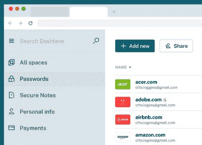
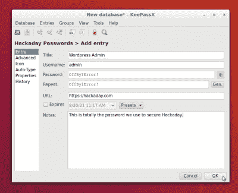
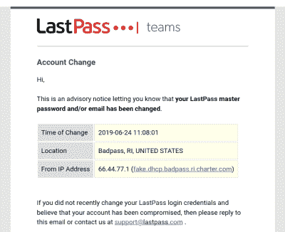

# 死后密码问题

> 原文：<https://hackaday.com/2021/09/01/the-postmortem-password-problem/>

死亡和密码:我们无法回避的两件事。如今，我们的生活与云服务紧密相连，我们有理由担心，如果我们明天死去，这些账户会发生什么。对于我们许多人来说，重要的文档、照片、财务信息和其他数据都会被锁定在登录提示后面。您的支付方式也将在您使用后不久到期，如果不及时处理，可能会导致数据丢失。解决这一问题最明显的方法是在紧急情况下允许可信方访问。

## 糟糕的解决方案

让我们从最简单的解决方案开始:在任何地方使用相同的密码。太好了，你所要做的就是把这个放在便利贴上，塞进信封，让别人知道在哪里可以找到它。不幸的是，对许多服务使用单一密码是一个糟糕的主意。密码泄露时有发生，如果你在互联网上使用单一密码，后果可能是灾难性的。

密码泄露通常是由于攻击者发现了允许从应用程序数据库读取密码数据的漏洞。您的信息很有可能在其中一个漏洞中被泄露。你可以通过[我被 pwn 了吗](https://haveibeenpwned.com/)来检查你的电子邮件是否在已知违规列表中。如果你被 pwned，不要难过，我的电子邮件显示了六个不同的漏洞，这项服务只索引公开已知的漏洞！

根据被入侵公司的能力，您的密码可能以几种不同的形式被盗。在最糟糕的情况下，密码按原样存储(即明文)，违规包含您的实际密码。如今，以明文形式存储密码是不被接受的。而是存储密码的散列。攻击者需要使用类似于 [hashcat](https://hashcat.net/hashcat/) 的工具，试图通过强力哈希破解来恢复密码。这对于复杂的密码来说很慢，但随着 GPU 的改进，速度会越来越快。

所以我们真的需要在任何地方使用不同的密码，否则我们从 2013 年开始的 Tumblr 帐户可能会访问我们的银行帐户。鉴于我们使用的大量服务和我们无法记住密码，我们将需要使用密码管理器。

## 你想要一个密码管理器

密码管理器是让你安全地存储大量密码的任何工具。这将让你随机生成一个长的，安全的密码，你永远不会想记住。这允许为每个服务使用唯一的密码，并且密码足够复杂，难以破解。

我们还需要考虑紧急使用这些工具。如何授权某人访问您的密码管理器，我们如何保护这个过程？目标是为你所有的账户创建一个后门，然后确保它得到合理的保护。

有很多密码管理器，这里不打算对它们进行比较。事实上，安全专家对什么工具是最好的意见不一。概括地说，这些工具分为两类:托管的和自我管理的。

### 托管密码管理器

The interface Dashlane uses for storing and accessing your passwords

这些是软件即服务(SaaS)工具，处理存储您的密码，并提供跨设备的访问。大多数都有桌面、移动和 web 扩展客户端。Firefox 和 Chrome 都内置了密码管理器，也属于这一阵营。其他受欢迎的产品包括 LastPass、1Password 和 Dashlane。

这些工具往往是最容易使用的，因为所有的数据都是为您管理的。缺点包括订阅费和需要将你的密码数据委托给第三方。虽然大多数管理服务被设计为只有您可以解密密码数据库，但是您仍然需要信任它们提供的软件。通常，这些服务的浏览器扩展被认为不太安全。关于这方面的更多信息，请参见塔维斯·奥曼迪关于密码管理器的文章。

当涉及到紧急访问时，这些工具中的许多都提供了帮助功能。LassPass 和 Dashlane 都允许“紧急联系人”请求访问您的帐户。如果您在一段时间内没有拒绝访问，访问将被授予。1Password 使用低技术解决方案，提供可打印的应急工具包文档，其中包含访问您的帐户所需的一切。

### 自我管理的密码管理器

KeepassX interface

另一个密码管理选项是使用本地软件管理您自己的数据。 [KeePass](https://keepass.info/) (和 [KeePassXC](https://keepassxc.org/) )和 [pass](https://www.passwordstore.org/) 是两个流行的开源选项。有了这些工具，你就可以保证你的密码数据库的安全，并在设备间同步。紧急通道也是由你决定的。

如果你要使用这些工具，可能有必要考虑一下在紧急情况下谁能得到帮助。他们是否能够确定需要什么软件，安装它，访问数据库文件，并解密它？虽然 pass 工具通过 gpg 提供了一些有趣的选项，比如使用硬件令牌进行解密，但是这种额外的复杂性可能会使紧急访问更加困难。

如果使用自我管理的解决方案，您将需要构建自己版本的应急包以供访问。这应包括查看密码数据所需的一切，以及访问加密密码数据库的说明。

## 信任和存储

不言而喻，你需要相信你提供紧急访问的任何人。一些托管服务提供了一些功能来最小化这种信任，方法是在授予访问权限之前要求超时。对于允许紧急联系人的服务，这意味着信任您指定的联系人。对于需要存储应急包的解决方案，这意味着要确保只有受信任的人才能够实际接触到。

Hosted services like LastPass include notification emails for logins and when settings are changed.

另一个担心是知道紧急通道已经被使用。如果攻击者在您不知情的情况下获得了对您的密码管理器的访问权限，他们可能会无限期地保持访问权限。托管服务将提供来自未知设备的新登录通知。对于自我管理的服务，这取决于您。防篡改信封和盒子是一种选择，但这些从来都不是完美的。

## 别忘了 2FA

您的帐户启用了双因素身份验证(2FA ),对吗？如果没有，去把它打开，我们在这里等。如果是，您是否曾失去过访问您的身份验证代码的权限？

一些服务将允许通过电子邮件重置 2FA。从安全角度来看，这并不好，但意味着丢失 2FA 代码只是一个小小的不便。其他服务使这一过程变得更加困难。例如，谷歌失去对 2FA 的所有访问需要经历一个可能需要几天的手动支持过程。值得思考的是，有人会如何获得你的 2FA 备份代码，至少对关键客户来说是这样。

## 没有完美的解决方案

提供紧急访问总是会让你的密码管理不那么安全，这没关系。在这种情况下，我们因为一个特定的重要原因而牺牲了安全性。这里没有完美的解决方案，但是目标是平衡安全性和可用性。不幸的是，在设计安全系统时，这种微妙的平衡是不可避免的。