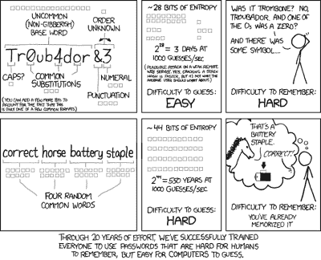
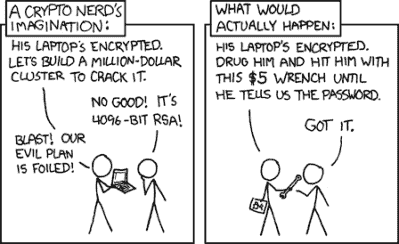

# 密码的问题

> 原文：<https://hackaday.com/2023/01/03/the-problem-with-passwords/>

到现在为止，很可能大多数读者都已经听说过 LastPass 的“[安全事件](https://blog.lastpass.com/2022/12/notice-of-recent-security-incident/)”，在该事件中，用户的密码库从他们的服务器中被窃取。我们被告知，金库是加密的，因此对于没有未来计算能力和大量时间的人来说，它们几乎没有用处，但损害仍然存在，我很高兴我不是他们服务的订户。但也许这场灾难对我们所有人来说都是一个很好的目的，因为它提供了一个非常需要的机会来看看我们制作密码的方式。

## 汽车轮渡和密码有什么共同点？

If I close my eyes, I can almost imagine I’m on a cruise! Stena Line, [CC BY 3.0](https://commons.wikimedia.org/wiki/File:MS_Stena_Britannica_2012-10-10_001.jpg)

我最喜欢的离开英国的方式之一是从 Harwich 到 Hoek van Holland 的渡轮。虽然它的两条腿之间有一个奇怪的区别，英国端有金属探测器和 x 射线的机场式安全，而在 Hoek，我只需通过护照控制站走到渡轮上。

这是一个特别令人震惊的安全剧场的演示，过度使用大量不必要的安全措施来表现出正在做的事情。在汽车轮渡的情况下，当所有的驾车者都畅通无阻地驶上轮渡时，对步行乘客采取旨在保护飞机的措施尤其没有意义。渡轮似乎与密码安全没什么关系，但是它引入的安全剧场的概念在密码领域绝对有关系。你有多经常遇到这样一个网站，它对你的选择强加神秘的规则，要求一个特定的长度，它必须包含数字，甚至更糟的是，特殊字符？这有很大帮助吗？我不相信，我想花一点时间通过这个问题来找出答案。

## 虚弱无力的人脑不是电脑的对手！

理想的密码是一个随机生成的长字符串，用来迷惑暴力破解软件。这些技术依赖于按顺序尝试每一种可能的字符组合，而熵最大的最长字符串是最费时的字符串。如果你把 95 个可打印的 ASCII 字符作为字母表，攻击者必须尝试 95 的字符串长度的幂次不同的字符串来捕捉一切，这可能需要一段时间。对于一个 10 个字符的密码来说，这个数字是 5.987369392 × 10 ⁹，你确实用了那么长的密码，不是吗？

不幸的是，很少有人使用随机字符串作为他们的密码。它们一点也不容易记住，因此如果你的密码是这样的，你可能在使用某种密码管理器。不幸的是，真实的人类倾向于以可预测的方式而不是随机的方式行事，所以他们会使用他们知道并记住的单词和短语。当被要求添加字母、数字和特殊字符时，他们仍然不能像处理字符串那样随意添加。一个简单的字符串如 **jennylist** 变成了 **JennyList** 加上大写字母，然后是 **JennyList！**带特殊字符，最后 **JennyList！1234** 当它被填充以适合时。试图破解它的开发人员可以尝试用常见的字母替换和数字序列来简化名字、狗的名字、足球队和出生年份，使这些容易记忆的密码看起来安全，但熵大大减少。但这都没问题，因为它们通过了由特殊字符、数字和大写字母组成的测试。

## 不正确的马电池装订

The famous “correct horse battery staple” from XKCD. ([CC BY-NC 2.5](https://xkcd.com/936/))

我们已经确定了密码安全剧场是一个东西，那么还有什么选择呢？XKCD 用“[正确的马电池钉](https://xkcd.com/936/)尝试了一下，其中他们提出了挑选四个令人难忘的单词来制作一个更长的密码的想法，因为它的大小具有更大的熵。这是一个很好的记忆密码的方法，但是值得仔细研究。攻击者只需猜测四件事就能破解它，但这仍然没问题。假设密码的拥有者是一个以英语为母语的人，从信封的背面估计大约 250，000 个英语单词，包括过时的单词，那么我们计算出有 3.90625 × 10 个可能性，这比我们随机的 10 个字符的 ASCII 字符串要好。

问题是，一个以英语为母语的普通人的词汇量远远小于 25 万这个数字。[你可以在这里查一下你的](https://my.vocabularysize.com/)，不过平均在 2 万左右。当我为一家著名的字典出版商工作时，我们做了测试，发现我们大多数人都在 30，000 左右，其中一位专业的字典编纂同事的工作是发现新词，达到惊人的 65，000 个。但是，如果大多数用户有 20000 个英语单词来选择他们的密码，尝试的次数就会下降到更容易管理的 1.6 × 10 ⁷.鉴于他们更有可能选择语言中出现频率较高的单词，这一数字甚至会进一步下降，因为他们倾向于组成一个句子，而不是随机序列，攻击者可以进一步缩小他们的选择范围。你现在还满意你的精确马电源紧固件吗？

## 你需要走多远？

因此，我们越是关注密码安全，就越能清楚地看到，整个体系是建立在沙上的。但这应该是我们唯一的防御手段吗？当然不会，而且我们确信大多数读者已经在使用双因素身份验证，在这种情况下，您拥有的东西和您知道的东西都会成为一个因素。对许多人来说，这是一部手机，而不是安全钥匙，但即使这样，也有歹徒劫持你的号码的可能性。哪里都不安全吗？也许是时候收回妄想症了。

XKCD for the second time, on the nail. ([CC BY-NC 2.5](https://xkcd.com/538/))

可能有几个级别的服务需要密码。那些无关紧要的，那些裂开后会变成温和的皮塔饼的，那些会变成大皮塔饼的，还有那些会结束游戏的。反过来，有几类攻击者，您可以根据资源级别和投入工作的意愿对其进行分类。

如果一个政府机构想要你的密码，他们已经通过你生活中的一切找到了它，或者更有可能他们会把你抓进监狱，用扳手打你，直到你告诉他们。同样，你当地的流氓，除了他们不会麻烦拖你进监狱之前，打破扳手。一个遥远国家的骗子会让你通过一个网络钓鱼骗局或一个恶意软件给他们，如果你不小心上当的话。这就留下了大众媒体钟爱的戴着连帽衫的神秘“黑客”，他们将使用上述技术对泄露的数据库中的密码进行哈希运算。

很明显，密码安全是我们所有人都需要考虑的事情，使用定期更改的唯一密码和熵密码进行双因素身份验证可能是在不陷入偏执的情况下取得的最佳效果。但仍然存在记住数百个不同网站的密码的问题，除非你每次需要使用一个不太重要的密码时，简单地用另一个任意字符串重置忘记的密码。LastPass 事件是否终结了对这类服务的使用，或者这只是更多的偏执？也许是时候恢复到最安全的方法了，把它们写在你键盘下的便利贴上。