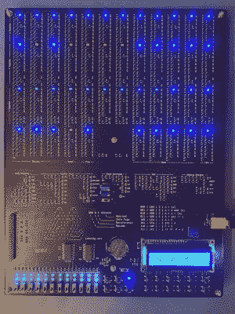
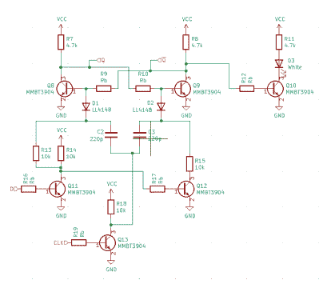

# Q2，一种类似 PDP8 的分立晶体管计算机

> 原文：<https://hackaday.com/2022/02/06/the-q2-a-pdp8-like-discrete-transistor-computer/>

[Joe Wingbermuehle]对古老的计算机很感兴趣，过去也有过用分立晶体管在 perfboard 上构建计算机的经验，所以这个下一个项目， [Q2，是一个在单个 PCB 上的类似 PDP8 的微型计算机的完整实现](https://hackaday.io/project/178788-q2-computer)。像 [DEC PDP-8](https://en.wikipedia.org/wiki/PDP-8) 一样，这是一台 12 位机器，但不是 DEC 的二极管晶体管逻辑，小得多的 Q2 使用简单的 NMOS 方法。此外，DEC 有核心存储器，但 Q2 求助于一对 SRAM ICs，只是因为谁想用分立的 2N7002 晶体管制作重复的存储器结构呢？

SMT components for easy machine placement

像 PDP-8 一样，该机器使用位串行 ALU，这使得电路比更常见的 ALU 结构小得多，代价是每个操作的每个位需要一个时钟周期，即单个 ALU 操作需要 12 个时钟周期。对于这台机器来说，指令周期时间无论如何都是 8 或 32 个时钟，在 80 kHz 的最大速度下，它并不算快(比 PDP-8 慢得多)，但它非常小。小，完美的形式。

该机器由 1094 个晶体管构成，逻辑为 NMOS 配置，使用 10 K 上拉电阻。这不是构建电路的快速方法，但非常紧凑。通过观察逻辑扇出，[Joe]发现了扇出较大的区域，并将上拉电阻从 10 K 降至 1 K，这样做是为了在不过度使用功耗的情况下将传播延迟保持在周期时间范围内。电源电流保持在 500 mA 以下，允许电路板通过 USB 连接器供电。聪明！

存储器由两个电池供电的 6264 SRAMs 提供，四个 12 位通用寄存器由分立晶体管构建。板上的 LCD 屏幕是一个很好的触摸，增加了用于程序输入和用户输入的“前面板”开关。增加了一个 40 针接口，用于通过 Raspberry Pi 编程，以防前面板编程开关被证明有点乏味且容易出错。

Discrete transistor D-type flip flop with indicator. Latest circuit switched to 2N7002 NMOS.

就项目撰写的而言，有很多东西可以看，有一个 Verilog 模型可用，[一种定制编程语言](http://joewing.net/projects/q2/q2l.html)【乔】调用 Q2L，配有一个编译器和[汇编器](https://github.com/joewing/q2/tree/master/q2asm)(用 Rust 编写！)甚至还有一个[在线 Q2 模拟器](http://joewing.net/projects/q2/sim/)！很多很酷的演示，比如 snake。游戏的生活，甚至乒乓球，添加一些真正可爱的触摸。很棒的东西！

多年来，我们已经推出了许多类似的项目；这里有一个很好的，一个真正的[小 4 位的](https://hackaday.com/2014/11/22/a-4-bit-computer-from-discrete-transistors/)，和一个真正的*大的。*