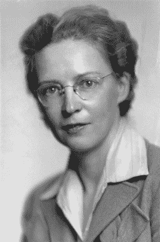

# 飓风女王

> 原文：<https://hackaday.com/2019/05/07/the-queen-of-the-hurricanes/>

工程学不仅仅是发明新事物。有时候，一切都是为了把事情做得更好、更便宜、更快。埃尔西·麦克吉尔(Elsie MacGill)在二战中为“飓风”战斗机所做的就是这一点，为她赢得了“飓风女王”的绰号。

埃尔西·格雷戈里·麦克吉尔/加拿大图书馆和档案馆【公共领域】

伊丽莎白·麦克吉尔 1905 年出生于温哥华，一个显赫的银行家族的成员，她的父亲是一位长期为妇女和儿童争取权利的先驱法官。她在家接受教育，从小就表现出修理东西的天赋。她从 1923 年开始在多伦多大学学习，成为第一个获得工程学位的加拿大女性，尽管她在期末考试前两周感染了小儿麻痹症。毕业后，她在一家工程公司工作，并决定专攻航空工程这一新领域。在工程公司工作期间，她还于 1927 年在密歇根大学获得了航空工程硕士学位，这是北美第一个授予女性的学位。

1938 年，她向英国皇家航空学会提交了一篇名为《飞机简化性能计算》的论文，该论文受到了广泛好评。这篇论文详细介绍了几种巧妙的方法来简化决定飞机性能的复杂计算，这些计算在当时仍然是手工完成的。同年，她加入了加拿大汽车和铸造公司(CanCar ),担任他们在桑德湾的新飞机工厂的首席工程师。在这里，她设计了一种新的双翼训练飞机，名为枫叶二号，用来训练新飞行员:它很难失速，而且在旋转中很容易恢复。这也是第一架装有反尾旋降落伞的飞机，可以用来增加阻力，帮助飞行员恢复。虽然麦克吉尔本人没有飞行员执照，但她参加了她工作过的每一架飞机的首次试飞，这无疑是对她自己能力的信任票。

最大的挑战出现在 1940 年，当时该公司被授予为加拿大和英国空军制造飓风战斗机的合同。CanCar 收到了飞机的设计图，但战争意味着他们没有收到任何工具和生产线设备。这意味着他们必须完全从零开始设计和创建生产线。

这是一个巨大的挑战，报纸宣称，因为汽车正在从生产线上下线，所以飞机应该能够毫不拖延地做同样的事情，这也于事无补。然而，当时飞机的设计并不标准化:每个零件都是定制的，需要专用的生产系统。汽车是由标准的冲压金属零件制成的，而飞机是由定制设计的手工钻孔零件制成的。麦克吉尔[写了一篇关于这个问题的论文](https://www.flightglobal.com/FlightPDFArchive/1940/1940%20-%202646.PDF)，宣称:

为了廉价和快速再生产，大部分零件必须由机器制造。压力机必须取代夹具。体力劳动，熟练的和不熟练的，必须减少到最低限度……生产工程师不能随意地把任何商品放到大规模生产的基础上。飞机不像婴儿车。对大规模生产方法在飞机制造中的适用性的轻易接受，源于对所涉及问题的可悲无知。”

换句话说，制造飞机很复杂，大量制造更复杂，因为一切都是定制的。

除此之外，生产线上的工人几乎没有任何工程或生产经验，大多数人在战争开始时才刚刚进入工厂。当生产全速运转时，超过 4500 人在生产线上工作。

麦克吉尔接受了挑战，在一年内从零开始创建了一条最先进的生产线。两年后，工厂每月生产 100 多辆飓风。与此同时，她还加入了飞机的设计，设计并制造了第一架快速战斗机上的除冰器，并增加了一个滑雪板选项，使其能够在冰雪上着陆:这对寒冷的东部前线至关重要。鉴于该公司不得不从零开始，这是一个相当大的成就，从这条线出来的飞机被用于世界各地的战斗。

她的天才在于理解如何在设计的每个部分都是定制的情况下创建一条生产线，将流程分解为尽可能小的步骤，并尽可能实现自动化。在现代大规模生产线技术出现之前的时代，她的洞察力是惊人的。她明白设计和生产并不是一回事，它们经常会有不同的目的。设计工程师可能需要的技能与生产工程师需要的技能非常不同，但两者对最终产品同样重要。

她对战争的贡献在一本漫画书里永垂不朽，书中称她为“飓风女王”。战后，麦克吉尔成立了她自己的咨询公司，为航空公司提供咨询，告诉他们如何吸取她在战争中挣扎的扩大生产的教训。她还成为妇女权利的倡导者，在 20 世纪 60 年代末加入加拿大皇家妇女地位委员会，并领导许多促进妇女在科学和工业领域工作的团体。她一直倡导女性在这些领域发挥作用，直到 1980 年去世，并激励了一代女性在这些行业工作。