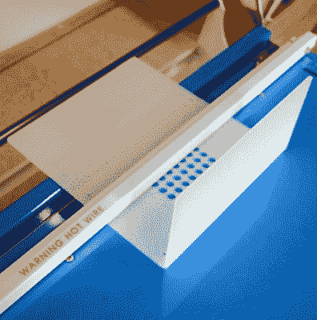

# 来自外太空的树莓派星团

> 原文：<https://hackaday.com/2019/03/15/the-raspberry-pi-cluster-from-outer-space/>

我们在 Hackaday 这里看到了许多奇怪和深奥的东西，但即使按照我们的标准，贝尔实验室的 Plan 9 操作系统也是一个怪人。以科幻电影*Plan 9 from external Space*命名，旨在将 UNIX“一切都是文件”的思想扩展到网络。它设想了一个未来，在那里利用另一台计算机的资源将像复制一个文件一样容易。但是随着台式电脑变得越来越强大，这个想法似乎不那么吸引人了，最终传统的操作系统胜出。当然，这并不意味着你仍然不能摆弄它。

 从逻辑上来说，要使用分布式操作系统，你真的需要一些东西来分发它，但是[正如【安德鲁回来】所显示的，今天这远不是当年](https://www.rs-online.com/designspark/a-pi-powered-plan-9-cluster)所面临的挑战。使用 Raspberry Pi，他构建了一个四节点的 Plan 9 集群，这不仅是探索这个实验性操作系统的一个极好的方式，而且坐在您的办公桌上看起来也很酷。即使你对喝贝尔实验室大约 1992 年的 Kool-Aid 不感兴趣，他的光滑的桌面集群设计也可以让你接触现代分布式软件栈。

该集群的外壳由激光切割的丙烯酸板制成，然后用热线弯曲机折叠成形。对于家庭黑客来说，这似乎是一个很高的要求，[但是我们在过去已经报道过 DIY 丙烯酸折弯机，这个过程出奇的简单。当然，你仍然需要获得一个结实的激光切割机，但如果你附近有一个黑客空间，这不再是太难了。](https://hackaday.com/2014/03/06/make-a-plastic-bender-using-stuff-you-already-have/)

[Andrew]使用短延长线和母面板安装连接器来保持一切整洁，加上一些内部 LED 照明，最终产品看起来确实像一台来自更时尚未来的台式计算机。结合极简键盘，整个设置在科幻电影的场景中不会显得格格不入。也许这是合适的，给贝尔实验室的未来计划 9 的目标。

自从我们第一次告诉你 9 号计划可以用于树莓派已经有十年的时间了，然而在这段时间里，我们从来没有真正看到它投入使用。希望像这样的构建能够激励其他人去体验这段有趣的计算历史。

【感谢戴夫的提示。]