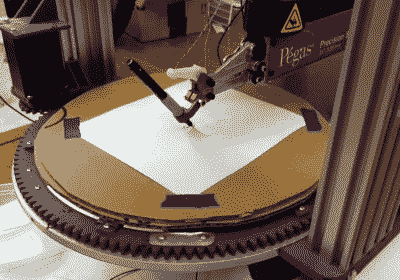

# 重新设计的数控线锯再次骑行

> 原文：<https://hackaday.com/2020/08/06/the-redesigned-cnc-scroll-saw-rides-again/>

当[Andrew Consroe]试图制造一台 CNC 卷轴锯时，他很快意识到这是一个多么棘手的设计问题。使用只在一个方向切割的刀片，您不能像使用激光或刳刨机那样简单地在 X 和 Y 维度上移动工具；工件或刀片本身需要不断向切割方向旋转。

他[最近展示了机器](https://www.youtube.com/watch?v=-WVPwa-2vr8)的第三个版本，虽然它仍然不完全是一个*实用*工具，但毫无疑问它是一个设计出色的工具，或者说它工作缓慢。早期的尝试使用旋转工作台来旋转工件，但是[Andrew]发现这不是一个完美的解决方案。制造一个足够重型的机器来旋转被切割的材料，同时保持足够的精度不会损坏刀片是一个很高的要求，尽管他已经非常接近了。

The earlier version used a rotating table.

这一次，他决定简单地旋转刀片本身。这可以通过单个步进电机和一些合适尺寸的滑轮来实现，同时保持极高的精度。整个叶片组件在带有电机和曲柄装置的铝挤压导轨上上下移动。通过使锯片的旋转与锯的垂直运动同步，软件可以确保在切割冲程实际发生之前一切都在需要的位置。

从休息后的视频来看，系统运行得相当不错。他从胶合板上切割出的复杂圆形看起来非常完美，听起来这种新版本的机器不会像以前的机器一样由于位置误差而折断刀片。可惜也很慢。有如此多的移动部件和仔细的定位要求，即使视频加速 10 倍，锯子似乎仍然只能在材料中爬行。

在视频的后半部分，[Andrew]详细介绍了旋转锯片的另一种方法，这种方法可以减少锯中的移动质量。这将给机器带来相当大的速度提升，我们很乐意看到他实现这一点。顺便说一句，在有人说之前:用螺旋叶片是作弊。

 [https://www.youtube.com/embed/-WVPwa-2vr8?version=3&rel=1&showsearch=0&showinfo=1&iv_load_policy=1&fs=1&hl=en-US&autohide=2&wmode=transparent](https://www.youtube.com/embed/-WVPwa-2vr8?version=3&rel=1&showsearch=0&showinfo=1&iv_load_policy=1&fs=1&hl=en-US&autohide=2&wmode=transparent)

