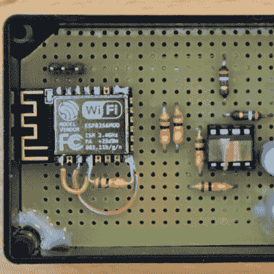

# 适合这项工作的工具

> 原文：<https://hackaday.com/2021/02/06/the-right-tools-for-the-job/>

我们对新型微控制器了如指掌，从新的 Raspberry Pi Pico 到现在摆在我们桌子上的 Espressif 的工程样品。(剧透警告，评论将于周一发布。)和微控制器外设有点像口袋妖怪——你必须抓住它们。如果一个微控制器没有 23 个 UARTS、WiFi、蓝牙、IR/DA 和一个 16 通道 48 MHz ADC，它几乎不值得考虑。越多越好，对吗？

 不，不是的。芯片设计总是一种妥协，谁说每个项目只能有一个微控制器呢？[Francesco]制造了[一个煤气表阅读器](https://hackaday.com/2021/01/31/old-gas-meter-gets-smart-with-the-esp8266/)，提醒人们跳出单微控制器的设计模式。它采用 ATtiny13，具有低功耗睡眠模式、易于唤醒和出色的 ADC。将它与 ESP8266(除了 ATtiny 想要向网络发送数据时，ESP 8266 是关闭的)配合使用，可以实现比单独使用 ESP 更低的功率预算，但仍然可以将他的数据上传到他自己开发的云。

当然，这里比单个微解决方案更复杂，但是两个芯片之间的 I2C 线实际上形成了自然的分工——每个单元都可以单独测试。它将每个芯片都用在了它最擅长的地方:简单、低功耗的任务，用于 ESP 上的微小且争吵不休的 WiFi。

一旦你摆脱了“越多越好”的思维定势，你就会开始在脑海中勾勒出哪种筹码最适合什么。显而易见的下一步是像这样的组合设计。

This article is part of the Hackaday.com newsletter, delivered every seven days for each of the last 200+ weeks. It also includes our favorite articles from the last seven days that you can see on [the web version of the newsletter](https://mailchi.mp/hackaday.com/hackaday-newsletter-649368). Want this type of article to hit your inbox every Friday morning? [You should sign up](http://eepurl.com/gTMxQf)!