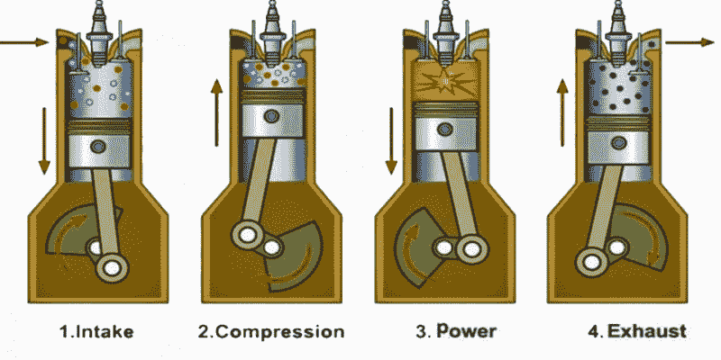
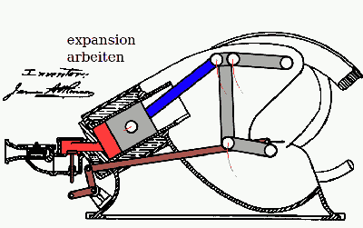
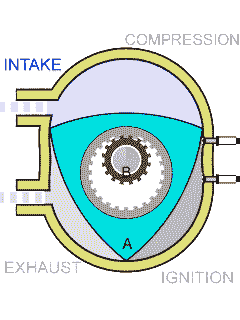
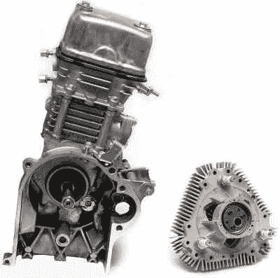

# 旋转 X 型发动机是热力学的一次革命

> 原文：<https://hackaday.com/2021/02/15/the-rotary-x-engine-is-a-revolution-in-thermodynamics/>

如果你在管理一支军队，你很可能需要大量的便携式电源，用于从通信到武器控制系统的一切。说到你的发电机，每一盎司都很重要。越小越轻越好。

总部位于康涅狄格州的 LiquidPiston 公司正在为美国军队开发一种大功率发电机，该发电机使用该公司自己的旋转式 x 发动机——一种小型、轻型、强大的野兽，听起来像是梦想成真。它可以使用汽油、柴油、天然气、煤油或喷气燃料，并且[可以从 1 马力扩展到 1000 马力](https://uploads-ssl.webflow.com/5f6086e9bbbabd41a20f2984/5f626e8bdfe6302ebcf26070_Brochure-LiquidPiston-X-Specifications-20191003.pdf)。

联合创始人兼首席执行官 Alex Schkolnik 将该设计描述为奥托和阿特金森循环发动机、柴油发动机和汪克尔转子发动机的最佳部分的结合，同时解决了后两者的大问题。这听起来令人印象深刻，但这并没有多大意义，除非你了解这些引擎的工作原理以及它们的各种优缺点。所以让我们看看引擎盖下面，好吗？

## 吸，挤，敲，吹

为了讨论的目的，奥托循环、阿特金森循环和柴油机都是四冲程发动机。这意味着每产生一个功率脉冲，活塞移动四次，曲轴旋转两次，点火一次。这四个冲程被称为进气、压缩、做功和排气，或者通俗地说，吸、挤、敲和吹。

任何给定的活塞式发动机的效率都可以用气缸的压缩比来解释。静态压缩比是指活塞处于冲程底部(压缩开始)时气缸内的容积与活塞处于冲程顶部(压缩结束)时气缸内的容积之差。计算动态压缩比还考虑了进入和离开气缸的气体。一般来说，压缩比越高越好。高压缩比可以充分利用油箱中的燃油。

这些发动机的不同之处在于运动部件的数量和形状、空气和燃料的进气方案以及燃料的点火。作为讨论四冲程的出发点，让我们看看许多汽车中常见的典型的汽油动力内燃机，也就是奥托循环发动机。

### 

### 奥托循环

奥托循环发动机由一个或多个在气缸内运动的活塞组成。活塞通过连接器连接到曲轴上，连接器将活塞的上下运动转化为曲轴的旋转运动。这种旋转运动传递到变速箱和车轮上，使汽车向前或向后移动。

在进气冲程中，活塞向下朝着下止点运动，气缸从气缸顶部的阀门充入燃料和空气的混合物。在压缩冲程，活塞朝着上止点向上移动，挤压空气燃料混合物，压缩并加热它。当火花塞产生火花，点燃压缩空气燃料混合物，迫使活塞向下返回，从而第二次转动曲轴时，就会产生动力。最后，活塞移回排气冲程的上止点，将用过的空气燃料混合物从排气口推出。发动机在怠速时的转速为每分钟 600 至 1000 转(RPM ),通常为每分钟 5500 至 7000 转。

奥托循环发动机的活塞越多，运行就越平稳。奥托循环发动机的主要优点是它不会燃烧太多的油，它的燃料效率高，并且比柴油发动机的有害排放物更少。一个主要的缺点是，这些发动机有许多活动部件，当它们发生故障时，往往会出现惊人的故障。

Animation by MichaelFrey via [Wikimedia Commons](https://commons.wikimedia.org/wiki/Mechanical_animations#/media/File:Atkinson_Engine_with_Intake.gif)

### 阿特金森循环

[阿特金森循环发动机](https://www.caranddriver.com/news/a15345875/what-is-the-atkinson-combustion-cycle-and-what-are-its-benefits/)自 19 世纪晚期就已问世，如今常见于混合动力车。阿特金森是一个四冲程内燃机，很像奥托循环，但有一个很大的区别:进气门在压缩冲程的第一部分保持打开。

这听起来可能很浪费，但空气燃料混合物不仅仅是通过打开的进气口流失，而是被推入下一个活塞，预热并准备燃烧。由于可变气门正时还不是一件事，最初的阿特金森循环发动机使用连杆来改变活塞正时。

阿特金森循环发动机的膨胀比大于压缩比，这意味着它的效率更高。它的功率较小，但当与电动机配对时，两者相辅相成。其他优点是减少了泵送损失——泵入空气和燃料以及泵出废气需要做功，并且执行这些功能需要更少的功率。

### 内燃机

鲁道夫柴油机的发动机也是四冲程的，但它的工作方式略有不同。在进气冲程中，气缸只吸入空气，不吸入燃油。压缩冲程挤压空气，并将其加热到约 1300 华氏度。在作功冲程开始时，燃油被喷入气缸，在热空气中瞬间点燃，迫使活塞向下运动。排气冲程是相同的——废空气燃料混合物从排气阀排出。

有趣的是柴油发动机没有火花塞。他们不需要它们——压缩足够加热空气，当燃料注入时，它无需火花就能爆炸。柴油发动机比奥托循环发动机更省油，但购买和维护成本比汽油发动机汽车高。柴油通常也更贵。

因为是压燃式，柴油发动机比汽油发动机有更高的压缩比(和更长的气缸)。这产生了更大的扭矩，这有利于重载，但代价是起飞速度较慢。

Animation by Y_tambe via [Wikimedia Commons](https://commons.wikimedia.org/wiki/File:Wankel_Cycle_anim_en.gif)

### 汪克尔旋转

这就是事情变得真正有趣的地方。菲力·汪克尔在 20 世纪 50 年代根据他少年时的一个梦想开发了他的转子发动机。汪克尔转子没有活塞和气缸，而是有一个大转子，三面在椭圆形外壳中运动。转子连接到偏心轴上，由于其设计，发动机将燃烧压力直接转化为偏心轴的旋转运动。

汪克尔是一种运动部件较少的紧凑型发动机。它利用相同的四冲程，但仅在热力学意义上——转子和偏心轴是唯一移动的部件。偏心轴的作用类似于曲轴，向传动系统传递动力。

汪克尔发动机运行更平稳，转速更高，但它们是为了燃烧机油以保持内部密封润滑而设计的。正如你可能想象的，这意味着他们有可怕的排放。

On the left, a 49cc Honda Metropolitan moped engine. On the right, LiquidPiston’s 70cc X-Mini engine. Image via [LiquidPiston](https://www.liquidpiston.com/engine-benefits)

## 旋转 X:一个反过来的傻瓜

旋转 x 引擎令人瞠目结舌的是相对于尺寸的功率大小。例如，LiquidPiston 向军队展示了他们的发动机，通过建造一个紧凑型火炮动力系统(CAPS)发电机来为 M777 榴弹炮上的数字火控系统提供动力。

今天，该系统需要一个发电机，需要一辆卡车来移动它。LiquidPiston 制造了一台重 41 磅(18.6 千克)的电脑，大约相当于一台游戏电脑的大小。陆军对此印象深刻，以至于[他们授予 LiquidPiston 一份小型商业创新研究合同](https://www.businesswire.com/news/home/20201215005194/en/LiquidPiston-Announces-Small-Tactical-Power-Generator-Development-for-U.S.-Army)，为“一系列军事用例”进一步开发发电机。

如果你想了解旋转 X 引擎是如何工作的，那就把你所知道的关于 Wankel 的一切都翻过来。Wankel 在椭圆形外壳中具有三角形转子，而 Rotary X 在三角形外壳中具有椭圆形转子。两台发动机都只有两个主要的运动部件——转子和轴。

旋转 X 轴的三个外壳室中的每一个都相当于一个活塞。进气口、排气口和腔室内置于转子本身。对于转子的每一转，有三个燃烧事件。这款发动机之所以能够如此小巧高效，是因为 LiquidPiston 重新设计了热力循环，以挤出更多动力。下面的视频解释的相当好。

[https://player.vimeo.com/video/64911927](https://player.vimeo.com/video/64911927)

我们会在消费汽车上看到这些引擎吗？也许有一天，但在那之前会发生很多事。更有可能的是，需要一家大型制造商来采用这项技术，并像马自达在 RX-7 和 8s 中安装 Wankels 那样将其安装在汽车上。即便如此，也不能保证它会成功，尽管 LiquidPiston 表示，它们适合作为主发动机或混合动力系统的一部分。

LiquidPiston 正在提供起价 3 万美元的 x-mini 开发套件，但你必须保证不会对其进行逆向工程。然而，可能有足够的信息来制作一个 3D 打印版本，所以我们将拭目以待，看看你会有什么发现。