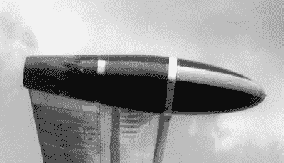

# 旋转马达无法起飞

> 原文：<https://hackaday.com/2019/11/09/the-rotodyne-fails-to-take-off/>

培根和鸡蛋，巧克力和花生酱，盐和胡椒；有些事情就是一起发生的。你会认为飞机和直升机的混搭会很棒，对吗？Fairey Rotodyne 正是 20 世纪 50 年代末的一款产品，虽然它看起来是未来的潮流，但它从未起飞——至少在商业意义上没有。[Mustard]有一个关于该机的精彩视频，包括一些飞行镜头，并解释了它为什么未能占领航空市场。可以看下面的视频。

虽然它看起来像是直升机和飞机的结合，但实际上有点不同。转子通常是不通电的。然而，它在向前飞行时会转弯，并产生飞机所需升力的一半。这解释了短粗的翅膀。最上面的旋翼在顶端有小喷口，可以在垂直起飞、着陆和悬停模式下使用。

One of the craft’s four tip jets.

在当时，它速度快，效率高，尤其是与同时代的直升机相比。这种类型的飞机被称为旋翼飞机，实际上是在 20 世纪 30 年代作为一种安全机制出现的，因为旋翼飞机可以在自转模式下着陆。

根据视频，嘈杂的叶尖喷气和生产延迟杀死了野兽。只有一个原型建成，但有一些我们发现它非常有吸引力。当然，还有其他的旋翼飞行器。英国、德国、日本和俄罗斯军方曾经使用过旋翼飞机。众所周知，美国邮政署​至少雇佣了一个。

即使在今天，仍有大约一千架旋翼飞机被不同的军事和警察组织使用。购买和飞行它们比直升机便宜。可悲的是，尽管如此，它看起来不像旋翼飞机将永远成为一个常见的景象。就像一艘飞艇，当你有机会看到它的时候，它们看起来就像是对更早时间的回拨。

我们总是很惊讶我们没有看到更多的[模型旋翼飞行器](https://hackaday.com/2015/04/21/rc-plane-converted-to-autogyro/)。我们想知道他们会如何在[砍树](https://hackaday.com/2019/09/24/helicopter-chain-saw/)。

 [https://www.youtube.com/embed/dkJOm1V77Xg?version=3&rel=1&showsearch=0&showinfo=1&iv_load_policy=1&fs=1&hl=en-US&autohide=2&wmode=transparent](https://www.youtube.com/embed/dkJOm1V77Xg?version=3&rel=1&showsearch=0&showinfo=1&iv_load_policy=1&fs=1&hl=en-US&autohide=2&wmode=transparent)

