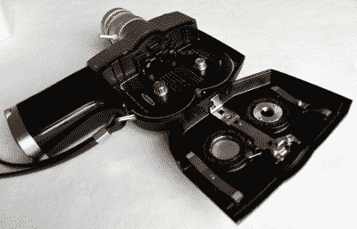
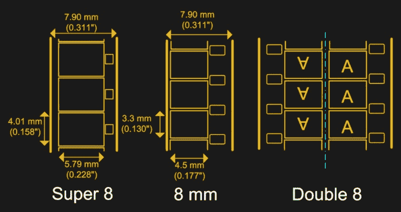
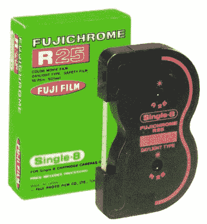
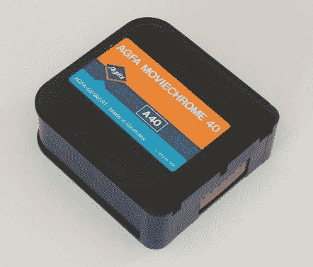
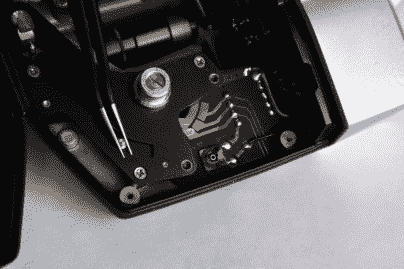
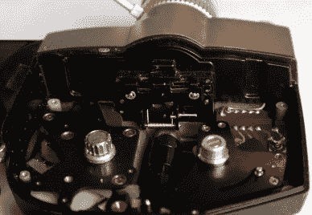
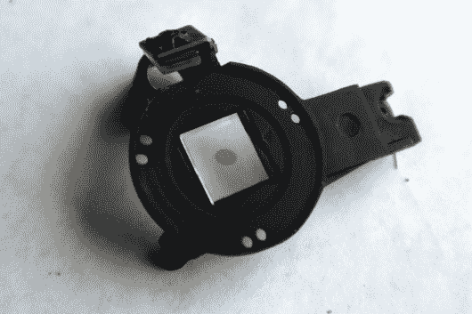
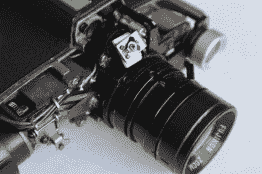
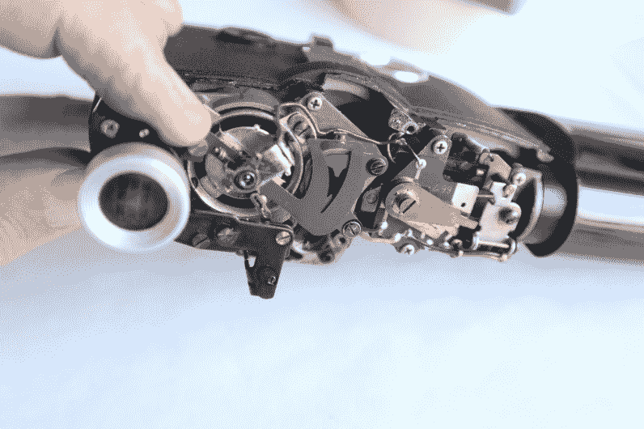

# 过时的家庭电影格式的诱人吸引力

> 原文：<https://hackaday.com/2021/12/15/the-seductive-pull-of-an-obsolete-home-movie-format/>

硬件黑客进二手店是很危险的。我在为我的新公寓寻找床架，但当然我花了一年时间浏览所有其他出售的垃圾宝贝。我有一个粗略的经验法则:如果它不到 10 英镑，并且适合一只手，那么我必须在特殊情况下才会买它，所以我放弃了一台 20 世纪 60 年代的漂亮的 Grundig 卷轴机，而是在我安排了床的交付后，带走了一台折叠式 Palm Pilot 键盘和一台富士 8 毫米家用电影摄像机。这两个我花了五英镑多一点，所以我很好。键盘是一个串行设备，这是一个未雨绸缪的项目，但相机是另一回事。我一直在留意一个用于树莓 Pi 相机转换，这一个似乎是理想的。但当我更仔细地研究它时，我被一系列意想不到的研究吸引住了，这些研究揭示了我父母那一代人真正渴望的东西。

## 旧货店的发现开辟了一个全新的领域

One of the surprises comes in just how small this thing is.

1972 年的富士 P300 是当时消费类电影相机中的典型。它采用胶卷暗盒的形式，在它的前面有一个变焦镜头组件，在它的侧面有一个反光取景器，在它上面有一个快门触发按钮的手柄垂直突出在暗盒下面，并且还装有电池。

令人惊讶的是，它仍然有一个水银电池，可以为它的测光表供电；正确处理这个有点麻烦。有时这些设备有发条马达，但这个有一个电动马达。它还有一个与某种机电光圈耦合的光传感器。当它是新的时候，它会是一个昂贵的相机，可能会像 2021 年的单反相机或体面的无反光镜相机一样值得购买。

当我打开它时，惊喜来了，因为它看起来不像我见过的其他 8 毫米相机。我熟悉标准 8 的两个卷轴或超 8 的四四方方的磁带，但这个使用了不同的东西。那种胶卷暗盒是为安装一个小型双盘暗盒而制造的，这种暗盒的胶卷可以装入一个金属胶卷门。这是一台单 8 相机，富士进入 8 mm 一体机胶片市场的入口，一种我从来不知道存在的格式。为了解释我的意外发现，有必要深入研究一下录像带出现并被淘汰之前的十年里家庭电影格式的世界。

## 家庭电影时代也有他们的格式战争

8 毫米胶片可追溯到 20 世纪 30 年代初，当时柯达推出了这种格式，作为家庭电影市场 16 毫米胶片的廉价替代品。最初的 8 毫米胶片，现在被称为标准 8，只是 16 毫米的胶片，有两倍数量的链轮孔，可以通过从两个方向穿过相机来曝光。胶卷将被切成两半，并在显影过程中拼接在一起，从而产生一个较长的胶卷，仅在一侧有链轮孔，但在连接处的中间有一个短暂的过度曝光的白色部分，这取决于用户在交换胶卷时如何成功地保持光线。从 20 世纪 60 年代开始，一些制造商在链轮孔和胶片边缘之间添加的磁条上提供录音。

A depiction of the various 8mm movie film formats. Max Smith, [Public domain](https://commons.wikimedia.org/wiki/File:8mm_and_super8_and_double8.png).

标准 8 的缺点是换片不方便，链轮孔过大，声音效果不理想，这促使制造商寻求改进的版本。柯达 1965 年的 Super 8 从一开始就设计了更大的图片区域，更小的链轮孔和声音功能，并采用了紧凑的盒式磁带，包含两个卷轴，一个堆叠在另一个之上，没有倒带设备。我同一年的相机 Single 8 使用了相同的胶片格式，但是胶片更薄，并且有单独的卷轴。关于 Super 8 的塑料薄膜压力板相对于 Single 8 的金属部分的相对优势，当时争论激烈，但围绕这个主题阅读，共识似乎是两个版本的图像质量都比标准 8 更好。

  A Fuji Single 8 cartridge. Carlitospradera, CC BY-SA 4.0\.  Agfa film in a Super 8 cartridge. Alfambra, Public domain.

对于一些已经转向数字电影几十年的读者来说，可能会感到惊讶的是，虽然《单身 8》在大约十年前就停产了，但《标准 8》和《超级 8》仍然可用，并且拥有一大批狂热的电影制作人。除了数百万像我的富士这样的简单的家庭电影摄像机，还有质量更高的专业级相机，这些相机的价格仍然很高。拿起一台 Super 8 家用电影摄像机并试一试很有吸引力，但由于胶卷盒售价约为 40 英镑(约 53 美元)，并且只能提供几分钟的镜头，这很难成为一个廉价的爱好。

## 拆卸一个有很多小螺丝的设备，还能出什么问题！

这是我第一次在我的桌子上放一台移动相机，所以这是一个理想的时机来拆除它，看看它的内部工作原理。当我拿起螺丝刀时，很明显这是一个设计和制造都非常好的设备。所有的东西都是用放置得非常好的螺丝拆开的，所有的螺丝都很容易够到和转动，就好像它们最后一次被接触是在昨天，而不是五十年前。从胶卷盒开始，胶卷盒下面有一个可移动的盖子，下面可以找到一个用于胶卷推进的齿轮系，以及一个用于胶卷使用指示器的 PCB 雨刷开关。电机驱动安装在手柄上，与电池并排，同一个齿轮系驱动快门和前进。对于 Pi 转换，有足够的空间来放置 Pi 相机，但遗憾的是，胶片压板需要移动。

  A gold-plated PCB switch for the film usage gauge.  The metal pressure plate assembly.

将我的注意力转向前面，有一个铝制的盖子，由两个螺钉和镜头上的变焦环固定。小心翼翼地取出微小的平头螺丝来固定镜头环，然后取下盖子，露出内部的工作原理。镜头组件有一个安装铸件，该铸件结合了用于取景器光路的棱镜和镜子。这发生在快门之前，因此在任何数字转换中都很容易保留。

棱镜下面是光圈装置，我怀疑是安装在动圈式仪表机芯上的锥形开口。光圈机构下面可以看到快门本身，但是我没有曝光，应该是有一对旋转的圆盘，上面有开口。令人惊讶的是，它包含的电子元件很少:除了光传感器和动圈，就这些了。这是小型化到手持设备中的机电工程的胜利，现在就像 20 世纪 70 年代初第一次打开包装时一样随时可以拍摄。

  The viewfinder prism behind the lens.  Looking through the lens, with the viewfinder light path on the right.  The viewfinder mirror above the lens.  The moving-coil aperture.

所以我为了一个圆周率转换把 8 mm 相机拆了有没有罪恶感？如果这是一个罕见的或高性能的相机，那么这样做可能是一个小罪，但对于一个大量和大规模生产的消费级项目，特别是一个多年没有拍摄的电影，它几乎不可能是除了镇纸之外的任何东西。

因此，对于这一个，我需要将快门停止在其打开位置，并移除足够的胶片门和压力板组件，以适合一个较小的 Pi 相机，其镜头已被移除。手柄中有足够的空间来放置现代电池，我正在考虑是否可以 3D 打印一个 8 芯的传真，以容纳 Pi 和传感器，从而最大限度地减少所需的拆卸。这些镜头给数字图像带来了与 8 毫米胶片一样的老式家庭电影质量，所以我希望我制作的任何视频都有适当的特色。