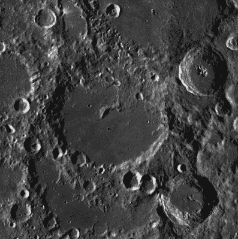
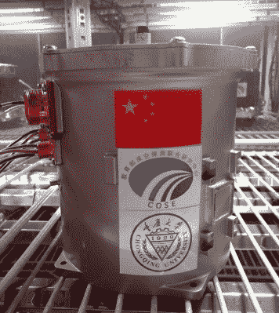
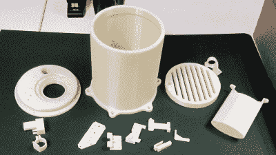
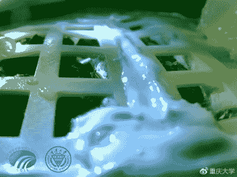

# 月球上生活的简短而悲惨的故事

> 原文：<https://hackaday.com/2019/01/23/the-short-and-tragic-story-of-life-on-the-moon/>

月球是一块荒凉的岩石，完全不可能有我们所知的生命。尽管是我们最近的天体邻居，地表的条件与我们称之为家的温暖潮湿的世界有着天壤之别。地表温度的变化是如此极端，从月球白天酷热的 106 摄氏度(223 华氏度)到夜晚寒冷的 183 摄氏度(-297 华氏度)，甚至机器人探测器都难以生存。月球的大气层，如果有人愿意把这一束束浓度几乎可以忽略不计的古怪气体，包括氩、氦和氖，称之为大气层的话，并不能保护月球表面免受宇宙辐射的轰击。

Von Kármán Crater

然而，在很短的一段时间里，就在最近，月球上的生命繁盛起来。当然，它确实有一点帮助。1 月 3 日，中国的嫦娥 4 号着陆器在冯·卡门撞击坑进行了历史性的着陆，并带来了一项实验，旨在测试植物是否真的可以在月球表面生长。该装置被称为月球微生态系统(LME)，包含空气、土壤、水和一系列种子。当收到适当的信号时，LME 给种子浇水，并仔细监测它们的反应。不久之后，中国媒体自豪地宣布，LME 的棉花种子已经发芽，长势良好。

不幸的是，这种成功非常短暂。就在宣布 LME 实验成功的几天后，人们发现所有发芽的植物都死了。这里的时间线有点模糊。甚至还不清楚 LME 实验的突然结束是故意的，还是由于一些硬件故障。

那么，我们对嫦娥四号的月球微生态系统以及其中的生命形式到底了解多少呢？为什么植物会死亡？但也许最重要的是，这一切与人类未来潜在的任务有什么关系呢？这些任务是为了探索离我们几十万公里外的那块荒凉的岩石。

## 建造一个外星温室

 感谢[对 LME 团队成员](http://www.chinanews.com/gn/2019/01-15/8729687.shtml)的采访，以及中国媒体发布的一些图片，我们对实验是如何进行的有了一个相当好的了解。整体设计可能最好被描述为一个金属桶，有一个拧紧的法兰盖来密封里面的内容。该设备与外部世界的唯一连接是电连接，不提供外部空气循环或处理。这样做不仅可以大大简化 LME 的设计，还可以防止其内容污染月球环境的任何可能性。

尽管在上述环境条件下，在月球上洒一些泥土或种子不太可能产生太大影响，但科学界要求在探索其他世界时，应认真遵守检疫协议。中国确保 LME 遵守这些原则的事实，可能会被视为让那些担心月球最近的访客可能对国际协议持某种傲慢态度的人放心。

罐子顶部的一个小孔，被设计者称为“光导模块”，让阳光进入室内。这避免了(或至少减少了)对人工照明的需求；从电力消耗的角度来看，这很重要，但也是一种观察植物对月球上阳光的反应是否不同的方法。侧面的连接器允许嫦娥 4 号与 LME 内部的设备和传感器连接，我们知道至少有两个摄像头，一个温度传感器，一个水泵和某种类型的加热元件。

LME 非常小，只有 2.6 公斤(5.7 磅)重，只为它的生物乘客提供了一升的可用体积。尽管如此，它实际上包含了几种生物，从果蝇卵到土豆。首席研究员刘汉龙的一句特别有趣的话似乎表明，目标并不是像后来声称的那样简单地发芽几粒种子，而是让 LME 维持一个复杂的生态微观世界:“有效载荷中携带的六种生物构成了一个包含生产者、消费者和分解者的微生态系统。其中，植物为所有消费者生产氧气和食物。”

3D printed model of the Lunar Plant Growth Habitat

有趣的是，虽然 LME 将成为在另一个世界进行的第一个生物实验，但它肯定不是第一个预想的。美国宇航局设计了一个非常相似的实验，名为“月球植物生长栖息地”,该实验原本是为了在现已停办的 2015 年谷歌月球 X 奖竞赛中搭乘月球之旅。谷歌从未登上月球，美国宇航局的月球生物学实验也是如此。

众所周知，埃隆·马斯克还想把一个温室送上火星，并相信另一个星球上发芽的植物的图像会像阿波罗任务传回的照片一样激励人类。由于无法以他认为合理的价格购买飞往火星的火箭，他决定自己动手建造这些东西；[一个叫 SpaceX 的小公司诞生了](https://hackaday.com/2012/05/23/spacex-finally-launches-scotty-makes-it-to-space/)。

## 中断的实验

LME 收到启动水泵的信号，并在着陆后不久开始种子发芽，中国媒体于 1 月 14 日开始报道棉花种子发芽成功。给定棉花种子名义上的 10 天发芽期，到那时的时间表是有意义的。但是仅仅几天后，中国媒体宣布 LME 实验结束；称生物样本没有机会活过即将到来的月夜，设备内的温度已经达到零下 52 摄氏度。

One of the over 170 images taken inside the LME

在这一点上，应该澄清的是，月球上的“一天”持续了 29.5 个地球日，这一事实在确定嫦娥四号的着陆日期时肯定被考虑在内了。此外，我们从在 LME 工作的工程师的陈述中得知，它包含一个加热器；这在太阴日经历的酷热中是完全不必要的。

考虑到这些事实，假设最初的目标是让 LME 号至少在长达半个月的月夜周期中继续运行，似乎是合乎逻辑的。突然宣布 LME 的实验已经结束，并且仅凭发芽的棉花种子就被认为是成功的，这可能只是为了应对一些技术问题而采取的损害控制措施。

事实上，中国媒体最近的一些报道称，由于重量限制，计划在夜间为 LME 供电的[电池从未安装在飞船上](https://www.scmp.com/news/china/science/article/2182565/chinas-first-lunar-leaf-dies-after-change-scientists-forced-cut)。很难相信如此雄心勃勃的生物实验会在没有必要的电池供电的情况下被送上月球，但目前，这是官方的解释。

## 灵感，如果不是创新

虽然一颗种子在月球上成功发芽肯定是一项值得称赞的技术成就，但从生物学的角度来看，它并没有开辟任何新的领域。LME 相对较好地屏蔽了外界的温度和辐射，并且从地球带来了土壤、空气和水，而不是试图利用月球资源。唯一真正未知的是月球上的低重力，但由于植物已经在轨道航天器上的失重条件下成功生长，这不太可能是一个问题。

人类是否从 LME 实验中学到了任何新东西，这是有争议的，但这并不意味着它不值得一做。这可能不会发生在月球上，中国也不可能做到。但总有一天，无论如何，我们将会在另一个世界的背景下看到那些令人敬畏的绿色增长的照片，就像美国宇航局和埃隆·马斯克一直梦想的那样。