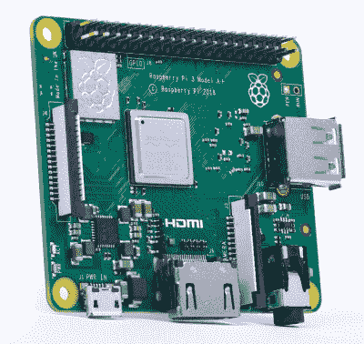

# 更小、更强大的树莓 Pi 3 型号 A+

> 原文：<https://hackaday.com/2018/11/15/the-smaller-more-powerful-raspberry-pi-3-model-a/>

又到了一年中的这个时候，树莓基金会为你准备了一些新的硬件。这一次，它是树莓 Pi Model A 的[改进版本，](https://www.raspberrypi.org/blog/new-product-raspberry-pi-3-model-a/)为它带来了其更大的兄弟树莓 Pi Model 3 B+的速度和功率。

 树莓派 A 型是树莓派阵容中怪异的老二，也可能是金发女孩的选择。它没有 Raspberry Pi Model 3 B+那么强大，也没有该系列最新版本中的 USB 端口或以太网插孔，也没有 Raspberry Pi Zero W 那么小或便宜，如果你运行的 Pi 只是接收功率并在 GPIO 引脚上输出数据，那么 Model A 可能就是你所需要的。

完整规格包括:

*   Broadcom BCM2837B0 Cortex A-53 以 1.4GHz 运行
*   512 MB lpddr 2 SRAM
*   2.4 GHz 和 5 GHz 802.11 b/g/n/ac 无线局域网，蓝牙 4.2/BLE
*   全尺寸 HDMI
*   MIPI DSI 显示端口/ CSI 摄像机端口
*   立体声输出和复合视频端口

简而言之，我们正在看今年早些时候发布的 [Raspberry Pi Model 3 B+的精简版](https://hackaday.com/2018/03/14/raspberry-pi-gets-faster-cpu-and-better-networking-in-the-new-model-3-b/)，没有以太网端口，只有一个 USB 端口。无线芯片组藏在一个可爱的浮雕罐下，在我们拿到这个新型号和一把钳子之前，我们假设这是一个 [CYW43455](http://www.cypress.com/documentation/product-overviews/cyw43455-wiced-ieee-80211ac-wifi-bluetooth-41-connectivity-solution) ，Pi 3 B+中的 Cypress 芯片组。

树莓 Pi 3 型号 A+的价格将为 25 美元，将很快在普通零售商处上市。由于还没有 Pi Zero 3 这样的东西，如果你正在寻找一台强大的 Linux 计算机，带无线功能，外形小巧，你不会比这个小家伙做得更好。当然，你可以拆下一台 Pi 3 b+，但目前这是最小、最强大的单板计算机，有很好的软件支持。