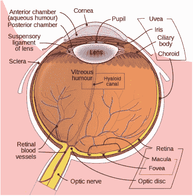
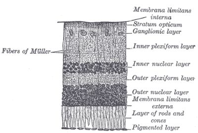
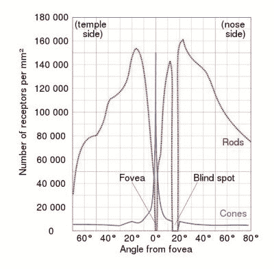
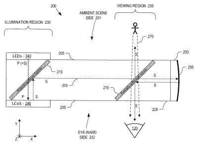
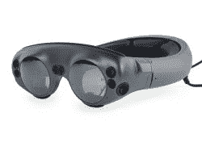
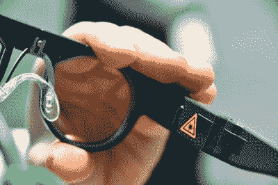

# 最小的大显示器直接投射到你的视网膜上

> 原文：<https://hackaday.com/2020/04/15/the-smallest-large-display-is-projected-straight-onto-your-retina/>

在人类历史的大部分时间里，在一个人的视网膜上获得定制形状和颜色的方法是把它画在洞穴墙壁上，或者一张羊皮纸上，或者纸上。后来，我们发明了电子显示器，并将其用于从电视到电脑的所有东西，甚至玩弄显示器，让我们产生眼前存在 3D 形状的错觉。然而，如果我们可以跳过这个表面，直接在我们的视网膜上画呢？

诚然，将激光直接瞄准我们眼球后部的细胞层——让我们能够看见的微妙器官——的想法，可能不会给出与你想到坐在 4K 27 英寸游戏显示器前观看相同内容时相同的反应。然而实际上，我们会让同样的光子在我们的视网膜上画出同样的图像。如果它可以是 8K 显示器，电影院大小的呢？或者也许有一个 HUD 覆盖，就像在视频游戏中一样？

在许多方面，这种被称为虚拟视网膜显示器的概念几乎太像科幻小说了，然而它已经成为几十年研究的主题，越来越复杂的技术使它更接近日常现实。我们会为了这项技术而抛弃显示器和电视吗？

## 简单问题的复杂解决方案

 人类的眼睛是经过数百万年进化过程产生的奇迹。虽然缺少了一些包含在[头足类动物眼睛](https://en.wikipedia.org/wiki/Cephalopod_eye)中的错误修复，但它仍然包含了许多先进的光学系统，一个高密度的[光感受器阵列](https://en.wikipedia.org/wiki/Photoreceptor_cell)，以及超高效的信号处理硬件。在一个信号从视神经传到大脑的视觉皮层之前，眼睛内部的神经网络已经处理了传入的视觉数据，只留下视觉皮层需要的重要部分。

眼睛的基本功能是利用它的光学系统来保持被观察物体的图像清晰。为此，它使用一圈称为[睫状肌](https://en.wikipedia.org/wiki/Ciliary_muscle)的平滑肌来改变晶状体的形状，允许眼睛改变其焦距，虹膜控制进入眼睛的光量。这使得眼睛能够将传入的图像聚焦到[视网膜](https://en.wikipedia.org/wiki/Retina)上，这样感光细胞最多的区域[中央凹](https://en.wikipedia.org/wiki/Fovea_centralis)用于场景中最重要的事情(焦点)，其余的视网膜用于我们的周边视觉。

Layers of the human retina (from Gray’s ‘Anatomy of the Human Body’)

当涉及到将图像投影到视网膜上时，简单的问题就变成了:如何以一种与眼睛现有的光学和聚焦算法很好地配合的方式来做到这一点？

## 给虚拟一个真实的地方

在虚拟视网膜显示技术的简单简化模型中，三束激光(红色、绿色和蓝色，用于全色图像)扫描视网膜，使受试者能够感知图像，就好像其光子来自现实生活中的物体一样。然而，正如我们在上一节中提到的，这并不是我们在现实中所做的。我们不能直接扫描视网膜，因为眼睛的晶状体会衍射光线，这种衍射会随着眼睛调整焦距而变化。

 我们唯一感兴趣的视网膜部分也是视网膜中央凹，因为它是视网膜中唯一一个有密集视锥群(能够感知光的频率，即颜色的光感受器)的部分。其余的视网膜仅用于周边视觉，主要是(黑白感知)杆状细胞和非常少的视锥细胞。为了将清晰可辨的图像投射到视网膜上，我们有一个 1.5 毫米宽的视网膜中央凹，直径为 0.35 毫米的[视网膜中央凹](https://en.wikipedia.org/wiki/Foveola)提供最佳的视觉灵敏度。

击中视网膜的这一部分要求主体要么有意识地聚焦在投影图像上以便清楚地感知它，要么在任何给定时间调整眼睛的焦距。毕竟，对眼睛来说，所有的光子都被认为来自现实生活中的物体，具有特定的位置和距离。这个过程中的任何问题都可能导致眼睛疲劳、头痛甚至更糟，就像我们在电影院的 3D 电影以及虚拟现实系统等相关技术中看到的那样。

## 智能眼镜:保持传统

Schematic overview of a Google Glass LCoS-based projection unit.

大多数人可能都知道头戴式显示器，也称为“智能眼镜”。这些技术的作用类似于虚拟视网膜显示技术，在受试者眼前显示图像。这用于像[增强(混合)现实](https://en.wikipedia.org/wiki/Augmented_reality)这样的应用，其中信息和图像可以叠加在场景上。

几年前，谷歌凭借其[谷歌眼镜](https://en.wikipedia.org/wiki/Google_Glass)智能眼镜引起了一点轰动，这种眼镜使用特殊的[半镀银镜子](https://en.wikipedia.org/wiki/Beam_splitter#Beam_splitter_designs)将投影图像引导到受试者的眼中。像后来的谷歌眼镜企业版一样，微软将他们的 [HoloLens](https://en.wikipedia.org/wiki/Microsoft_HoloLens) 技术瞄准了专业和教育市场，使用组合透镜将图像投影在有色护目镜上，类似于飞机上的平视显示器( [HUDs](https://en.wikipedia.org/wiki/Head-up_display) )的工作方式。

The Magic Leap One AR smart glasses (Credit: iFixit)

Magic Leap 的 [Magic Leap One](https://www.ifixit.com/Teardown/Magic+Leap+One+Teardown/112245) 使用[波导](https://en.wikipedia.org/wiki/Waveguide_%28optics%29)，允许图像在不同的焦平面上显示[，类似于第三代 hud 中使用的技术。与更具未来感的 HoloLens 相比，这些看起来更像焊接护目镜。HoloLens 和 Magic Leap One 都能够完全增强现实，而谷歌眼镜](https://virtualrealitypop.com/understanding-waveguide-the-key-technology-for-augmented-reality-near-eye-display-part-i-2b16b61f4bae?gi=231a4d1d962d)[更适合作为基本的 HUD](https://www.theverge.com/2019/5/20/18632689/google-glass-enterprise-edition-2-augmented-reality-headset-pricing) 。

虽然智能眼镜有其用途，但它们肯定不是很隐蔽，而且大多数也不适合户外使用，尤其是在阳光明媚的天气和炎热的夏天。如果能跳过笨重的头带和护目镜或护目镜，那就太好了。这就是虚拟视网膜显示器(VDR)发挥作用的地方。

## 用激光和小镜子绘画

很自然，当听到 VDRs 时，第一个想到的问题可能是，为什么突然可以用三束而不是一束激光照射你的眼睛？毕竟，我们被告知永远不要，甚至一次也不要，用低功率激光笔瞄准一个人，更不要直视他们的眼睛。有些人可能还记得 2014 年火人节上发生的事件，参加火人节的人几乎用手持激光摧毁了一名工作人员的视线。

The BML500P prototype. (Credit: Evan Ackerman/IEEE Spectrum)

解决这些问题的方法是使用非常低功率的激光。足以画出图像，不足以做更多的事情，除了使用眼睛感知我们周围的世界引起通常的磨损和撕裂。由于光线直接投射到视网膜上，所以没有图像会在明亮的阳光下褪色。像博世这样的公司[已经有了 VRD 眼镜的原型](https://spectrum.ieee.org/tech-talk/consumer-electronics/gadgets/bosch-ar-smartglasses-tiny-eyeball-lasers)，后者最近展示了他们的 [BML500P](https://www.bosch-sensortec.com/products/optical-microsystems/smartglasses-light-drive/) 博世智能眼镜光驱动解决方案。他们声称光输出功率为 15 W。

博世的解决方案使用 RGB 激光器和一个 MEMS 反射镜将光线引导到受试者的瞳孔和视网膜上。然而，这种 VRD 解决方案的一个大缺点是，它不能像前面提到的智能眼镜一样被拿起来使用。正如前面所讨论的，VRD 需要精确地瞄准视网膜中央凹，这意味着 VRD 必须根据每个用户进行调整才能工作，否则当激光错过目标时，人们将什么也看不到。

与谷歌眼镜解决方案非常相似，博世的 BML500P 主要用于 HUD 目的，但随着时间的推移，这种解决方案可以扩大规模，比 BML500P 的 150 线对分辨率更高，并且是立体声版本。

## 未来是光明的

AR 和智能眼镜市场在这一点上的进入成本仍然非常陡峭。虽然谷歌眼镜企业版 2 会让你花费少得可怜的 999 美元左右，但 HoloLens 2 的价格为 3500 美元(或更高)，这导致一些人[利用从当地光学商店的便宜货箱中挖出的分束器即兴制作他们自己的解决方案](https://eclecti.cc/hardware/blinded-by-the-light-diy-retinal-projection)。在这里，对潜在伤害眼睛的警告也不能被低估。将小型(微型)投影仪的全部亮度直接射入眼睛会导致永久性损伤和失明。

也有专注于特定应用的 AR 方法，例如使用 Tilt Five 的解决方案的[桌面游戏。综合来看，增强现实技术——无论是使用分束器、投影还是 VRD 方法——似乎仍处于萌芽阶段。就像几年前的虚拟现实(VR)一样，需要更多的研究和开发才能推出一种能够检查所有盒子是否负担得起、鲁棒和可靠的东西。](https://hackaday.com/2019/09/25/tilt-five-a-fresh-take-on-augmented-reality-tabletop-gaming/)

也就是说，这里肯定有很大的潜力，我很期待看到未来几年的发展。