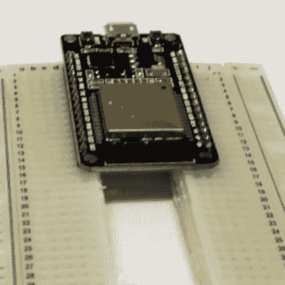

# 超大开发板的解决方案:文字破解

> 原文：<https://hackaday.com/2018/08/27/the-solution-to-oversized-dev-boards-a-literal-hack/>

哦，曾经有一段时间，你可以在一块试验板上制作出几乎所有东西的原型。您计算机中的 CPU 采用 DIP 封装，没有 BGA 封装。随处可见。从那以后的四十年里，芯片变得越来越小，封装变得越来越狭窄，你几乎不能手工焊接最酷的芯片了。不用担心——公司仍在生产 0.1 英寸接头的开发板，但有一个问题:它们不适合无焊试验板。它们太宽了。我们的世界正在分崩离析。

[Luc]在玩一些 NodeMCU 开发板时遇到了问题。这些对实验板来说太宽了。[【Luc】想出了不止一个解决方案，而是两个](http://lucstechblog.blogspot.com/2018/08/breadboard-hack-for-esp32-and-esp8266.html)。这就是如何用太大的开发板制作原型。

当[Luc]意识到每个试验板的中心都没有电气连接，只是由一小块塑料连接在一起时，他想到了解决方案。是的，他用钢锯锯面包板。这在技术上是一个黑客。

随着无焊试验板的两半被撕开，[Luc]有了一种简单的方法来制作太宽的开发板原型。但是[Luc]在破坏了一个试验板后发现了一个更简单的解决方案:那些无处不在的无焊试验板有可拆卸的电源轨。如果你简单地把其中一个电源轨拿掉，你就有一个简单的方法在一个模块上使用两个试验板，这个模块对于一个无焊试验板来说太宽了。

这算不算黑？哦，当然。[卢克]用钢锯。这也是一个很好的提醒，提醒人们一个可能不知道的常见技巧。谢谢你，卢克。