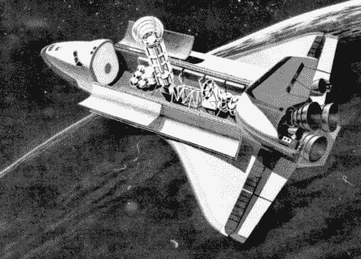
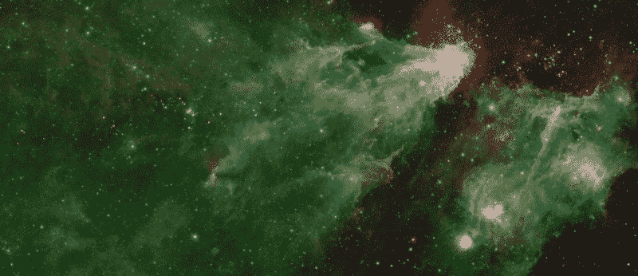
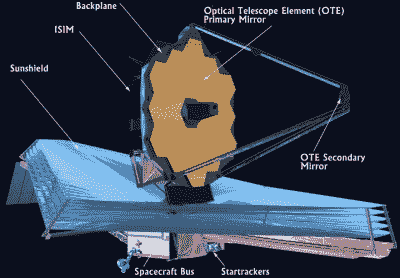

# 斯皮策太空望远镜结束了它不可思议的旅程

> 原文：<https://hackaday.com/2020/01/30/the-spitzer-space-telescope-ends-its-incredible-journey/>

今天，在 16 年的模范服务之后，美国宇航局将正式关闭斯皮策太空望远镜。运行时间超过其设计服务寿命十多年，红外天文台与哈勃太空望远镜合作，揭示了已知宇宙物体以前隐藏的细节，并帮助我们扩大了对宇宙的了解。在后来的几年里，尽管它从未被设计用于这项任务，但它成为了研究太阳系外行星的一个无价工具。

虽然目前距离地球超过 2.6 亿公里的飞船上没有发生灾难性的故障，但岁月无疑对斯皮策产生了影响。飞船的各种技术问题，加上它不断增加的距离，使得它的持续运行很麻烦。地面控制人员没有让它运行到彻底失败的地步，而是决定退出，同时他们仍然可以选择命令飞行器进入休眠模式。在它与地球的距离上，它没有成为传统意义上的“太空垃圾”的危险，但一个在深空中随机传输的流氓航天器可能会成为未来观测的麻烦。

从绘制大熊座 190 光年外的一颗行星的天气模式，到提供土星最大光环的第一张图像，很难夸大斯皮策的发现的广度。但当你考虑到这项任务的传奇历史时，这些成就就更加令人印象深刻，从其混乱的概念到长期太空飞行的独特技术挑战。

## 航天飞机的瞄准镜

虽然斯皮策太空望远镜可能是在 2003 年发射的，但它的起源可以追溯到阿波罗时代。随着美国宇航局向太空发射大型有效载荷的能力提高，天文学家开始考虑轨道红外天文台的可能性。太空中的红外望远镜将远远超过地球上类似大小的望远镜，因为来自太空的大部分红外辐射被大气中的水蒸气和二氧化碳吸收。虽然建造、发射和操作这样一台望远镜将是一个相当大的技术挑战，但毫无疑问，它将能够比地面上建造的任何东西做更多有用的科学研究。

Concept art from the Hughes design study.

1976 年，休斯飞机公司发布了他们对航天飞机红外望远镜设施(SIRTF) 的初步设计研究，这是一个低温冷却的红外望远镜，将安装在航天飞机的货舱内。由于航天飞机承诺的快速可重复使用性，SIRFT 可以定期升级和回流，以利用红外成像技术的进步。

不幸的是，航天飞机计划的现实与最初的设想大相径庭。航天飞机不像商业客机那样定期廉价发射，而是像更传统的火箭一样缓慢而昂贵地进入太空。更糟糕的是，[在 STS-51-F 任务期间进行的实验](https://en.wikipedia.org/wiki/STS-51-F)显示，从航天飞机上进行的红外观测被环绕在有翼轨道飞行器周围的灰尘和热量光环复杂化了。

到 80 年代中期，SIRTF 显然不能作为航天飞机的一部分工作。它需要是一个自由飞行的仪器，这自然使设计变得相当复杂。SIRTF 不仅要安装在较小的火箭上，还需要有自己的通信、推进、导航和发电装置。

## 战胜炎热

在整个 1990 年代，SIRTF 的概念经历了几次修改。现在被称为*太空*红外望远镜设施，以区别于早期以航天飞机为中心的设计，新望远镜需要足够小和轻，以便由德尔塔 II 火箭携带。优化航天设计从来都不容易，但在 SIRTF 的案例中，它提出了一些独特的挑战。

为了获得最佳性能，红外传感器需要冷却到接近绝对零度。这意味着低温冷却剂和绝缘，这增加了航天器的质量和体积。减轻发射质量最简单的方法是在火箭上装载更少的冷却剂，但这会缩短望远镜的使用寿命:这是一个非常困难的妥协。

为了解决这个问题，对最初的概念进行了彻底的改变。SIRTF 将被发射到深空，而不是像哈勃太空望远镜那样在近地轨道运行。在这个距离，冷却系统将不再需要与地球辐射的热量相抗衡。当然，航天器也会被太阳加热，但这可以通过被动太阳能护罩来缓解。SIRTF 仍然需要携带液氦来冷却传感器，但在深空中它需要的要少得多。

随着任务参数的这些变化，估计 SIRTF 可以将其仪器冷却到大约 5 开尔文(-268°C，-450°F)达 5 年。

## 斯皮策不断发展的使命

SIRTF 于 2003 年 8 月 25 日由德尔塔 II 火箭发射升空。按照当时的惯例，在准备开始观测之前，美国宇航局没有正式将该航天器的名称改为斯皮策太空望远镜。它是以莱曼·斯必泽博士的名字命名的，他是太空望远镜的早期支持者，在 1997 年去世前，他帮助游说国会为建造哈勃望远镜提供必要的资金。

从 2003 年 12 月到 2009 年 5 月， *Spitzer* 在 3.6 微米和 160 μm 之间的波长上观察来自遥远星系、年轻的形成中的恒星和系外行星的能量。在那之后，液氦耗尽，仪器的温度上升到大约 30k(243°C，406°F)。这将望远镜的观测限制在最小波长 4.5 微米，并标志着任务控制人员所称的“斯皮策温暖任务”的开始。

An image created using data from the “Cold” phase of *Spitzer’s* mission. Credit: [NASA/JPL-Caltech](https://www.jpl.nasa.gov/spaceimages/details.php?id=PIA23126)

当任务中所谓的温暖阶段开始时，斯皮策号已经超过了它最初的设计寿命。但是它在此期间的发现，无论是它自己的发现，还是与其他仪器和天文台合作的发现，都同样令人印象深刻。来自*斯皮策*的数据帮助确定了一个距离地球令人难以置信的 320 亿光年的星系，诸如凌日测光和引力微透镜等技术使其能够进行系外行星研究，这在最初的任务中甚至从未被考虑过。

科学观测一直持续到今天，尽管近年来，电池健康状况的下降以及*斯皮策*与地球之间不断增加的距离使得下载由此产生的数据变得更加困难。

## 红外天文学的未来

斯皮策太空望远镜已经比欧洲航天局类似的威廉·赫歇尔望远镜寿命长，美国宇航局的宽视场红外巡天探测器(WISE)不够灵敏，无法进行同样的观测。自然，目前有大量的数据需要筛选，但是今天之后，天文学家还要等多久才能进行新的红外观测？

The James Webb Space Telescope

斯皮策的直接继任者，[被称为 SAFIR(单孔径远红外)](https://safir.jpl.nasa.gov/)，目前只是一个概念，还没有确定的建造或发射时间表。欧洲航天局希望在 2022 年发射*欧几里德*，尽管它只能像*斯皮策*一样远地观察红外波长。美国航天局还继续运营平流层红外天文观测台(SOFIA ),这是一架经过改装的波音 747 飞机，飞行高度足以避开大气层中大多数阻挡红外的水蒸气。

但毫无疑问，地平线上最令人兴奋的前景是詹姆斯·韦伯太空望远镜(JWST)。定于明年发射的 JWST 将无法看到所有与 T2 斯皮策 T3 在寒冷阶段相同的红外波长，但望远镜令人难以置信的 6.5 米直径的镜子将允许它观察比以往任何时候都更暗和更远的物体。