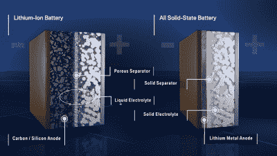
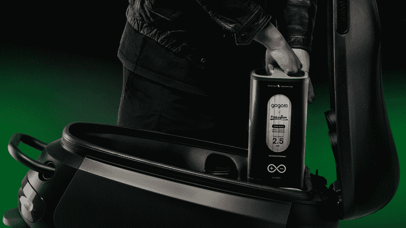
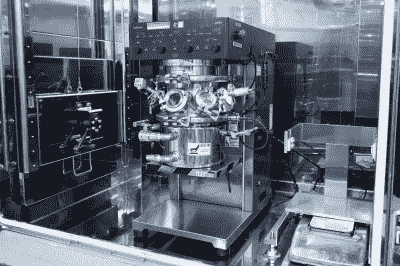
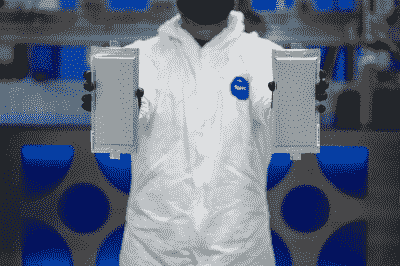

# 固态电池的发展状况

> 原文：<https://hackaday.com/2022/04/27/the-state-of-play-in-solid-state-batteries/>

电动汽车正在缓慢但肯定地从其内燃机前辈那里抢夺市场份额。然而，里程和充电速度仍然是客户的主要症结，也是任何现代电动汽车的主要卖点。当谈到提高这些数字时，电池技术是最重要的。

固态电池可能标志着这些领域的性能发生了巨大变化，将它们推向市场的竞争开始升温。我们来看看目前的发挥状态。

## 为什么选择固态硬盘？

The hope is that solid-state batteries could pack in higher energy densities by making it practical to use a lithium metal anode design. Credit: [BMW, press site](https://www.press.bmwgroup.com/global/article/detail/T0331495EN/bmw-group-strengthens-leadership-position-in-battery-technology-with-investment-in-solid-state-innovator-solid-power?language=en)

目前，锂离子或锂聚合物电池用于绝大多数电动汽车。与其他实用的商业化电池技术相比，它们具有更高的功率密度和更轻的重量，非常适合车辆使用。然而，它们也有一些缺点。它们仍然比我们预期的容量要重，充电时间太长，而且它们有一个令人讨厌的习惯，那就是以一种相当凶猛的方式着火。

固态电池可以改变这一切。它们被称为“固态”，因为液态电解质被固态材料所取代。固体电解质远不如目前使用的液体材料易燃，因此对热也不太敏感。这可以允许更大的电流消耗以及更快的充电，因为出于安全原因，电池不必保持在如此狭窄的温度范围内。

此外，固体电解质可以允许使用不同的阳极材料，这将提供更大的能量密度。特别是，科学家们长期以来一直希望将锂金属直接用作电池的阳极材料。然而，在目前的液体电解质电池中，锂金属阳极形成枝晶，使电池短路，并在此过程中破坏电池。据信，固体电解质可以阻止这种增长，并可以提供高达现有锂电池能量密度的两倍半。

## 挑战

固态电池技术还没有成熟到主流使用的程度。一些固态电池[已经上市](https://hackaday.com/2021/08/03/murata-to-deliver-solid-state-batteries-to-market-in-the-fall/)，但是它们对于电动汽车来说太小了几个数量级。

挑战仍然围绕着导电性，特别是在较低的温度下，以及构成阴极、阳极和固体电解质的固体材料之间的高电阻问题。许多固态电池设计要求固体电解质处于巨大的压力下以保持良好的导电性，这引入了围绕应力和脆性的机械问题。

此外，根本没有任何基础设施来大规模生产固态电池。汽车制造商一直在急于建立新的电池厂来支持电动汽车制造。然而，绝大多数是为了弥补现有电池设计生产中的不足。很可能工厂将不得不进行重大改造，以生产内部设计非常不同的固态电池。

## 竞争者

Electric scooter manufacturer Gogoro unveiled a prototype solid-state battery earlier this year. The “lithium ceramic battery module” came with a 40% boost in capacity over the company’s existing cells. Credit: [Gogoro, press site](https://www.gogoro.com/news/solid-state-battery/)

不管怎样，固态电池商业化的临界点已经很近了。几家公司正在这一领域投入巨资。每个公司都希望通过拥有最好的电池技术成为第一个获得竞争优势的公司。

在小规模上，我们去年已经看到组件制造商 Murata 去年开发了 [25 mAh 固态电池。](https://hackaday.com/2021/08/03/murata-to-deliver-solid-state-batteries-to-market-in-the-fall/)这些安装在 PCB 上很棒，但不会真正帮助你开车去任何地方。Hitachi Zosen 的努力有所提高，但规模仍然较小。该公司已经生产了 1000 mAh 容量的高性能固态电池[，](https://asia.nikkei.com/Business/Energy/World-s-highest-capacity-solid-state-battery-developed-in-Japan)，但是该技术尚未商业化。

电动滑板车公司 Gogoro 垄断了台湾的电动助力车市场。他们的汽车配备了方便的可更换电池系统，电池更换站遍布全国各地，让骑行者随时随地都可以出行。现在，该公司推出了一种新的固态电池原型，与他们现有的电池外形兼容。这意味着新电池可以投放到他们现有的所有在路上行驶的车辆中。新电池的 ups 容量从 1.7 千瓦时增加到 2.5 千瓦时。能量密度增加了整整 40%，提高了任何使用 Gogoro 电池组的车辆的行驶里程。然而，在这一阶段，该包仍然是一篇演示文章，该公司尚未宣布将电池推广到他们网络的明确计划。

Nissan recently unveiled a prototype production facility for solid-state batteries. Credit: [Nissan, press site](https://global.nissannews.com/en/releases/release-8aef385f4e3efd0619b175c665007f52-nissan-prototype-production-facility-for-all-solid-state-batteries#)

与此同时，汽车行业的巨头们也在争夺这一领域的领先地位。去年，宝马明确表示，它将在 2025 年前展示一款固态动力技术演示车，同时它希望在 2030 年左右投入生产。

日产走得更远，展示了与美国宇航局合作的固态电池原型工厂。这家日本汽车制造商声称，其固态汽车的充电速度可能比当前车型快三倍，同时提供两倍的续航里程。该公司希望在 2024 年前拥有一条试点生产线，为 2028 年向公众销售固态电动汽车做准备。该公司还指出，固态技术将生产一个“大约是目前电池一半大小”的电池包，它可以“在 15 分钟内充满电，而不是几个小时。”

BMW has managed to produce prototype solid-state batteries up to 20 Ah capacity in partnership with Solid Power. The plan is to test 100 Ah batteries in 2022\. Credit [BMW, press site](https://www.press.bmwgroup.com/global/article/detail/T0331495EN/bmw-group-strengthens-leadership-position-in-battery-technology-with-investment-in-solid-state-innovator-solid-power?language=en)

丰田也进行了大量投资，并与松下一起努力成为领头羊。今年早些时候[公司声称](https://www.motor1.com/news/559226/toyota-production-car-solid-state-battery-2025/)最早将于 2025 年推出一款使用固态电池的混合动力汽车。考虑到开发和生产新电池的高成本，这种违反直觉的举动有些道理。混合动力汽车使用比电动汽车更小的电池，因此固态技术不会使混合动力汽车的价格上涨太多，使其适合市场。

然而，就汽车市场而言，固态电池从根本上说是一项不容忽视的重要技术。从[大众](https://www.carsales.com.au/editorial/details/volkswagen-group-solid-state-ev-batteries-still-a-decade-away-132562/)到[里维安](https://electrek.co/2021/03/02/rivian-planning-to-manufacture-solid-state-batteries/)的每个人都在关注，尽管大多数其他玩家还没有摊牌。

总的来说，固态电池技术有望改变游戏规则。科学家和工程师需要做的只是解决一些可靠性、可制造性和成本方面的问题。如果这些障碍能够被克服，这种新型电池应该会让锂电池相形见绌，并迅速占领市场。

横幅图片: [Solid Power](https://solidpowerbattery.com/) 的量产 20 Ah 电池对比 2 Ah 第一版。