# TVGuardian 诅咒捕手背后的故事

> 原文：<https://hackaday.com/2022/12/14/the-story-behind-the-tvguardian-curse-catcher/>

最近一系列关于电视卫士脏话过滤器的视频和帖子勾起了一些美好的回忆。在这个项目的大部分时间里，我都是它的首席工程师。你已经[看过拆卸](https://www.youtube.com/watch?v=ZiXg6H_FycI)，你已经[看过逆向工程](https://hackaday.com/2022/11/21/reverse-engineering-the-seven-words-and-more-you-cant-say-on-tv/)，现在这里是内部独家新闻。

## 冈比出生了

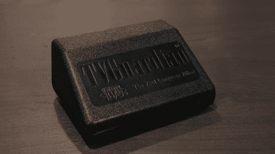

TVG Model 101 Gumby ([Technology Connections](https://www.youtube.com/watch?v=ZiXg6H_FycI))

早在 1999 年，我的公司承担了一个 TVG 产品的重新设计项目，这是一个用净化过的对等物取代闭路字幕中的脏话的盒子。我们的第一项任务是采用现有的限量生产的设计，并对其进行改进，使其更易于生产。

最初的 PCB 使用所有的通孔元件，不适合大批量生产。将这些器件替换成表面贴装器件，就产生了 101 型号，内部命名为 Gumby，原因早已失传。如果你眼尖，你会注意到棋盘上的两个部分有些奇怪，如[【食本者】的视频](https://www.youtube.com/watch?v=a6EWIh2D1NQ)所示。微芯片 PIC 和 Zilog OSD 芯片有两个重叠的足迹，一个用于通孔，一个用于 SMD。尽管我们更喜欢 SMD 器件，但有时还是会有供应问题。这是我们在公司的几个设计中使用的一种技术，用来对冲我们的赌注。它还允许我们使用插座式 IC 进行测试和开发。

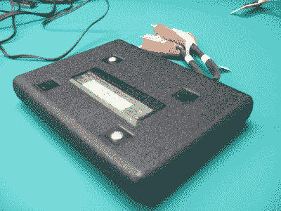

The Gumby Light, Easy to Carry on Business Trips

101 模型案例在视频中受到了一些抨击，这是理所应当的。外壳模具是在我参与之前制作的，但我们收到的原始原型放在一个盒子里，这个盒子太贵了，无法用于生产，而且它的背面有一个锁定门，表面上防止人们拔掉电缆。当时，我们的客户已经许可了至少一种其他口味的盒子，称为“无诅咒电视”( [[foone]获得了他们收藏的其中一种](https://twitter.com/Foone/status/1594735363137732613))，这需要一个模具插件来改变品牌。我不记得为什么会有未使用的 RF 输入的细节，但这要么是监管要求，要么只是 20 世纪 90 年代市场上可用模块的结果。我的同事为旅行打造了一款独特的平板手机(没有射频调制器)。我们称之为“甘比之光”。

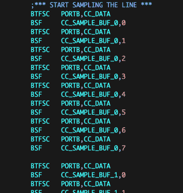

Portion of PIC Assembly that samples Line 21

关于 Zilog Z86129 CC/OSD 芯片，我想提到的一个不明显的事情是，它只使用了一半。’129 作为独立的 CC 处理器工作，并且不提供对解码的 CC 数据流的访问。Gumby 的设计完全忽略了芯片的这一半，仅将‘129 用作 OSD 发生器。相反，最初的设计者使用非常聪明/邪恶的汇编语言将 21 行数据阈值化并转移到 PIC 中。共有 96 对位测试/位设置指令，无论 CC 数据限幅器比较器是高电平还是低电平，每一对都在相同的时间内执行。

正如[Alec]在他的视频中指出的那样，有一个开关可以关闭过滤，将盒子变成一个外部 CC 解码器。在这些产品销售的这些年里，对这种功能的需求很小，所有的设计都保留了这种功能。尽管联邦通信委员会要求所有新电视都要有内置字幕解码器，但一些拥有老式或小型电视机的观众仍然想要字幕，并为此订购了这些型号。

## 脏话词典

当我看到[Ben Eater]开始连接串行 EEPROM 以取出诅咒语时，我想起了 Gumby 生产加速期间的一个有趣事件。制造商要求批准该 EEPROM 的替代供应商。在我检查了数据表和一些样品后，我批准了这个请求。不久之后，他们带着一个神秘的失败回来了。我们很快追踪到问题出在电可擦可编程只读存储器上，并意识到数据都被打乱了。但奇怪的是，我可以重新编程，它工作得很好。我清楚地记得和服务公司的一位女士打了一个电话，我们曾经给芯片编程。他们遵循正确的程序，得到正确的校验和，我们感到困惑。沉默了很久，她突然打破了沉默，

> 你知道，这不关我的事，但是在你的魔法文件里有一些非常糟糕的单词。

作为对那次事件的回应，我对文本进行了粗略的加扰，不是为了加密，而是为了让随便浏览数据的人不会被满屏的咒骂击中。唉，本拆卸的部件是在此之前制造的。

我们最终发现了 EEPROM 的问题。这种替代品有一种块编程模式，将内容以不同于微芯片 93LC86 的顺序存入存储器。并非所有芯片编程器都实现了这一点，数据手册中也没有记录，但在向制造商索取更多编程文档时发现了这一点。

## 黛西和奥利弗

Model 201 Oliver (credit: Family Safe Media)

一旦 Gumby 的生产开始，就开始寻找能够处理新功能、扩展 I/O 选项(如 S-Video、数字音频和多路输入)的新设计。这比任何人想象的都更具挑战性。虽然芯片制造商在处理 CC 方面有多种选择，但他们都把精力集中在数字视频上。很明显，模拟 CC 正在走下坡路。Zilog 129 和它的姐妹芯片是非常诱人的竞争者。本质上，它们实际上是一个带有定制屏蔽 ROM 固件的 DSP /微处理器。我们探索了在修改固件的新设计中使用它的选项。获得 Zilog 的合作是艰难的，当我们得知芯片的 ROM 已经被填满时，我们放弃了这种方法。

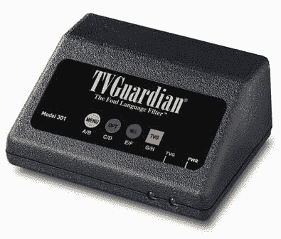

Model 301 Daisy (credit: Family Safe Media)

我们最终无意中发现了飞利浦半导体公司的 Painter 芯片，它太好了，不能错过。这是一个完整的 MCU (8051 ),内置所有 CC 电路，并带有 CC 和用户菜单 OSD 库。我在之前关于模拟隐藏字幕的文章中提到了这个芯片。尽管被告知这个部分是“秘密”的，我们最终还是得到了使用它的许可。这是我第一次，但遗憾的是不是最后一次，遇到零件的概念及其支持如此复杂，以至于制造商对谁可以使用它非常挑剔。尽管有这个障碍，飞利浦的团队还是很好合作的。Painter 设计构成了三种机顶盒模型的基础:

*   201 型奥利弗(2004 年)
*   301 型雏菊(2004 年)
*   奥斯卡 401 车型(2010 年)

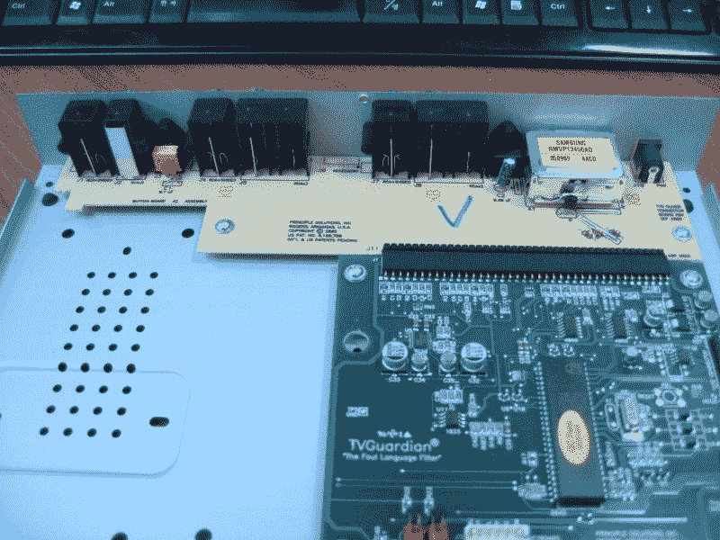

Two-board FR1/FR4 Solution was less expensive

奥利弗和黛西的设计，名字也不为人知，都是基于画家芯片，但输入数量不同。黛西只有一个，奥利弗有两个。数字音频很容易静音。除了使用不同的连接器之外，这与静音模拟音频没有什么不同。在这两种情况下，通过用 CMOS 4066 模拟开关中断信号来静音音频。最初两种设计都使用单板，但我们的合同制造商要求采用双板解决方案来节省成本。连接器安装在单面 FR1 板上，因此主四层 FR4 板可以更小。令我们惊讶的是，增加板间连接器和额外的处理成本更低，但这就是数字增加的方式。

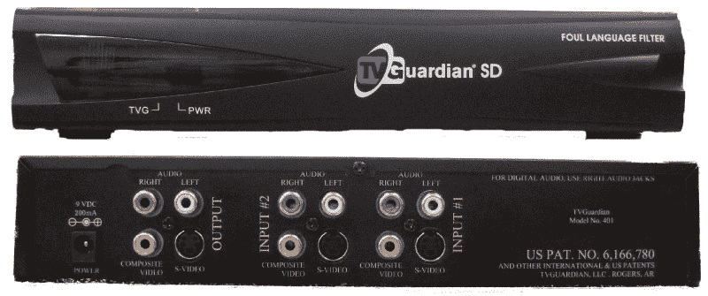

Model 401, Oscar (credit: Family Safe Media)

这种情况下模具插件在雏菊版本中派上了用场，因为我们可以将该区域用于薄膜键盘覆盖。Oscar 只是另一个名字，以与 Oliver 相同的字母开头，它代表了模拟系列机顶盒。这只是一个印刷电路板重新旋转，在 2010 年后，使用不同的外壳，可能是世界上最后的画家芯片库存。

## 宏视

尽管 Painter 解决方案很好，但它在机顶盒应用中存在一些问题。它被设计成存在于电视机内部，需要稳定的水平和垂直同步信号。我们不得不把它放在芯片外面。这通常是一个简单的设计，但由于需要容忍 Macrovision 当时的模拟复制保护(ACP)方案，因此变得复杂。ACP 以各种形式存在，它们都在视频的垂直消隐间隔(VBI)中插入不同幅度的额外同步脉冲。表面上，这些脉冲不会干扰电视机的高 Q 槽同步电路，但会对 VHS 录像机的同步和 AGC 电路造成严重破坏。我们在 Gumby 继承的 PIC 设计在固件中支持 Macrovision，但并不完美。这让我很担心，因为 ACP 的方法很多，而且容易改变。我不想测试机顶盒在现场可能遇到的所有不同形式。因此，我放弃了这部分电路设计，购买了 Elantec(现为瑞萨)EL1883 同步分离器芯片形式的现成解决方案，可以说是推卸责任。

第二个次要问题是，像 Zilog 芯片一样，正常的 CC 模块使用是作为一个独立的黑盒，不能读取/修改数据流。但这是在固件中实现的，很容易破解。我们能够在将数据提交给 CC 解码器功能之前获取并更改数据。

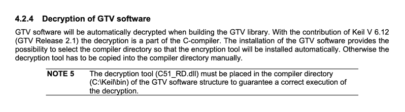

Reference to Keil Encrypted Source Files (from obsolete Philips manual)

Philips 提供的 Painter 支持固件不完全是预编译的库。根据应用程序所需的特性，构建的某些方面需要重新编译某些专有的源代码文件。飞利浦提供了这些文件作为加密的源代码和一个名为`C51_RD.dll`的 Windows DLL 形式的解密工具。他们与 Keil 合作，以便编译器知道每当文件带有**时就使用这种解密算法。遇到了 ec** 扩展。我推测这个能力一定不再是凯尔的一部分，因为我在 2022 年的网上找不到任何关于它的提及。

## 在后缘

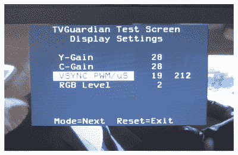

Factory Test Screen for Adjusting Vsync Pulsewidth

虽然 1883 年解决了宏视问题，但仍有一个小问题。VSYNC 信号的上升沿是精确指定的，但下降沿不是，换句话说，VSYNC 的脉冲宽度不受控制。事实上，不同的芯片之间差别很大。这并不好，因为画家的 CC 解码是在 VSYNC 的后沿同步的。原来，可以通过改变外部电阻器`Rset`的值来调整脉冲宽度。

我们通过增加一个工厂校准步骤来解决这个问题。油漆工测量并向操作员显示 VSYNC 脉冲宽度，操作员使用两个测试夹具按钮上下调整宽度，直到脉冲宽度达到所需值，油漆工使用 PWM 输出改变有效 Rset 值。出于好奇和 Elantec engineering 的要求，我们在 2004 年第一次制作时收集了超过 1000 个这样的设置，以描述传播的特征。

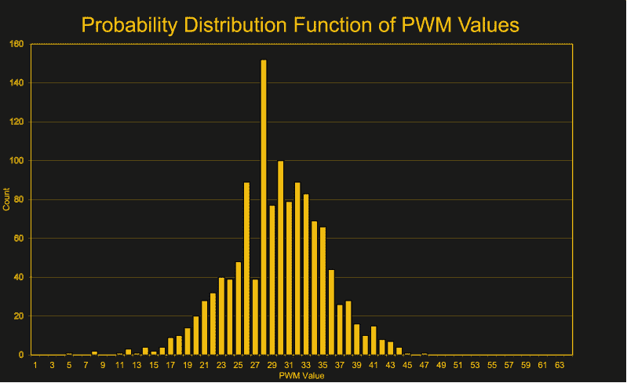

Observed Probability Distribution of Vsync Variations

## 全数字化？赫伯特计划

机顶盒设计多年来保持稳定，该项目最终结束。数字电视和视频的出现使得这些设备中的技术过时了。至少我是这么认为的。2010 年，我被要求使用 HDMI 视频进行一项新的设计。TVGuardian 发明人[Rick Bray]发现，大多数 HDMI 视频源继续提供与 CC 信号同步的模拟复合视频输出。就这样，我开始设计一款新的机顶盒，取名为赫伯特——这是一个以“H”开头的随机名字，代表高清视频。

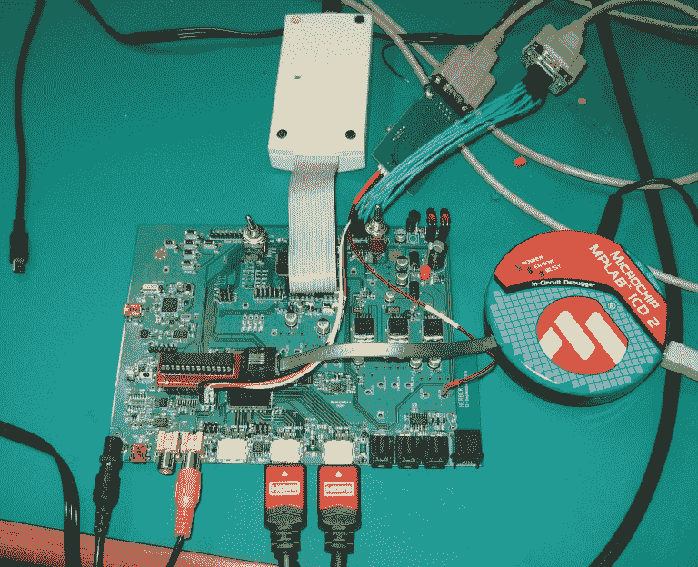

Testing the First Herbert Prototype on the Bench

进入 HDMI 视频设计的世界并不适合胆小的人。入场费很高，HDMI 和 HDCP 组织都要求很高的年度会员资格以及单位版税——这些实际上是合理的。现有的 HDMI 芯片都不支持 CC，因为没有通过 HDMI 接口传输的 CC 数据，这一点我在本文的[中讨论过。我们最终选择了 ADI 公司的 ADV7623，这是一款支持 OSD 文本和图标的 HDMI 中继器芯片。这是制造商承诺提供最少支持或不提供支持的部件之一，特别是因为我试图以一种非预期的方式使用它——即动态改变文本而不是固定的 OSD。](https://hackaday.com/2021/05/27/history-of-closed-captions-entering-the-digital-era/)

Model 501, Herbert (credit: Family Safe Media)

ADI 公司的工程师比我们预期的更乐于助人。虽然这是一个漫长而令人沮丧的黑客攻击，但我最终找出了 OSD 系统的各种隐藏和未定义的行为，并使其工作。除了制作 CC 解码器的最初目标之外，韩国的另一个客户希望使用该芯片在屏幕底部生成滚动文本爬行。自然，他既想要英语文本，也想要韩语文本(韩文)。这也是另一个有趣的技巧，生成外语符号，并在屏幕上一次一个像素地平滑移动它们。Herbert 平台支持 501 型产品，以及其他一些需要在 HDMI 上覆盖动态 OSD 的应用。

## 不是电话插孔

我设计的一个有趣的配件，但从未售出，是一个用于环绕声系统的中央声道音频静音开关。Herbert 的背面有一个 6P6C 模块化连接器，为该配件提供辅助电源和静音信号。这里的想法是，95%的电影对话来自中央声道扬声器，当只有文字被静音而其他背景声音被保留时，静音不那么刺耳。我不需要解码、修补和重新编码环绕声信号，只需切换连接中置声道扬声器的电线。然而，这是一个相当昂贵的模块——它使用继电器来静音，并在静音时接入 8 欧姆的功率电阻，以欺骗放大器认为扬声器仍然连接着。否则，一些放大器会检测到故障并关断。

## “哇你”和“哦 Crud”

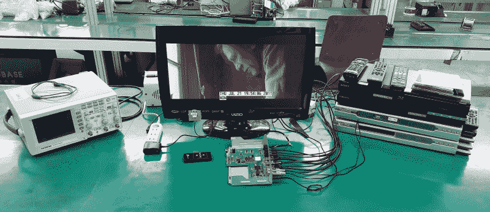

Herbert Factory Test Station Two

工厂测试需要一个长的可重复的隐藏字幕源，其中包括脏话。一开始，工厂使用南方公园动画情景喜剧的 VHS 拷贝。后来，我尝试了各种定制的 VHS 磁带、DVD 电影，甚至安装了双 CC 生成器卡的计算机。我最终决定制作两张定制 DVD。这些有一个视频色条测试模式和 21 行数据，包含在骂人和不骂人之间交替的单词。这是 WOW YOU 和 OH CRUD 测试光盘，使用了两种不同的光盘/短语，以便操作员能够区分频道 1 和频道 2。测试 Herbert input 的完整设置使用了两个提供 HDMI 视频的 DVD/BD 播放器，以及两个包含生成复合视频的 CC 光盘的 DVD 播放器。对于输出，使用监视器来检查 HDMI 输出，使用带光学同轴数字适配器的示波器来检查静音，使用一对 led 来检查从未使用过的辅助连接器。

## 兔子和莎莉计划

所有这些封闭设计和专业芯片的经历真的困扰着我，我继续寻找替代方案。在 HDMI 方面，我对应用[Bunnie Huang]为 NeTV 开发的技术非常感兴趣，我们早在 2012 年就讨论过这个问题。我用他的开发工具包进行了试验，但是我无法说服我们的任何客户承担在产品中使用他的方法的法律风险。

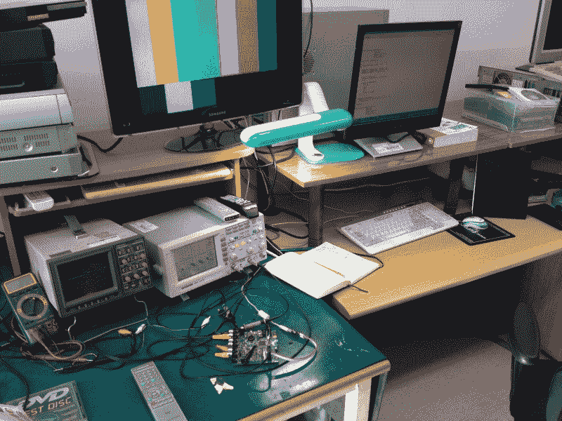

Project Sally in Development

我在一个内部设计上取得了更大的成功，我称之为 Sally——这个名字很无聊，因为“S”代表 SD 视频。我受到各种基于 Arm 的项目的启发，这些项目直接为复古游戏生成 VGA 信号。但是在我看来，这些像素缓冲区浪费了大量的内存。后来有一天，我意识到一个计时器-计数器寄存器可以作为 DMA 传输的目的地(至少在 LPC1768 上)。这意味着你可以用游程编码的方式更有效地存储像素数据。一行像素只是振幅和计时器持续时间的短暂缓冲。我构建并演示了这种方法，成功地生成了测试视频模式或 CC 信号。它还可以与输入的视频信号同步，以覆盖菜单和 CC 数据。唉，这种设计从未投入生产，但我可能会在以后的文章中再次讨论这个问题。

## 最近关于 TVGuardian 的视频和帖子

*   [亚历克·沃森]的技术联系[视频“这个电视小工具用 1980 年代的技术审查不良词汇”](https://www.youtube.com/watch?v=ZiXg6H_FycI)
*   【食本者】的后续视频，标题为[“黑掉一个奇怪的电视审查设备”](https://www.youtube.com/watch?v=a6EWIh2D1NQ)，我们在这里[报道过](https://hackaday.com/2022/11/21/reverse-engineering-the-seven-words-and-more-you-cant-say-on-tv/)
*   【RetroStuff】的帖子[“TV guardian 101 和 201 污言秽语过滤器”](https://retrostuff.org/2021/10/27/tvguardian-101-and-201-foul-language-filters/)(其实是去年的)
*   [foone]的[各种 TVG 模型的大量实验](https://twitter.com/Foone/status/1594735363137732613)