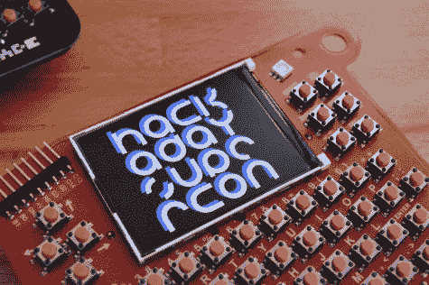
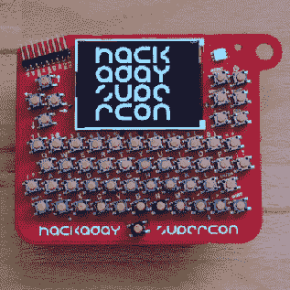
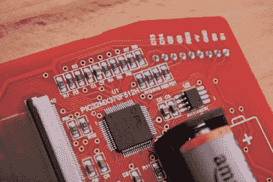
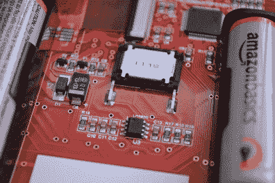
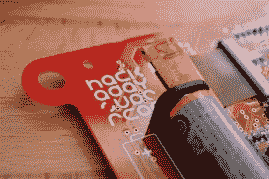
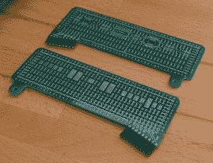
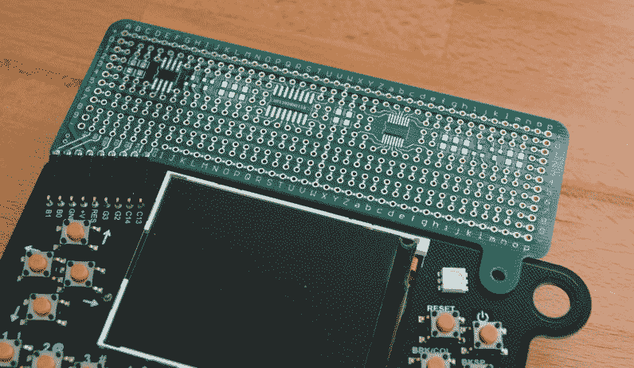

# 超级警徽是一台奇怪的电脑

> 原文：<https://hackaday.com/2018/10/17/the-supercon-badge-is-a-freakin-computer/>

它挂在你的脖子上，伴随着入场费，将吹走一台 20 世纪 80 年代的台式电脑。这是 Hackaday Superconference 徽章，你可以通过终极硬件会议的入场费得到一个徽章。

每个进门的人都会得到一个 320 x 240 彩色显示屏、全 qwerty 键盘和无限黑客潜力的徽章！股票固件运行一个基本的解释程序，CP/M 操作系统，并包括游戏和复活节彩蛋。这是一个巨大的游乐场，我们想看看在为期三天的 Supercon 期间，您可以使用这种定制硬件做些什么。[现在就买票](https://www.eventbrite.com/e/hackaday-superconference-2018-tickets-47386813234?aff=1017com)，休息之后，请和我一起观看演示视频和更多信息。

 [https://www.youtube.com/embed/p5FqnL5tUyQ?version=3&rel=1&showsearch=0&showinfo=1&iv_load_policy=1&fs=1&hl=en-US&autohide=2&wmode=transparent](https://www.youtube.com/embed/p5FqnL5tUyQ?version=3&rel=1&showsearch=0&showinfo=1&iv_load_policy=1&fs=1&hl=en-US&autohide=2&wmode=transparent)

这个由 Voja Antonic 设计的徽章在 5 月份的贝尔格莱德 Hackaday 会议上首次亮相，并在 super co 上再次亮相。它看起来很神奇，但是直到你把它拿在手里，你才意识到在令人难以置信的点击键盘上敲打一些基本代码是多么有趣。看看这个有趣的数字:我们订购了 30，000 多个瞬时开关来装配这些徽章！

## 硬件设计和黑客

    

徽章上的显示是一流的，并为高度可读的文本提供了足够的空间。当然，它是全彩色的，需要一些很棒的视觉效果——有人演示一下吗？该徽章由 Macrofab 组装，macro fab 也捐赠了部分组装费用。他们使用红色 PCB 作为原型——你看到的是 5 个中的第一个——但最终的阻焊膜将是黑色的。在右上方，您可以看到白色组件是一个可从 BASIC 解释器内部控制的 RGB LED。

    

艰苦的工作发生在徽章的背面。PIC32MX370 微控制器驱动一切，SST26VF016BT 闪存芯片用于额外的 16 MB 存储——这两个芯片都是 Microchip 为该项目慷慨捐赠的。

板上还有一个扬声器和放大器电路。没错，这个徽章播放音乐！您可以用 BASIC 或 C 语言编写三声部音频。

  Expansion header  Lanyard hole, and expansion mounting hole  Expansion boards (front and back)  Expansion board in place

Supercon 的新功能是硬件黑客突破板。它附在徽章顶部的分接头上，包括一个用于螺栓和螺母的孔。这里显示的是原型，最终版本将是黑色的，包括三个“[傻逼附加组件](https://hackaday.io/list/161121-shitty-add-ons-2018)”(SAO)的足迹。如果你想把自己的骚带到 Supercon，这里有[的设计规格](https://hackaday.io/project/52950-shitty-add-ons)。

扩展接口包括四个 GPIO 引脚，可以通过 BASIC 解释器进行控制。有 I2C 和 UART 串行中断的引脚。标题也用于对徽章进行编程。如果你有一个 PICKIT，请把它带到 Supercon。如果有的话，你还应该带一根 USB 转串行线。(不像你会不带它就离开家，对吧？)

在贝尔格莱德的哈卡代，我们看到了各种各样与头球有关的东西。午饭前，WiFi 网络上有一个徽章，你可以登录并在手机浏览器的屏幕上绘制。有徽章通过远程无线电软件狗交流。今年，我们希望看到通信黑客和大量的珠宝！

## 固件黑客

固件由 Jaromir Sukuba 设计，今年仍在进行中[。他从一个现有的令牌化器开始，在添加特定于硬件的功能之前充实了核心功能:播放音乐、控制 LED、控制 GPIO、写入屏幕、查看和戳 RAM 位置等等。他还添加了 CP/M 操作系统，并配置了闪存芯片作为其磁盘空间。](https://github.com/Hack-a-Day/2018-Supercon-Badge/)

我们建议您开始考虑涉及以下内容的黑客攻击:

*   基本语言
*   音乐(寻找或安排最多使用 3 种声部的曲目)
*   为 CP/M 编写代码(或定位现有程序)
*   使用 GPIO、I2C 或串行驱动您的外部硬件攻击

我们在 5 月份的贝尔格莱德会议上看到的最令人愉快的徽章破解是一个名为“[拍摄我的情人](https://hackaday.io/project/158740-shoot-my-valentine)”的双徽章游戏。每个玩家都有一艘指向另一个徽章的小飞船，当那个徽章发射激光时，你会看到它们从屏幕顶部出现在另一个玩家的徽章上。这就是我们今年希望看到的令人敬畏的创造力。有人能想出 4 人游戏吗？

## 不要错过！

Supercon 将会销售一空，你能保证得到其中一个徽章的唯一方法就是[拿一张票，出现在 Hackaday Superconference](https://www.eventbrite.com/e/hackaday-superconference-2018-tickets-47386813234?aff=1017com) ！十一月见。