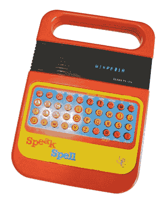
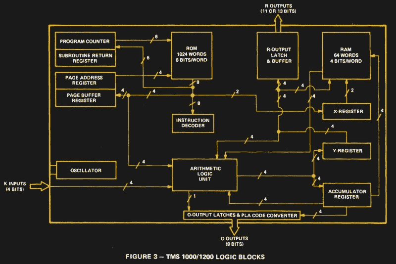
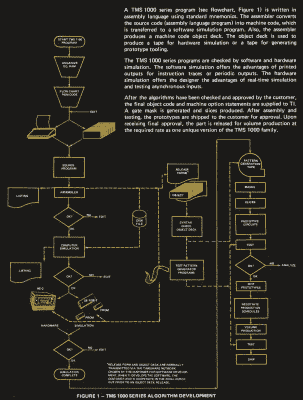

# TMS1000:首款商用微控制器

> 原文：<https://hackaday.com/2020/02/18/the-tms1000-the-first-commercially-available-microcontroller/>

我们毫不犹豫地使用微控制器，在应用中，我们曾经可能求助于 74 个逻辑芯片。但是我们当中有多少人考虑过微控制器是如何进化的呢？是时候回到几十年前，看看第一款商用微控制器——德州仪器 TMS1000。

## 想象一个没有微控制器的世界

The Texas Instruments [Speak & Spell](https://en.wikipedia.org/wiki/Speak_%26_Spell_(toy)) from 1978 was a typical use for the TMS1000\. FozzTexx ([CC-SA 4.0](https://commons.wikimedia.org/wiki/File:Speak_%26_Spell_(original_style).jpg))

公平地说，如果没有微控制器，我们在 Hackaday 上的许多项目将永远无法实现。我们当中那些还记得在广泛可用且易于编程的微控制器出现之前的日子的人会告诉你，对一个小型硬件项目进行计算机控制当然是可能的，但这将涉及构建一个完整的计算机系统，而不是投入一个单独的芯片。我记得带板上的 Z80 系统，Z80 本身以及 EPROM、RAM 芯片、74 系列解码器逻辑和外围芯片，如 6402 UART 或 8255 I/O 端口。闪烁一个 LED 或留意一两个微动开关在结构和成本上都成了一项重大任务，所以我们只有在应用确实需要时才会去做。这种情况在 20 世纪 90 年代初对我来说发生了变化，当时第一个带板载 EEPROM 的经济型微控制器上市，但那时这些芯片已经存在了几十年。

这对现代人来说似乎很奇怪，但对于 1970 年左右的工程师来说，台式计算器比台式计算机更令人兴奋。然而，许多第一批微型计算机在设计时就考虑到了计算器，例如 Intel 4004。每个计算器制造商都推动了处理器芯片的进步，这导致德州仪器在 1971 年开发了第一个一体化单芯片微控制器，作为预编程 CPU，旨在提供芯片上的计算器。又过了几年，直到 1974 年，他们才生产出 TMS1000，这是一种用于一般用途的单芯片微控制器，也是第一个上市的此类器件。

有必要花点时间来考虑一下其中涉及的一些术语，因为在 1974 年，我们当前的一些词汇并不一定被普遍使用。TI 将 TMS1000 作为微型计算机进行营销，因为他们认为它是一台不需要额外外围设备的一体化计算机。今天，我们会认为微型计算机是一种多合一的通用计算机，就像你可能正在阅读这篇文章的那种计算机，沿着一条完整的线一直延伸到同一年的 Altair 8800，但那时的词汇就像技术一样；处于起步阶段。那时，微控制器一词用于指具有独立 I/O 的计算机，*牛津英语词典*在 1971 年的一份 IBM 技术公告中引用了该词，但它似乎还没有成为通用的定义。相比之下，更现代的“片上系统”或 SoC 指的是一种通用的一体化计算机芯片，它向外界提供其内部总线，而不是一组 I/O 线或外设，就像在微控制器中一样。

## 微控制器需要有多简单？

The internal architecture of the TMS1000.

当时，TMS1000 是第一款商用微控制器。但是它是什么样的芯片呢？在最初的系列中有四个变种，都共享相同的哈佛架构的 4 位处理器，并具有不同数量的 I/O 线以及 ROM 和 RAM 大小。TMS1000 和 TMS1200 系列有 8192 位程序 ROM 和 265 位 ram，而 TMS1100 和 1300 系列有两倍于此的数字。有用于驱动真空荧光显示器的耐高压输出版本，它们提供 28 引脚和 40 引脚封装。以今天的标准来看，它的内部架构非常简单，没有你在最近的设计中所期望的寄存器库或流水线。它没有现代微控制器上的大量外设，但它的 I/O 锁存器由一个简单的可编程逻辑阵列补充。这可以用作编码器或解码器，数据手册[中的示例](https://archive.org/details/bitsavers_tiTMS1000TualDec76_3193454/mode/2up)将其用作 7 段显示解码器。

The complex process of TMS1000 software development.

你不会发现这种芯片是以单个数量出售给实验者的，因为它的板上掩模 ROM 只能由 TI 在制造时编程。因此，所有编码都是在 TI 操作的分时主机上的模拟器中进行的。这将产生一副穿孔卡，在非常复杂的调试和测试过程之后，这些穿孔卡将用于产生 ROM 编码的掩码。微代码甚至可以根据 TI 的命令进行修改，从而可能扩展设备的 43 条指令。掩码编程还意味着你今天发现的任何 TMS1000 仍然包含它制造时使用的任何软件；如果没有原始的硬件作为背景，它们除了作为历史珍品之外没有什么用处。这似乎并没有阻止一些供应商对它们附加令人垂涎的价格，但谢天谢地，如果你真的需要一个 TMS1000 在你的收藏中，他们仍然可以买到不是很多。

## 如果在 20 世纪 70 年代到处都有，为什么现在没有了？

![A die shot of a CMOS TMS1000\. Pauli Rautakorpi [CC BY 3.0]](img/ab8ce04aa544a4a716e19dc80b2bb062.png)

一个 CMOS TMS1000 的死镜头。到 20 世纪 80 年代，世界属于 8 位和 16 位微处理器和微控制器，因此，除了作为 TI 计算器芯片的核心在几年内未被发现之外，TMS1000 系列最终退役，并在电子历史中悄然消失。有趣的是，它的一些同时代产品仍然和我们在一起，你仍然可以买到大量的 PIC，8051，Z80，甚至 6502 衍生产品，但没有 4 位 TI 处理器的直接继任者。技术的进步是造成这种情况的罪魁祸首之一，但也许神秘的软件开发也是导致其灭亡的原因之一。这些 8 位 CPU 仍然和我们在一起，因为任何人都可以拿起开发板和 EPROM 程序员并开始编码，所以他们吸引了精通其架构的核心开发人员。相比之下，TMS1000 开发人员肯定少之又少，当然也不足以要求后续芯片。有一些特殊的处理器开发版本加入了采用外部 ROM 的范围，但那时市场已经向上转移了 4 位。

如果你今天遇到一个 TMS1000，很可能你手中会有一个 70 年代后期的电子游戏，比如 TI 自己的 Speak & Spell，或者 Milton Bradley 的 [Simon](https://en.wikipedia.org/wiki/Simon_(game)) 。甚至这些游戏存活的时间也比它们原来的处理器长；你仍然可以从美泰公司买到现代版的西蒙，TI 的语音学习玩具系列一直延续到 20 世纪 90 年代。这种处理器的遗产是巨大的，今天可以在每一个包含微控制器的电子设备中看到。如果你有一个，这是一段真实的历史！

标题图像:Antonio martíCampoy[[CC BY-SA 4.0](https://commons.wikimedia.org/wiki/File:TMS1000.jpg)]