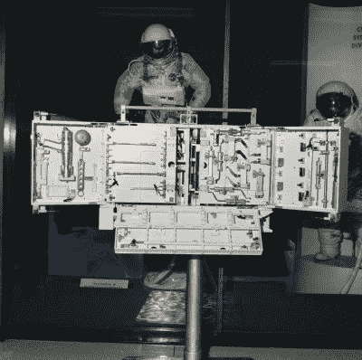
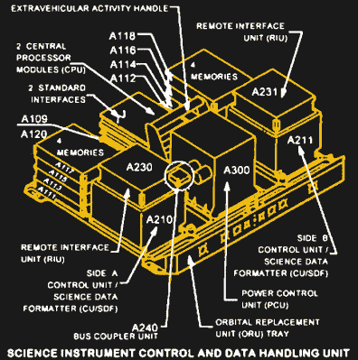

# 哈勃的麻烦:有效载荷计算机故障停止了太空天文台的科学研究

> 原文：<https://hackaday.com/2021/07/02/the-trouble-with-hubble-payload-computer-glitch-stops-science-at-the-space-observatory/>

哈勃太空望远镜非常长的使用寿命和它对天文学的一系列惊人贡献掩盖了它多灾多难的历史。早在 1990 年发射到近地轨道之前，哈勃就遭受了设计冲突、资金和预算压力，甚至七名宇航员的死亡。经过长时间的延迟，大量的修改，并错误地用次优的光学系统将哈勃送上太空，哈勃仍然设法提供了从字面上改变了我们对宇宙的看法的结果，并且可能是比任何其他单一来源更多的屏幕保护程序和桌面图片的原因。

但这一切都在今年 6 月 13 日发生了变化，当时哈勃遭遇了一次计算机故障，中断了来自轨道天文台的科学数据流。目前还不清楚哈勃望远镜目前的问题将如何解决，以及这对这一几乎不可替代的科学资产的未来意味着什么。当然，我们都抱着最好的希望，但是在我们等待看到发生什么的时候，有必要借此机会潜入哈勃内部，看看它的工程设计，以及那里到底出了什么问题。

## 最重要的是

甚至在 20 世纪 60 年代初，当人类首次尝试进入太空时，将望远镜放在我们都生活在其中的翻滚的大气汤上方的想法就不是一个新的想法了。在他们登上月球之前，美国国家航空航天局就渴望在地球轨道上放置一个大型反射望远镜，暂定目标是在 1979 年底实现。他们认识到，这样的安装需要频繁的访问来维护和升级，因此未来的太空望远镜的设计与 NASA 打算取代阿波罗时代强大的一次性火箭的计划一起进行:可重复使用的太空飞机，即后来被称为航天飞机。

航天飞机和太空望远镜的平行发展，最终以美国天文学家埃德温·哈勃的名字命名，导致了设计决策，这将在未来带来巨大的红利。哈勃从一开始就被设计用来服务，特别是航天飞机任务。因此，携带望远镜和所有各种科学仪器的航天器可以切换到它的光路中，有大量的手柄，系绳点，以及容易进入的舱口和隔间，所有这些都是为了让太空行走的宇航员更容易执行他们的任务。在宇宙飞船的许多设备舱里，仪器用标准化的紧固件连接，设计成用戴手套的手操作。哈勃甚至还配备了一整套专业工具，供未来的服务任务使用。

All the best vehicles come with a nice toolkit. Hubble’s specialized service tools. Source: NASA

哈勃的设计者时刻关注着进步的步伐，他们知道他们在 20 世纪 80 年代所能想到和建造的仪器与随后无疑会出现的相比将会相形见绌。为了防止内部老化，哈勃被特别设计，不仅考虑了维修，还升级了它的科学包。实际上，哈勃望远镜在其使用寿命中唯一不变的部分是光学望远镜组件，包括著名的错位主镜、副镜和支撑结构，如保持它们对齐的桁架和控制反射的挡板。

主镜后面的仪器舱被设计成可以同时容纳 5 台科学仪器。哈勃的第一次服务任务于 1993 年由奋进号发射升空，使斯托里·马斯格雷夫和凯瑟琳·桑顿家喻户晓，其中包括 COSTAR 校正光学组件，该组件恢复了哈勃的精细聚焦，使其能够探索宇宙中最微弱和最远的物体。几年来，十几台其他的光谱仪和照相机一直占据着设备间，有些只放了几年；其他的则是哈勃的永久部分，从一开始就产生数据。

## NASA 标准宇宙飞船计算机:为改进而制造

哈勃的设计者在认识到需要更换哈勃上的科学包时表现出的远见也影响了他们对航天器其他领域的设计。早在 20 世纪 70 年代中期，美国宇航局就意识到，为每个任务建立定制的子系统，这在水星、双子座和阿波罗的载人航天飞行中非常有效，将成为开发和部署各种航天器探索近空间的障碍。为此，美国宇航局开发了标准航天器计算机-1 (NSSC-1)，其目标是将复杂的业务标准化，使几乎所有携带它的航天器保持稳定并在轨道上运行，并运行任务规划者可以想到的任何科学，基本上只需改变软件即可完成所有这些工作。

The Hubble SI C&DH. The NSSC-1s are called out as CPUs at the back of the tray, flanked by the stacks of primary and backup memory modules. Source: NASA

在进入哈勃设备舱之前，NSSC 1 号执行了一系列任务。按照现代标准，这台计算机似乎很原始，只有分立的 TTL 芯片和仅仅 64k 的 18 位核心内存([镀线内存](https://en.wikipedia.org/wiki/Plated_wire_memory)也被使用，看起来是最初搭载在哈勃的 NSSC 1 号上的)。但这种设计是鲁棒的，抗辐射的，在模块层面上是冗余的，最重要的是，它第一次给了任务规划者以前的航天器控制器基本上没有的东西:飞行中的可编程性。

在哈勃上，NSSC 1 号形成了一个被称为科学仪器指令和数据处理单元，或 SI C&DH 的子组件的核心。这是一个很大的托盘，上面连接着 NSSC 1 号模块和其他模块，如电源调节器、科学仪器接口和远程控制接口。一切都是多余的，整个组件是为了支持太空行走的宇航员交换而建造的。事实上，2009 年支付给哈勃的最后一次服务电话包括用一个新单元替换 SI C&DH，一个将原始核心内存模块升级到 CMOS 的单元。下面的视频显示了 SI C&DH 在上楼之前正在进行地面测试。

 [https://www.youtube.com/embed/dw3p6QjmQvA?version=3&rel=1&showsearch=0&showinfo=1&iv_load_policy=1&fs=1&hl=en-US&autohide=2&wmode=transparent](https://www.youtube.com/embed/dw3p6QjmQvA?version=3&rel=1&showsearch=0&showinfo=1&iv_load_policy=1&fs=1&hl=en-US&autohide=2&wmode=transparent)

## 楼上有麻烦

哈勃当前的问题集中在 SI C&DH 组件上，媒体仁慈地称之为“有效载荷计算机”6 月 13 日，该装置中的 NSSC-1 进入安全模式，这就是广泛报道的“小故障”。最初的诊断让操作人员怀疑其中一个内存模块已经退化到计算机无法继续运行的程度。一个降级的内存模块究竟是如何导致这个问题的，这是一个谜；NSSC-1 一次只需要一个内存模块即可工作，其余三个——以及备份 NSSC-1 中的四个内存模块——都留着备用。但考虑到现有的数据，这似乎是最合理的解释。

从错误状态中恢复的最初尝试几乎是我们首先尝试的:关闭并再次打开它。这样做的命令于 6 月 14 日发出，但无济于事。下一步是将 NSSC-1 切换到三个备用内存模块中的一个，但该命令也遇到了失败。这一诊断和其他诊断使美国宇航局认为，问题可能根本不在于 NSSC 1 号或其内存模块，而是 SI C&DH 上的其他模块，特别是标准接口(STINT)硬件，或中央处理器模块(CPM)。

检验这个假设需要一个激进的步骤:在太空中第一次打开备用的 NSSC 1 号。该备份只在地球上进行了测试，自 12 年前安装以来一直处于休眠状态。这一步是在 6 月 23 日和 24 日采取的，数据表明备份计算机遭受了与主计算机完全相同的故障。

在极端情况下，闲置了十多年的主计算机和备用计算机不太可能在完全相同的时间以完全相同的方式发生故障，因此该测试提供了强有力的证据，表明故障存在于其他地方。目前的想法是，两台计算机共享的 SI C&DH 上的某个其他硬件实际上导致了故障，内存错误只是一个症状。美国国家航空航天局(NASA)正在研究指挥单元/科学数据格式化器(CU/SDF ),它将命令格式化并发送到各种科学仪器，并将数据发送到地面，这可能是罪魁祸首。另一个疑点是电源控制单元，它调节和调节 SI C&DH 周围所需的各种电压轨。

## 结束了吗？

虽然听起来美国宇航局对哈勃发生的事情处理得很好，但鉴于该航天器在过去 31 年中经历的一切，很难说恢复的几率在这一点上对它有利。这是一个遗憾，因为除了目前的问题，航天器和仪器都处于良好状态。但也有一个事实，自 2011 年航天飞机队退役以来，哈勃没有了它的设计服务，并不时地将其提升到更高的轨道以对抗大气阻力。

更不祥的是在 2009 年的服务呼叫中对哈勃进行的最后一次修改:将一种称为软捕获机制的设备固定在航天器的尾部。最初的目的是在航天飞机的有效载荷舱中提供一种将哈勃返回地球的方法，现在 SCM 的目的是为未来的脱轨任务提供一个连接点。如果任其自生自灭，哈勃将在 2028 年至 2040 年间的某个时候自然脱轨，其轨迹可能会使 800 多公斤的镜子至少部分完好无损。SCM 将允许 NASA 更精确地控制重返大气层，给哈勃一个快速而有尊严的结束，结束长达几十年的无与伦比的科学成就。

在我们看来，一个假设的脱轨任务可以很容易地成为一个轨道推进任务，但这是假设美国宇航局将能够清除当前的错误，让哈勃重新工作。这里希望这正是所发生的，并且 SCM 不需要比必要的早一分钟使用。

非常感谢[大卫·安德斯]收集了一堆关于 NSSC 1 号和 SI C&DH 的优秀资料，并把它们发布在 hackaday . io 上。这是这篇文章的无价之宝。

[主图片[通过维基共享资源]( href=)