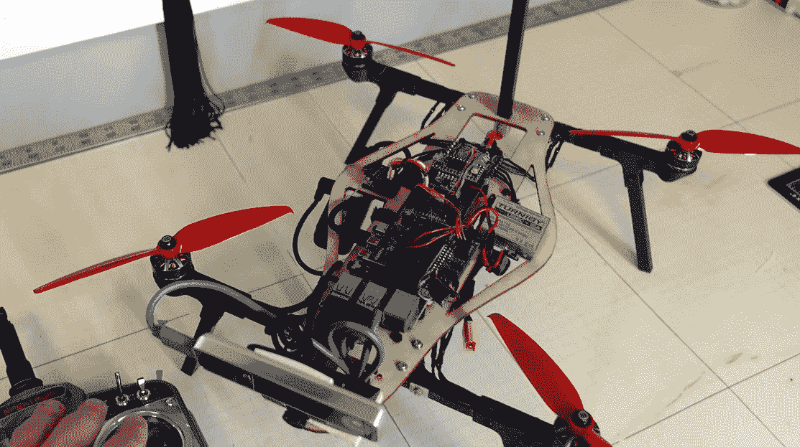

# 空中机器人的独特挑战

> 原文：<https://hackaday.com/2022/06/10/the-unique-challenges-of-aerial-robotics/>

当我们想到机器人时，我们许多人首先想到的通常是某种固定在地板上的工业手臂，或者可能是一辆在尘土飞扬的火星景观中跋涉的半自动漫游车。虽然这两种环境差别很大，但基本的“规则”却非常相似。在坚实的地面上，机器人可以清楚地了解自己的位置和方向，这大大简化了避免碰撞或与附近物体互动等任务。

但是当参考点消失时会发生什么呢？当机器人在空地上飞行或在半空中盘旋时，它是如何导航的？这只是尼克·雷姆感兴趣的问题之一，[他停下来主持本周的*空中机器人黑客聊天*](https://hackaday.io/event/185486-aerial-robotics-hack-chat) 来谈论他对飞行机器人的热情。他目前是约翰·霍普金斯应用物理实验室的一名航空航天工程师，在那里他致力于自主飞行车辆面临的独特挑战，如空中碰撞的检测和避免，以及垂直起飞和着陆(VTOL)系统的开发。但在他获得航空航天工程和旋翼机硕士学位之前，他和我们许多人一样，通过自己动手做项目来起步。

事实上，经常阅读 Hackaday 的读者可能会想起看过他的一些令人印象深刻的作品。他设计的使用计算机视觉追踪目标的[自主机器人登上了四月的头版。回到 2020 年，我们看了看他对 SpaceX 的星际飞船原型](https://hackaday.com/2022/04/29/this-machine-vision-ekranoplan-might-just-follow-you-home/)的[再造，它使用了控制表面和矢量推力的现实排列来执行飞船的标志性“腹部翻转”机动——尽管使用了 RC 马达和螺旋桨而不是火箭发动机。但即使在那之前，尼克回忆说，他请求母亲允许他拆开 Wii 控制器，这样他就可以在他正在研究的木制框架三翼直升机上使用它的惯性测量单元(IMU)。](https://hackaday.com/2020/12/13/rc-starship-perfects-its-skydiving-routine/)

讨论这些爱好构建会将聊天引向 Nick 的 [dRehmFlight 项目](https://github.com/nickrehm/dRehmFlight)，这是一个 GPLv3 许可的飞行控制包，可以在相对低成本的硬件上运行，即与 GY-521 MPU6050 IMU 配对的 Teensy 4.0 微控制器。该项目旨在让爱好者轻松体验垂直起降飞行器，特别是那些在垂直和水平飞行剖面之间转换的飞行器，并为尼克自己的飞行器提供动力。

谈到更多的技术问题，尼克说，设计自动驾驶飞行器时最困难的一个方面是确定你的约束条件。他的意思是有一个明确的目标，即工艺需要做什么，关键是，需要做多长时间。飞行器需要能飞多远？有多快？它需要在目标位置徘徊吗？如果需要，徘徊多长时间？这些问题的答案将在很大程度上决定最终飞行器的形式，并且是决定是否值得实现从垂直起降向固定翼水平飞行转变的复杂性的关键。

但据尼克说，空中机器人最大的挑战是机载状态估计。也就是说，飞行器知道其相对于地面的位置和方向的能力。虽然高性能计算机变得越来越轻，传感器也有所改进，但他说，仍然没有什么可以取代地面跟踪系统。他提到，那些你见过的无人机编队飞行并协同完成任务的花哨演示几乎肯定会有一系列动作捕捉相机藏在旁边。这是一场令人印象深刻的表演，但极大地限制了这些无人机群的实际应用。

Nick’s custom Raspberry Pi 4-powered quadcopter lets him test autonomous flight techniques.

那么空中机器人的未来是什么样子的呢？尼克表示，像 ArduPilot 和 PX4 这样的开源项目仍然是业余爱好者的绝佳选择，但他看到了将传统自动驾驶仪与更多机载计算能力相结合的新平台的前景，如 Auterion 的 Skynode。更强大的飞行控制器可以实现同步定位和地图绘制(SLAM)等技术，这种技术使用环境的 3D 扫描来帮助机器人确定自己的方向。他还对能够在没有 GPS 的环境中实现自主飞行的[技术](https://www.youtube.com/watch?v=p8frNNYQNV4)非常感兴趣，这对于需要在室内或卫星导航不可用或不可靠的情况下操作的机器人飞行器来说至关重要。鉴于美国宇航局的*独创性*直升机令人难以置信的成功，我们想象这些技术也将在未来的火星空中探索中发挥不可估量的作用。

我们要感谢尼克主持了本周的*空中机器人黑客聊天*，这是最近记忆中最快的一个小时。他作为该领域的狂热爱好者和专业人士的经历提供了 Hackaday 社区所寻求的那种洞察力，他亲切地提出与几位参加聊天的人保持联系，以进一步讨论他们的项目，这表明了他对这个主题的热情。我们期待看到 Nick 取得更大的进步，也希望他将来能再次加入我们，看看他都做了些什么。

* * *

Hack Chat 是一个每周一次的在线聊天会议，由来自硬件黑客世界各个角落的顶尖专家主持。对于黑客来说，这是一种有趣和非正式的联系方式，但如果你不能现场直播，这些概述帖子以及发布到 Hackaday.io 的[文字记录确保你不会错过。](https://hackaday.io/event/185486-aerial-robotics-hack-chat)