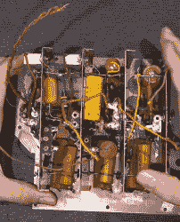
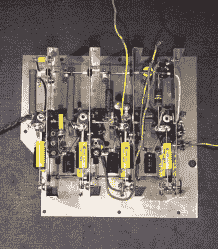

# Vedolyzer 是 1939 年的高科技维修装备

> 原文：<https://hackaday.com/2019/02/13/the-vedolyzer-was-high-tech-repair-gear-for-1939/>

有一个老笑话说，你只需要一个骗子、一个加热器和一个电表就能修好电视。如果你不记得的话，骗子是一根电线，用来控制电视上的联锁装置，这样你就可以在拆下后盖的情况下打开电视。当然，在现实生活中，专业维修技师总是有更好的设备。在 1939 年，这可能意味着最高的光电倍增管，它把一个仪表、一个望远镜和一个波长计结合在一起。[卡尔森先生]买了一个还不错的，并制作了几个关于拆卸和修复的视频(见下文)。

顺便说一句,[卡尔森先生]并没有把它修复成一个艺术项目。他计划使用它，所以他不太关心真实性，更担心可用性。这导致他做了一些事情，如移除输入插孔，并用 BNC 替换它们。这个视频系列有点耗费时间。第一部分大约 82 分钟长！但如果你对旧装备感兴趣，这是一个窥视不寻常标本内部的机会。

如果你不看别的，你应该看看重建的中心管组件。该模块中有相当多的旧组件，有些已经被其他人替换了。之前的图片(左)和之后的图片(右)很好地展示了[卡尔森]的技能。

Before Restoration

After Restoration

你可能会想，当他显然拥有最先进的设备时，为什么他会想要使用这样一件古董设备。我们明白了。就像你看到人们用老式的方法制作肥皂或花边一样，在某种程度上，用旧的测试设备来修复旧的收音机是令人满意的。

顺便说一下，Supreme 是密西西比州格林伍德的一家乐器公司。他们制造了许多设备，包括一个音频分解器(用于无线电维修)。顺便说一下，那个网站有用户手册和其他与仪器相关的文档的扫描件。

1939 年，工程师们可能不会维修很多电视——同年，美国无线电公司在世界博览会上推出了美国电视——所以这对大多数服务中心来说可能是一项风险投资。那个时候的[电视剧](https://hackaday.com/2018/07/03/philo-farnsworth-rca-and-the-battle-for-television/)历史挺有意思的。然而，我们最喜欢的专业电视服务工具是后来的[电视分析师](https://hackaday.com/2016/05/03/retrotechtacular-tv-troubleshooting/)。这是一个小电视台，它可以向出现故障的电视发送任何信号来隔离问题。

 [https://www.youtube.com/embed/RHv7EPef2E4?version=3&rel=1&showsearch=0&showinfo=1&iv_load_policy=1&fs=1&hl=en-US&autohide=2&wmode=transparent](https://www.youtube.com/embed/RHv7EPef2E4?version=3&rel=1&showsearch=0&showinfo=1&iv_load_policy=1&fs=1&hl=en-US&autohide=2&wmode=transparent)

 [https://www.youtube.com/embed/tUEkXAgqHFc?version=3&rel=1&showsearch=0&showinfo=1&iv_load_policy=1&fs=1&hl=en-US&autohide=2&wmode=transparent](https://www.youtube.com/embed/tUEkXAgqHFc?version=3&rel=1&showsearch=0&showinfo=1&iv_load_policy=1&fs=1&hl=en-US&autohide=2&wmode=transparent)

