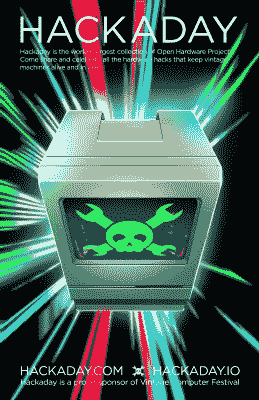

# 古董电脑节将于本周末在东部举行

> 原文：<https://hackaday.com/2019/05/01/the-vintage-computer-festival-east-is-happening-this-weekend/>

这个周末是东海岸第一次老式电脑聚会。[这是 VCF 东部](http://vcfed.org/wp/festivals/vintage-computer-festival-east/)，这一切都将在本周末，周五至周日下午，在新泽西的沃尔进行。

 2019 年对于计算机历史来说是梦幻般的一年，是 Unix 的 50 周年，也是雅达利的 40 周年。为此，将会有几十个运行某种*nix 的系统的展览，包括来自苹果、AT & T、DEC、IBM、NeXT、SGI 和 Sun 的系统。对于雅达利的盛会，你会得到雅达利 8-bitters，一些 STs，和一个猎鹰 030 全系列。将会有其他关于 POTS 的展览，所以带上一部固定电话，1/10 比例的进度更新，ENIAC 的脉冲级模拟器，肯定有人会有 C64 运行的超级马里奥兄弟。

主题演讲反映了计算机历史上伟大的一年，由独一无二的肯·汤普森，Unix 的共同发明者。周日，有一个与 Joe Decuir 的谈话，他是帮助开发雅达利 VCS 和雅达利 800 的工程师。还有一个自制计算讨论小组。

和往常一样，这里会有一个跳蚤市场，这是任何老式电脑节的低调亮点。这就像一个你可以买到的博物馆。曾经有一个苹果 IIc 的液晶显示器。对我的血统来说太丰富了，但技术上来说是第一台苹果笔记本电脑。

和所有东 VCF 的活动一样，它在第二次世界大战期间的 Camp Evans 信号部队研发实验室所在地[信息时代科学&历史中心](https://infoage.org/)举行。它基本上就是后来成为 DARPA 的地方。阿斯伯里公园的路边还有[银球弹球博物馆。这个周末在泽西海岸有很多可做可看的事情，而且现在还不是劳动节。](http://silverballmuseum.com/asbury-park/)