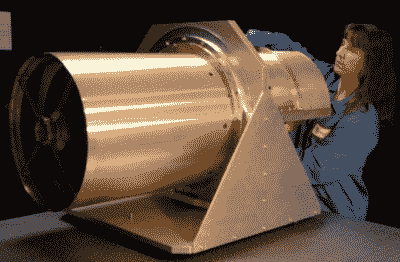
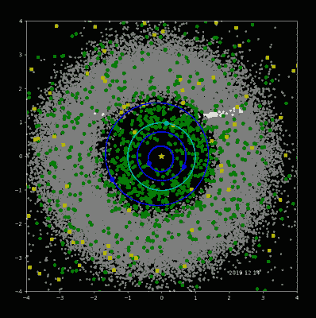
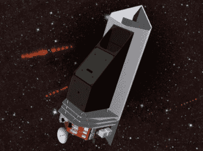

# NEOWISE 中的智者:冬眠的卫星如何醒来发现彗星

> 原文：<https://hackaday.com/2020/07/22/the-wise-in-neowise-how-a-hibernating-satellite-awoke-to-discover-the-comet/>

在过去的几周里，媒体一直在谈论 NEOWISE，这是有史以来穿过我们太阳系的最明亮、最壮观的彗星之一[，如果你抓紧时间](https://hackaday.com/2020/07/14/dont-wait-you-need-to-see-comet-neowise-right-now/)，你仍然可以看到它。虽然对这位星际旅行者的兴奋不仅仅是合理的，但这也是庆祝以命名的[宽视场红外巡天探测器(WISE)太空望远镜的绝佳机会。这颗特殊彗星的发现只是轨道天文台令人难以置信的发现任务的最新胜利，这项任务持续了十多年，没有任何迹象表明会很快放缓。](https://www.nasa.gov/mission_pages/WISE/main/index.html)

事实上，WISE 已经运行了很长时间，其任务已经超出了最初的范围。当它于 2009 年 12 月从加州范登堡空军基地发射时，它的主要任务计划在不到一年的时间内完成。但是就像在它之前的许多美国宇航局的飞船一样，WISE 实现了它最初的设计目标，并发现自己已经准备好迎接新的挑战。尽管在此之前，它已经休眠了近三年，因为该机构决定如何处理它。

## 天空，一次一张图

WISE 的主要任务是在红外波段的多个波长上对从地球上看到的整个天空进行成像。WISE 在大约 500 公里的高空运行，并小心地将望远镜指向远离行星表面和月球的方向，每 11 秒拍摄一张照片。最终，轨道天文台收集了数百万张图像，天空的每一部分都被拍摄了至少八次，因此它们可以被“堆叠”起来以提高精确度。

WISE’s telescope before installation.

这些图像是使用直径为 40 厘米(16 英寸)的望远镜和四个独立的红外探测器拍摄的，分别工作在 3.4，4.6，12 和 22 微米。为了最大限度地提高灵敏度，整个光学组件被安装在航天器上的低温恒温器内，并用一块固体氢冷却到大约 17 开尔文。只要望远镜和探测器能保持在这样的温度下，WISE 拥有比以前的红外观测飞船高几千倍的灵敏度。

到 2010 年 10 月，经过 9 个月的观察，最后的固态氢已经升华，望远镜的温度开始上升。在这一点上，WISE 已经完成了对天空的全面调查，并且大约通过了它的第二次行程的一半。虽然望远镜仍然可以在更高的温度下工作，但它收集的数据不再能够直接与任务“冷”阶段的数据进行比较；就这样，怀斯的主要使命结束了。

## 实验扩展

当然，WISE 耗尽冷却剂并不意外。任务规划者从一开始就知道他们在与时间赛跑，第二次巡天可能无法及时完成，但他们决定尝试从理想配置的望远镜中获得尽可能多的有用科学。一旦望远镜不再能够被主动冷却，就只是为航天器下降的能力找到一个合适的任务。

美国宇航局的行星部门提出了一项新的任务，他们称之为[近地天体智能(NEOWISE)](https://neowise.ipac.caltech.edu/) 。WISE 在其最初的全天勘测中已经发现了数千颗小行星，人们认为即使望远镜的灵敏度降低，进行另一次扫描也可以帮助识别潜在危险的附近物体。这个实验持续了四个月，足够完成另一次对天空的全面扫描。所有的数据下载完毕后，飞船被命令关闭发射器，并于 2011 年 2 月 1 日进入休眠模式。

## 行星防御

故事可能就此结束了。即使 WISE 没有重新启动，这次任务也会取得巨大的成功。但就在飞船进入休眠模式的近两年后，一颗小行星进入地球大气层，并在俄罗斯车里雅宾斯克上空爆炸。

Objects detected by NEOWISE since its reactivation.

这一事件释放的能量大约是广岛原子弹的 30 倍，提醒人们即使是相对较小的小行星也会带来危险。在提出未来探测和理想偏转类似物体的方法的压力下，美国宇航局决定重新启动成功的 NEOWISE 计划。

在 2013 年 9 月与卫星建立通信后，地面控制人员命令飞船将望远镜指向深空，开始散发其积累的热量。一个月后，望远镜温度降到了 75 开尔文，红外探测器被尽可能地重新校准。

这不是一个完美的解决方案，因为增加的工作温度和望远镜软件的限制意味着 NEOWISE 很难识别直径小于 100 米的物体。即便如此，自从重新启动以来，天文台已经能够识别数百颗附近的小行星；其中近 50 种被列为潜在危险。

## 疲惫的监护人

宽视场红外巡天探测器至今仍在 NEOWISE 计划下运行。3 月 27 日，它发现了这颗最终被命名为的彗星，这证明了该天文台在其主要任务结束十年后仍然具有科学价值。自 2013 年重新启动以来，NEOWISE 已经对天空进行了第 14 次全面扫描，对太阳系中的 37，000 多个物体进行了近百万次红外测量。

NEOCam could be launched by 2025

即使考虑到这个冬眠后计划是多么成功，事实仍然是天文台的硬件已经过了它的全盛时期，并且正在被用于一个它从未打算过的任务。历史将回顾像 NEOWISE 和开普勒的 K2 这样的项目，它们是有史以来设计的最辉煌的任务扩展，但它们不应该被认为是启动新任务的替代品。

[近地天体相机(NEOCam)望远镜](https://neocam.ipac.caltech.edu/)是专门为 WISE 设计的，作为一个专门的天文台，用于探测和分类太阳系中的小行星和彗星，最终目标是找到偏转或抵消发现与行星碰撞的物体的方法。

不幸的是，为这项任务获得资金一直很困难，该项目已经有过几次失败的开始。因此，在 NEOcam 或类似的航天器解除它的职责之前，WISE 将继续坚守岗位，尽最大努力向我们发出预警，以防任何宇宙旅行者向我们迎面而来。