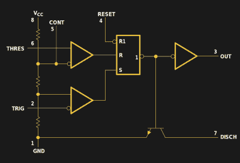
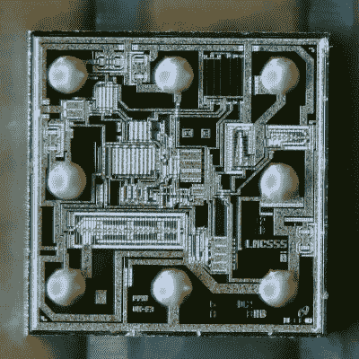
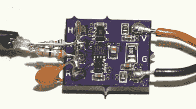
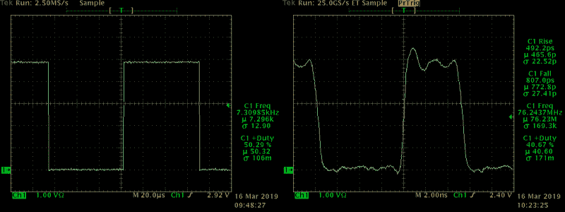

# 制作世界上最快的 555 定时器，或者使用现代集成电路版本

> 原文：<https://hackaday.com/2019/03/25/the-worlds-fastest-555-timer-and-the-state-of-the-555/>

如果你不熟悉 555 定时器，可以说这款多功能集成电路可能是有史以来最成功的设计，并被用于无数设计中，其中许多设计与初衷相去甚远。从它的推出，传奇的 555 已经找到了专业设计师和业余爱好者的青睐，并继续在两个阵营的设计中使用。IC 的新版本仍在开发中，分立版本是为了好玩，这是我在开始这篇文章后无法抗拒的诱惑。

如果你认为所有的 555 都一样，那就再想想。如今，许多制造商继续以原始双极性配方生产 555 以及低功耗 CMOS。虽然金属罐版本不再提供，但 DIP-8 仍然存在，新的表面贴装封装一直到芯片级。一些供应商也开始制造简化的变体来减少引脚排列。最后，如果你需要一些商业产品做不到的东西，或者只是想要一个有趣的周末项目，你可以用几个零件组装出你自己的版本。在我的情况下，我想出了可能是最快的 555-like 左右，虽然我不遗余力这样做的费用很少。

跟随我们参观 555 的现状，也许会受到启发，用这种最通用的部件设计出全新的东西。

## 盒子里有什么？

Signetics 的第一款 555 定时器 NE555V/SE555T 生产于 47 年前。由 Hans Camenzind 设计，这个部件最终每年售出超过 10 亿台，并被用于从儿童玩具到宇宙飞船的所有东西；最初的双极技术 555 不需要辐射加固，只需要非常严格的测试，以获得空间资格。汉斯在 2012 年不幸去世，但你可以听到一些他在晶体管博物馆讨论 555 的音频剪辑。在那次采访中，他讲述了 Signetics 是如何选择不为这项设计申请专利的。当时，硅谷在知识产权方面享受着一种相互确保毁灭的文化:公司自由地从彼此那里窃取创意，并确信第一个提出专利诉讼的公司会因为自己所有的侵权行为而遭到铺天盖地的回应。这种环境允许多个供应商采购 555 的各种版本，从而保持低价并增加该器件对设计师的吸引力。

*电子艺术*称 555 为一套零件，这可能是你能想到的最好的总体描述。内部有一个分压器，产生 1/3 和 2/3 电源电压的基准电压。当 TRIGger 引脚上的电压小于基准电压下限或 THREShold 引脚上的电压大于基准电压上限时，两个比较器之一触发。比较器的输出进入数字锁存器，该锁存器也可以用外部低电平有效信号复位。最后，锁存器的输出驱动输出和放电引脚，后者通常用于在输出周期的高电平部分对外部电容进行放电。

你能用这些零件做什么？也许最常见的用途是作为非稳态多谐振荡器或 RC 张弛振荡器。在这种情况下，外部电阻和电容设置振荡时间常数。虽然最初的双极性设计难以产生低至 50%占空比的输出脉冲，但 CMOS 变体可以通过在输出端和电容之间使用一个电阻来解决这一问题。虽然只需一个施密特触发器(ST)反相器就可以制作一个类似的张弛振荡器，但最终的频率精度会很差，因为 ST 输入端的迟滞水平无法很好地控制:不同器件的时序会有所不同。通过使用 555 的分压器和窗口比较器结构，您可以获得更好的频率精度和稳定性，以及很大的设计灵活性。

然而，555 不仅仅是一个振荡器。它也可以用于单稳态(单次触发)模式，响应触发输入端的低电平信号，产生固定的输出脉冲宽度。在这种模式下，向控制引脚施加电压可以调制输出脉冲宽度。我很惊讶这种用法的使用频率:就在上周，我听两个人说，他们发现 555 用于商业产品中 led 的 PWM 调光。除了基本功能之外，555 还可用于时序发生器、脉冲位置调制、时间延迟、斜坡发生器以及其他多种应用。

仅仅因为它经常被使用并不意味着 555 受到普遍喜爱。EDN 2011 年的一篇专栏文章分享了 555 次失败的惨痛教训，以及模拟传奇人物鲍勃·皮斯根本不喜欢这个角色的事实。不过，它很便宜，易于使用，对于很多很多应用程序来说足够好了。

## 为什么不是微控制器？

鉴于其多功能性，这种 IC 继续得到应用就不足为奇了。但是，在 0.03 美元的微控制器时代，人们不得不怀疑 555 是否会最终失去阵地。除了各种令人惊叹的创新设计和技术外，选择该器件而非微控制器解决方案还有很多理由，包括:

*   不需要编程
*   没有软件错误
*   编程和调试没有 NRE(非经常性工程)成本
*   无制造时加载代码
*   宽电源电压范围
*   没有来自宇宙射线或电压尖峰的闪存位损坏或软错误
*   没有挂起或停滞的软件状态；不需要看门狗

因此，一旦我们决定使用 555 型电路，就该四处看看，看看 2019 年有什么可用的。虽然你仍然可以从几家供应商那里买到原始配方的双极 555，其频率限制为 100 kHz，但新的 CMOS 版本似乎是最受欢迎的。我看了看两个这样的产品。

## 你是 lmc555

LMC555 chip-scale DSBGA package. Dark bars in background are 1 mm ticks on machinist’s rule. (click to enlarge)

TI 的 LMC555 号称是目前最小最快的全功能 555。这是一种 CMOS 变体，根据数据手册，最大频率为 3 MHz。它提供多种 8 引脚封装，包括 DIP、SOIC 和 VSSSOP，按尺寸降序排列。

也有爱好者的噩梦:一个芯片大小的 BGA(球栅阵列)封装的 555。该器件小于两个并排的 0603 电阻。虽然彻底破解 DSBGA 版本将是一项壮举，但如此小的软件包的存在引发了一些有趣的问题。现在哪里在使用这么小的 555，什么样的黑客使用会受益于这种小型化水平？

还要注意的是，如果你有显微镜，你可以把这个版本翻过来，看看模具；不需要强酸或钢锯。如果你看得足够近，你可以看到美国国家半导体公司的标志。(TI 在 2011 年收购了 NS。)

## 微芯片“IttyBitty”mic 1555/57

微芯片提供了自己版本的 555 概念，带有 [MIC1555/57 定时器](http://ww1.microchip.com/downloads/en/DeviceDoc/20005730A.pdf)，两者都采用小型但相对黑客友好的 SOT23-5 封装。更小尺寸的代价是减少了几个引脚。MIC1555 可用于传统振荡器或单次触发，但缺少控制电压输入、放电和复位引脚。一个不幸的后果是 PWM 应用被淘汰了。另一方面，MIC1557 将触发器和阈值合并到一个“T/T”引脚中，并增加了一个片选(CS)引脚。这个版本根本不适合一次性操作；相反，它是一个具有关断(< 1 uA)能力的振荡器。数据手册列出了任一器件的最大 5 MHz 不稳定频率，至少理论上比 LMC555 快。

## 卷你自己的

看着 Microchip 的精简功能定时器产品，我想知道如果你用其他部件构建一个类似 555 的电路，你能做什么。这个想法并不全新——一款由分立晶体管制成的[555](https://www.evilmadscientist.com/2011/some-gems-from-the-555-contest/)在著名的 555 竞赛中获得了一个奖项——但可能性相当有趣。对于我的概念，我选择了原始速度，选择了一对快速 ADCMP600 比较器和一个由 74LVC2G02 双通道 NOR 门制成的锁存器。比较器的传播延迟仅为 3.5 ns，NOR 门的典型值低于 2 ns，并且提供了我在 CMOS 逻辑上测量的一些最快的边沿。由于 RS 锁存器提供两个输出，您可以选择正常或反相脉冲。这也允许在不加载反馈路径的情况下获得输出(从反相端口)。 

由此产生的电路，我称之为 FF555 ( [参见 hackaday.io 上的完整项目](https://hackaday.io/project/164475))，构建在一个邮票大小的 PCB 上，带有 50 平方英里的焊盘用于外部连接。我使用通孔电阻和电容作为时序元件，以方便测试。为了测量反相输出的精确波形，我使用了一个 10:1 电阻探头，由一个 1/8 W 453 欧姆电阻和一段 RG174 电缆组成。探头向一个 50 欧姆的终端示波器输入端馈电。

在非稳态模式下的测试表明，该电路相当鲁棒:它将愉快地振荡，完全没有增加 RC。当输出直接连接到阈值和触发输入时，它以 90.5 MHz 振荡，该频率主要由总传播延迟(~ 5.2 ns)加上电路本身的一些小 R 和 C 决定。当与典型 RC 值一起使用时，它的性能与预期一致，很容易达到 VHF 频率，50 MHz 可能是可重复性的合理限制，无需调整单元之间的个体分布。输出边沿清晰，反相输出的上升时间小于 500 ps，下降时间约为 800 ps。(双极性 NE555 通常在 100 ns 时慢两个数量级。)在这些速度下，即使是短连接也需要被视为传输线并正确端接以防止反射。

FF555 output. 1k / 100 nF (left), 39 Ohm / 10 pF (right)

虽然在数十 MHz 频率下使用 RC 张弛振荡器不太实际，但将此电路用于极短的单次脉冲或高频 PWM 可能会很有意思。这个版本也不划算:板上有价值近 10 美元的比较器。即便如此，我认为这个实验的收获是，如果你需要一些特殊的东西，或者只是想改变一下，555 的架构可以很容易地转化为其他电路。

这些对经典定时器 ic 的现代化改造是否给了你新应用的想法，或者对现有 555 hack 的改进？你能做一个更快的吗？请在评论中告诉我们。另一方面，如果你想更多地了解 555，[看看一些 541(如此接近！)这些年来我们一直在谈论它的文章。](https://hackaday.com/?s=555)