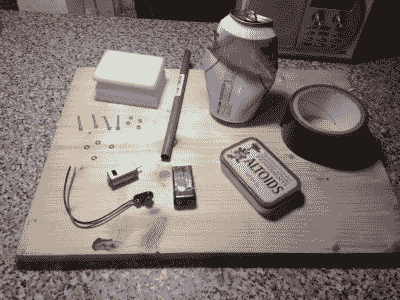

# 世界上最小的真空罐

> 原文：<https://hackaday.com/2019/10/12/the-worlds-smallest-vacuum-in-an-altoids-tin/>

这些年来有很多 Altoids tin hacks，但是在 tin 中的[真空吸尘器是新事物。在[]托比·巴特森](https://hackaday.io/T08Y) ]的第一个关于 Hackaday 的项目中，他用简单的家庭用品创造了一个功能强大的吸尘器，用来吸掉你键盘上的面包屑或你桌子上的纸张穿孔。

这种真空吸尘器具有一个可伸缩的吸管、一个低剖面开关和一个无袋废物收集系统(废物被储存并从罐中丢弃)。有刷电机和叶轮提供气流。安装在轴上的啤酒罐碎片被用作叶轮叶片，中间夹着薄金属片的两个螺栓被制成开关(说明书建议你在使用废金属之前喝完你的饮料)。海绵用于过滤电机上的灰尘，同时在罐的顶部切出一个孔以提供气流。

[巴特森]希望将自己的名字载入世界最小真空管的世界纪录，因为他最近在 1cc 管中创造了一个更小的真空。

哦，天哪，我把东西洒在桌子上了，我该怎么办呢？幸运的是，我有一个装在 Altoids 罐子里的真空吸尘器…”

 [https://www.youtube.com/embed/kYNPmo2VgV8?version=3&rel=1&showsearch=0&showinfo=1&iv_load_policy=1&fs=1&hl=en-US&autohide=2&wmode=transparent](https://www.youtube.com/embed/kYNPmo2VgV8?version=3&rel=1&showsearch=0&showinfo=1&iv_load_policy=1&fs=1&hl=en-US&autohide=2&wmode=transparent)

The [HackadayPrize2019](https://prize.supplyframe.com) is Sponsored by:     