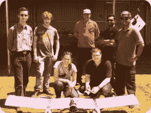
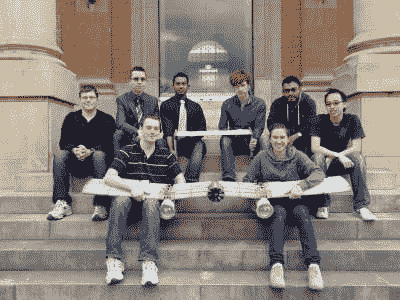
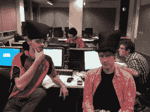
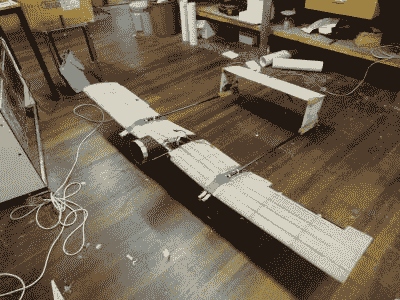

# 大学顶点工程青年工程师指南

> 原文：<https://hackaday.com/2019/11/26/the-young-engineers-guide-to-university-capstone-projects/>

工程学位就像现实世界中提供的潜在职业一样广泛多样。从热力学到流体力学，有大量的数学要学，还有一系列棘手的课题。然而，真正的挑战是*顶点工程。*这通常发生在四年制学位的最后一年，是学生将所学知识应用于现实工程项目的机会。

众所周知，这是一项需要无休止熬夜和艰苦努力的挑战，它是一项事前备受尊崇，事后又大肆吹嘘的挑战。在项目期间，每个人通常都太忙而没有时间谈论它。当我在 2012 年承担可以飞行的潜艇项目时，我的经历非常符合这一思路。这个项目教会了我很多工程方面的知识，这是教科书上解决不了的问题。以下是我一路走来学到的一些经验。

## 这是一个团队游戏

After 12 months of hard work, we still got along well enough to take a photo together and have everybody smiling – no easy feat!

工程是一项团队运动，一个巨大的顶点工程会让你很快明白这一点。项目越大，团队越大，为了成功，学会如何在这样的环境中工作是很重要的。我领导了一个由其他七名初露头角的工程师组成的团队，他们的目标是在不到十二个月的时间里，设计、制造并测试一个会飞的潜水器。

在这个团队中，有着不同的个性、技能和文化。记住这一点是让你的员工发挥最大潜能的关键。要求你正统的犹太队友周六早上来上班不会有什么收获，就像让你的流体力学专家去处理沉闷的压力分析问题没有什么意义一样。一个快乐的团队是一个富有成效的团队，尽可能发挥你的优势通常是有意义的。如果你的项目是一次愉快的经历，或者是一场灾难，了解你的团队是关键。

我们很幸运在团队中拥有广泛的能力。一名成员开始管理团队的文档，成为 LaTeX 的专家。另一个人将他的建模能力用于 CAD 方面的工作，而另一个人进行稳定性计算，以确保我们在一天结束时有一架工作的飞机。

Okay, so some days were better than others.

显然，对所有团队成员来说，对项目的更大范围有一个想法是很重要的，但是允许团队成员找到他们的位置有助于每个人都认同更大的整体。有时，不得不做出艰难的决定，而且总会有没人愿意做的工作。但是，通过认真分配任务，每个人都尽自己最大的努力，我们能够作为一个团队取得更大的成就。

做好这一点，你会有一个压力较小的项目，并以一群终生的朋友结束。如果做错了，你会在同行评估中被毁掉，再也不想和你的团队说话。你们将一起在战壕里呆上一整年，所以一定要选对人！

## 你会有很多会议

不幸的是，当你和其他人一起工作时，你不得不召开会议来让每个人了解最新的进展。这适用于团队成员，以及外部利益相关者，如发起人或项目主管。如果管理不善，这些会议可能会变得过长和令人厌倦，因此掌握全局非常重要。

Funny hats are worth a chuckle late at night in the computer labs, but don’t wear them to a meeting.

议程应该简短、清晰、有光泽——并提前提供。如果你召集了一个会议，但没有人带来必要的材料，因为你事先没有说清楚，这是对时间的巨大浪费。很可能你的项目主管是一位忙于其他事情的教授，他不会容忍这样的错误，所以一开始就不要犯这样的错误。

保持话题的讨论也很重要。例如，当你甚至还没有决定你的汽车的基本布局时，不要花 40 分钟讨论玻璃纤维和碳纤维的相对优点。这些事情很自然地发生，但如果你想在日落前离开房间，将谈话拉回到关键的议程主题是很重要的。

最后，当你有效沟通时，学习是值得的。如果你提高嗓门，或者一遍又一遍地陈述同样的事情，而人们仍然不理解你，那么很可能是时候改变策略了。在开始解释你自己的立场之前，你可能需要先理解他们的立场。此外，画一个图表通常会有所帮助。或者就我而言，让别人画一张图，因为你自己的技能有些欠缺——谢谢你，劳拉！

## 制作东西很难

Our SUbmersible Aerial Vehicle, or SUAVE, was built with an unconventional wing structure. Plywood ribs were connected together with carbon fiber stringers, and the whole assembly covered in fiberglass. No spars were used, as the stringers alone gave us enough rigidity.

如果你幸运的话，你会去一所设备齐全的机械车间的大学。他们会让你花数不清的时间生产零件，你毕业时会对机械师的手艺有很大的欣赏。我们没有这么幸运，相反，我们必须准备图纸，让大学自己的加工人员生产我们的零件。这本身就是一种强大的学习体验，因为能够按照他人能够正确理解的标准来绘制图纸是非常重要的。

在大学的车间和我们的数控加工赞助商之间，我们从经验丰富的操作员那里了解到在各种加工方法中什么可行，什么不可行。坐下来与我们的生产合作伙伴开会，我们能够从他们几十年的经验中学习。我们开始改进我们的零件，将生产成本削减到最低，如果我们在工具上放松自己，我们可能不会想到这样做。向专业人士学习如何最大限度地减少设置和避免重复的工具更换，使我们的成本降低了十分之一。

一路上也有陷阱。我们的复合材料知识很薄弱，我们试图做一些有点不寻常的事情。加上沟通失误，我们的机翼最终比预期的重了一倍，严重影响了我们的飞行性能。由于学位的限制，顶点项目有严格的时间限制，像这样的小错误在事后很难补救。自始至终保持敏锐和注重细节是很重要的。

## 不要忘记演示

Our poster was designed to give visitors to our exhibition a quick and clear rundown of the project’s goals, and the technology involved in our vehicle.

顶点项目的一个重要部分是记录和展示项目。现实是，许多顶点项目未能实现他们在年初设定的所有崇高目标。我们的也不例外——我们的飞行潜艇确实升空了，但未能在截止日期前完成潜水任务。尽管如此，顶点计划的真正目的是学习——我们的文档和演示反映了这一点。

我们能够讨论固定翼潜水器的稳定性标准和结构要求。我们的测试制度强调了使用单个导管推进器进行空气和水下推进的可行性。我们还学会了如何建造有效的推力测试设备，以及一些成功的非常规机翼结构。在这方面，我们的工作有很多值得展示的地方，许多其他团队也处于同样的位置。

通过清晰地记录我们的工作，清晰而有重点地展示我们的最终研讨会，我们能够与观众交流并标记我们项目的价值。这反过来又让我们取得了优异的成绩，这也是我们最初的目标！

## 总之…

如果你正在接近你的顶点项目，提前做一点准备工作会大有帮助。找一个你热爱的项目，组织一个有正确态度和技能的学生团队来完成这项工作。为一路上不可避免的错误做好准备，尽可能多地从帮助你的人那里吸取知识。你的顶点项目可能是你最终职业生涯的巨大垫脚石，所以把它做好是值得的。祝你学业顺利，如果你正在做一些真正伟大的事情，[你可能只是想让我们知道！](http://hackaday.com/submit-a-tip)