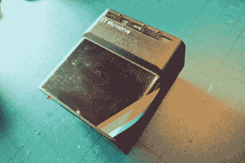
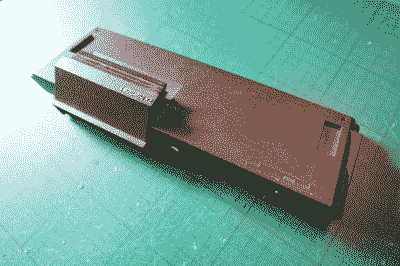
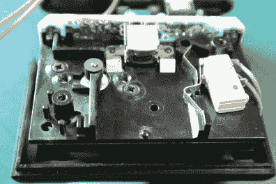
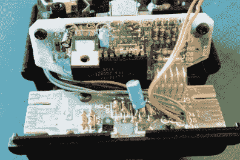
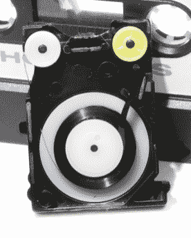
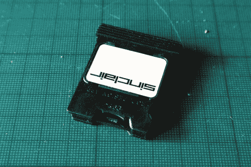
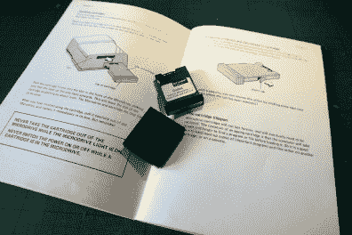

# ZX Microdrive:预算数据存储，1980 年代风格

> 原文：<https://hackaday.com/2020/09/18/the-zx-microdrive-budget-data-storage-1980s-style/>

对于大多数在 20 世纪 80 年代早期使用 8 位家用电脑的人来说，一个持久的记忆是使用盒式磁带存储程序。只有非常富有的人才买得起磁盘驱动器，所以如果你不喜欢永远等待代码加载的想法，那么你就不走运了。如果你有一个辛克莱光谱，虽然，到 1983 年，你有另一种选择的形式，独特的辛克莱 ZX 微驱动器。

这是 Sinclair Research 内部开发的一种格式，本质上是无限循环磁带车的微型版本，该磁带车在过去十年中以 8 声道高保真盒式磁带的形式出现，并承诺在几秒钟内实现闪电般的快速加载时间，以及超过 80 kB 的相对巨大的存储容量。辛克莱公司的所有者可以与家用电脑界的巨头们并驾齐驱，而且他们这样做不会让银行破产太多。

## 当时 80 kB 的存储是一件大事

The ZX Microdrive unit in all its glory

作为一名从欧洲大陆黑客营地返回的旅行者，英国政府要求我因疫情而隔离两周，我是作为 Claire 的客人而做的，Claire 是我的一个朋友，也是 8 位 Sinclair 硬件和软件的知识源泉和多产收藏家。闲聊着 Microdrive，她不仅买下了一些驱动器和软件的样品，还买下了接口系统和原装盒装 Microdrive 套件。这给了我检查和拆卸系统的机会，并为读者提供了对这个最不寻常的外设的迷人见解。

拿起一个 Microdrive，它是一个大约 80 毫米×90 毫米×50 毫米的单元，重量不到 200 克，它遵循与原始橡胶钥匙系列相同的丰富的 Dickinson 风格线索。正面有一个约 32mm×7mm 的开口，用于放置 Microdrive 盒，背面的每一侧都有一个 14 路 PCB 边缘连接器，用于连接到光谱，并通过提供的带状电缆和连接器上的自定义串行总线以菊花链形式连接到另一个 Microdrive。以这种方式最多可以连接八个驱动器。

The ZX Interface 1 unit, which screwed to the bottom of the Spectrum and engaged with its expansion port.

在 20 世纪 80 年代初，Spectrum 的价格令人惊叹，但这是以视频和磁带端口以外的内置硬件接口为代价取得的。在它的后面是一个边缘连接器，基本上暴露了 Z80 的各种总线，留下任何进一步的接口通过扩展模块连接。举个最明显的例子，一个典型的频谱拥有者可能会以这种方式拥有一个 Kempston 操纵杆适配器。Spectrum 当然没有配备 Microdrive 连接器，所以 Microdrive 有自己的接口。辛克莱·ZX 接口 1 是一个楔形单元，与 Spectrum 上的 edge 连接器接合，并用螺丝固定在计算机的底部，提供了 Microdrive 接口、RS-232 串行端口、使用 3.5 毫米插孔连接器的简单 LAN 接口，以及可以插入更多接口的辛克莱边缘连接器的复制。这个接口包含一个 ROM，它将自己映射到 Spectrum 的内部 ROM 上，正如我们注意到的，当 Spectrum 的原型在剑桥计算历史中心出现时，它是著名的未完工产品，并且它的一些预期功能没有实现。

## 开始拆卸吧！

谈论硬件很有趣，但当然，这是 *Hackaday* 。你不只是想看看它，你还想看看它*是如何运作的*。是时候拆卸了，我们将从打开 Microdrive 单元本身开始。就像 Spectrum 一样，该装置的顶部覆盖着一层粘贴的黑色铝板，上面印有标志性的 Spectrum 标志，必须小心翼翼地将它从 20 世纪 80 年代粘合剂的残余力中剥离，以露出固定表壳上半部分的两个螺钉。与光谱一样，不弯曲铝很难做到这一点，所以需要一些技巧。

抬起上半部分，取下驱动器指示灯，机械装置和主板便会出现。经验丰富的读者会立即注意到与更大的 [8 声道音频拾音器](https://hackaday.com/2017/04/12/retro-teardown-inside-an-8-track-stereo-player/)的相似之处，尽管这不是该系统的衍生物，但其工作方式非常相似。该机制本身非常简单，右边是一个微型开关，当盒式磁带的写保护标签被移除时，它会进行感应，左边是带主导轴辊的电机轴。在盒式磁带的商业端是一个磁头，它看起来非常类似于你可能在盒式磁带走带设备中发现的磁头，但是具有更窄的磁带导轨。

有两个 PCB，在磁带头的背面，一个装有 24 针定制 ULA(非专用逻辑阵列，实际上是 20 世纪 70 年代 CPLDs 和 FPGAs 的前身)，用于选择和操作驱动器，另一个连接到外壳的下半部分，装有两个接口连接器和电机开关电子设备。

  The mechanism up-close and personal.  And at the rear, the ULA that runs the show.

这些磁带盒尺寸为 43 毫米×7 毫米×30 毫米，内含 5 米长的 1.9 毫米自润滑磁带，呈连续环形。我不怪克莱尔不让我撬开她的老式墨盒，但谢天谢地维基百科给我们提供了一张没有盖子的墨盒的照片。与 8 道磁带盒的相似之处立即变得明显，主导辊可能在一侧，但同一卷磁带会返回到单个磁带盘的中心。

ZX microdrive 手册乐观地声称每个盒式磁带可以存储 100 kB 的数据，但实际情况是，一旦使用一段时间后，它们可以存储大约 85 kB，然后增加到 90 kB 以上。公平地说，它们不是最可靠的介质，磁带最终延伸到无法再读取的程度，甚至 Sinclair 手册也建议备份常用的磁带。

  A Microdrive cartridge, decapped. Mumiemonstret / [CC0](https://commons.wikimedia.org/wiki/File:ZX_Microdrive,_opened.png)  80 kB of storage in a very small form factor for its day.

接收拆卸处理的系统的最后组件是接口 1 本身。不同寻常的是，Sinclair 的产品没有任何隐藏在橡胶底座下的螺钉，所以除了将外壳顶部从 Spectrum edge 连接器上拆下来的微妙操作之外，拆卸起来很容易。里面有三个芯片，一个德州仪器 ROM，一个通用仪器 ULA 而不是频谱本身使用的费兰蒂项目，和一个 74 逻辑位。除了用于驱动 RS-232 串行总线、Microdrive 和网络的分立器件之外，ULA 还包含所有电路。Sinclair ULAs 因过热和自己烹饪而臭名昭著，这是最脆弱的一个。这里的接口不可能被使用太多，因为它没有安装 ULA 散热器，并且在外壳或周围没有热印。

这次拆卸的最后一个词应该是手册，这是一个典型的写得很好的薄卷，它提供了对系统以及它如何集成到 BASIC 解释器中的洞察。联网能力特别迷人，因为很少看到它在使用中，它依赖于网络中的每个频谱发出命令，在启动时为自己分配一个号码，因为没有闪存或类似的内存。这将被纳入目标学校市场，作为 Acorn 的 Econet 的竞争对手，这并不奇怪为什么 BBC Micro 赢得了政府支持的学校合同，而不是 Sinclair machine。

  The Microdrive manual and sample software set.  For a 1980s home computer, it’s unusually well-written.

## 为什么我们不都使用小型盒式磁带进行存储？

从 2020 年开始，回过头来审视这一被遗忘的计算技术，看看一个 100 kB 的存储介质在大约 8 秒内加载而不是一盒磁带需要几分钟才能完成的世界是多么重要。令人困惑的是，Interface 1 没有包含并行打印机接口，因为从完整的 Spectrum 系统来看，不难看出它将成为一台足够的家庭办公室生产力计算机，当然，就其价格而言也是如此。Sinclair 确实出售了他们自己的热敏打印机，但是即使是最异想天开的 Sinclair 爱好者也会发现很难说 ZX 打印机不新奇。

事实是，像辛克莱的所有东西一样，它也是克莱夫爵士传奇般的成本削减和用意想不到的组件创造不可能的独创性能力的受害者。Microdrive 完全是 Sinclair 内部开发的，但也许它太小、太不可靠、太晚了。第一台配有软驱的苹果 Macintosh 于 1984 年初问世，是 ZX Microdrive 的同时代产品，尽管这些小盒式磁带进入了辛克莱命运多舛的 16 位机器 QL，但结果却是商业上的失败。一旦他们购买了辛克莱的资产，就会有一个来自阿姆斯特拉德的 3 英寸软盘的频谱，但那时辛克莱微型电脑纯粹作为游戏机销售。这是一次有趣的拆卸，但也许最好是带着对 1984 年的美好回忆离开。

我非常感谢 Claire 使用了这里介绍的硬件。如果你想知道，上面的照片显示了各种不同的组件，既有工作的也有不工作的，特别是完全拆卸的 Microdrive 单元是有故障的。我们不希望在 Hackaday 对逆向计算硬件造成不必要的伤害。