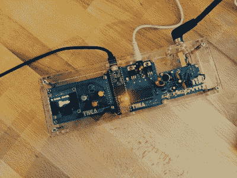

# thea Flowers–从头开始创建一个受世嘉启发的硬件合成器

> 原文：<https://hackaday.com/2019/11/22/thea-flowers-creating-a-sega-inspired-hardware-synthesizer-from-the-ground-up/>

对于那些伴随着视频游戏长大的人来说，过去游戏机的传奇声音是一种怀旧的冲击。[西娅·弗劳尔斯]第一次在游戏手柄上玩刺猬索尼克，所以世嘉创世纪的声音在她心中占有特殊的位置。几十年后，这启发了 Genesynth 的创建，这是一个受经典控制台启发的硬件 synth。开发这种硬件的旅程构成了[【Thea】富有启发性的超级对话的基础。](https://www.youtube.com/watch?v=Yt-QnINCskI)

[西娅的]首先从探索为什么创世纪的声音如此独特开始。世嘉控制台巧妙地进入了一个时期，该公司试图做一些事情，而不是简单的减法合成，但在此之前，有可能以可承受的价格使用全波形音频。在与雅马哈的合作中，YM2612 FM 合成芯片被制造出来，这是一种降低成本的声音引擎，类似于 20 世纪 80 年代著名的 DX7 合成器。这使得 Genesis 的能力远远超出了当时其他游戏机的基本功能，因此[Thea]决定将其内置于一个专用的硬件合成器中。

作为硬件新手，[西娅]最初的目标是简单地让 YM2612 制造噪音。《创世纪》中的歌曲可以以 VGM 格式存储，这种格式由输入到声音芯片的原始数据组成，声音芯片需要再现音乐。通过将这些数据从微控制器直接输入 YM2612 的相关寄存器，可以创建一个自动点唱机来播放 Genesis chipmusic。

Designing your own PCBs means you get to decide on the graphics, and it’s clear Thea had fun with the process.

硬件现在产生声音，但噪音是一个问题。最初尝试用[兆安电路](http://www.sega-16.com/forum/showthread.php?26568-Introducing-the-Mega-Amp-The-universal-Genesis-audio-circuit)解决这个问题有所帮助，但只是一点点。[Thea]的研究表明，试验板以及微控制器和显示硬件中的各种开关调节器和降压转换器都是可能的噪声源。设计出所有这些将是一项艰巨的任务，所以[西娅]选择了另一条路。硬件有自己的 PCB 设计，有独立的模拟和数字电源。随着噪音问题的解决，[西娅]开始把钻机变成一个真正的合成器。目标是拥有能够接收 MIDI 信号并在 YM2612 上播放适当声音的硬件。尽管项目早期取得了成功，但进入下一阶段被证明是一场艰苦的斗争。

The final build looks resplendent in a tidy acrylic case with bright blue PCBs.

然后，大量的工作进入理解如何正确地与 YM2612 接口。遗憾的是，该设备的文档并未公开。直接联系雅马哈一无所获，研究模拟器是一个死胡同。没有被吓倒，[西娅]开始分析来自相关硬件的文件，在朋友们的帮助下破译日文文件。还涉及大量的试验和错误，例如手动调整写序列计时，直到一切开始工作。一旦芯片被理解，最后的艰苦工作就是把它变成一个合适的有用的合成器。诸如补丁管理、复音和同音设置以及参数控制等都需要处理。

通过坚持不懈、努力工作和扎实的研究，[西娅]终于脱颖而出。完整的 Genesynth 能够打出最好的 FM 合成线，Thea 在演讲结束时用一首粉丝最喜欢的歌曲巧妙地展示了这一点。这个项目展示了顽强的坚持能取得什么样的成就，以及在这个过程中你能学到多少东西。对于那些渴望挖掘技术细节的人来说，[请访问 Github，](https://github.com/theacodes/genesynth)如果你正在开发自己的 epic synth 项目，[请务必告诉我们这个故事！](http://hackaday.com/submit-a-tip)

 [https://www.youtube.com/embed/Yt-QnINCskI?version=3&rel=1&showsearch=0&showinfo=1&iv_load_policy=1&fs=1&hl=en-US&autohide=2&wmode=transparent](https://www.youtube.com/embed/Yt-QnINCskI?version=3&rel=1&showsearch=0&showinfo=1&iv_load_policy=1&fs=1&hl=en-US&autohide=2&wmode=transparent)

