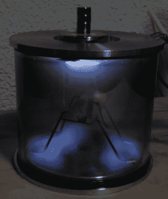
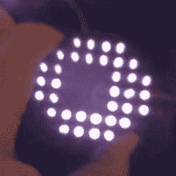
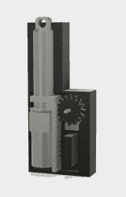
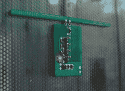
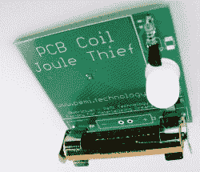
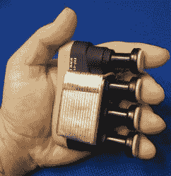
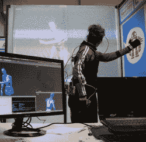

# 这些是黑客日奖的 100 名决赛选手

> 原文：<https://hackaday.com/2018/11/02/these-are-the-100-finalists-in-the-hackaday-prize/>

Hackaday 奖是全球最大的硬件竞赛。这是开放硬件的奥斯卡奖，在过去的几年里，我们一直在做，我们已经看到了几十个项目从一个想法到一个原型到一个完成的项目再到一个可销售的产品。这是开放硬件社区最成功的故事。

在过去的八个月里，我们一直忙于今年的 Hackaday 奖。共有五场挑战，每场挑战有 20 名获胜者。这是一百个将进入半决赛的项目，希望成为今年最伟大的项目。只有一个人会成功，但事实上他们都值得。这些是 Hackaday 奖的 100 名决赛选手，都是真正令人敬畏的项目，但只有一个人将带着大奖回家。

### 开放式硬件设计挑战

开放硬件设计挑战赛是今年 Hackaday 奖的第一轮，获奖者都是精英中的精英。二十个项目进入了决赛，从车库里的半导体实验室到使用惠普墨盒的 3D 打印机。

 is turning ions into FETs

看看 [Semiconductors @ Home](https://hackaday.io/project/107598-semiconductors-home) ，一个来自【谢妮】的项目——这是一个试图让沙子眨眼的项目。[谢妮]正在制造所有的工具，在国内制造半导体。能够建造一个简单的场效应晶体管是令人惊讶的，为此你需要一个通风橱来容纳危险的氢氟酸，一个用于溅射沉积的真空室，以及一个具有可控气氛的奇特烘箱。这些工具是[谢妮的]设计挑战的入口。这不是普通的硬件入侵；这是*高级*硬件黑客。

卡尔·布吉亚用一块印刷电路板做了一个马达。在过去的十年里，定制印刷电路板的价格急剧下降，这意味着任何人都可以用铜箔和玻璃纤维做实验。我想既然你可以把线圈放在印刷电路板上，你也可以做一个马达。虽然我们这里只看到一个 1 瓦电机，但这是一个由印刷电路板制成的无刷电机。这太神奇了，你以前从未见过，我们完全不知道人们会为这项神奇的技术找到多少用途。

### 机器人模块挑战

机器人模块挑战赛是今年 Hackaday 奖的第二项挑战，[这二十名获胜者](https://hackaday.io/list/159019-thp-2018-semifinalists-robotics-module)已经证明了他们是我们创造家庭机器人未来所需要的工具。在两百多件参赛作品中，这二十件是最好的。

IR QR Code Navigation will solve the problem of indoor robotic navigation

为了赢得机器人模块挑战赛的参赛资格，[Josh Starnes]正在解决室内机器人导航问题。他的项目 [IR 二维码导航](https://hackaday.io/project/135292-ir-qr-code-navigation-day-or-night-for-robotics)，用二维码完成任务。乔希没有把难看的像素块安装在墙上，而是做了一些不同的事情。他在利用所有数码相机都有的特性。如果你从数码相机上取下红外阻挡滤光片，它就能看到红外线。通过人眼不可见的红外敏感涂料的巧妙应用，这些二维码可以被机器人视觉照亮和检测，同时对你和我完全不可见。[Josh]的系统同时解决了不想让难看的二维码塞满墙壁的问题，并使计算机视觉更容易。太棒了，这个壮观的项目进入了 Hackaday 奖的决赛，我们对此感到惊讶。

3D Printed Mini Linear Actuator is a tiny 3D printed mechanism

计算机视觉不适合你吗？*动*的东西怎么样？今年 Hackaday 奖的机器人模块挑战的关键挑战是将部件组装成一个令人惊叹的机器人，无论是四轴飞行器还是强大的机器人 Voltron。让机器人移动的最大挑战之一是线性驱动——这些东西可以前后移动，而不仅仅是像轮子一样旋转。

Giovanni 和 Jonathan 开发了一款 [3D 打印迷你线性致动器](https://hackaday.io/project/156520-3d-printed-mini-linear-actuator)来解决这些问题。这是一个非常非常小的装置，可以将旋转运动转化为直线运动。它通过在螺杆上添加一个电机，并使用一个连接到齿条的电位计来提供位置反馈。实际上，这是一个简单、廉价的业余爱好伺服系统，它可以进进出出而不是旋转。它建造简单，造价低廉，而且效果很好。使用 Arduino 来控制整个事情，该团队设法让活塞上下移动，所有这些都是 3D 打印的零件。太棒了，外形也很棒。

### 能量采集挑战

当然，未来将会有电力，但我们可能不会从煤或石油中获得电力。可持续能源是未来，如果我们能从一些经常不用的资源中获取能源，那就更好了。这是今年 Hackaday 奖的第三个挑战，这 20 个项目展示了我们能在多大程度上实现这个想法。

 如果你想在你的房子里收获随机的能量波动，你会从哪里开始？你可能会考虑在窗户旁边放一块太阳能电池板，或者在你的屋顶上放一个风车，但是你错了。你的微波是一个充满愤怒光子的泄漏法拉第笼。你可以收获这种力量，这正是[法学家]在他的项目[T4 中所做的。](https://hackaday.io/project/159319-mwessenger)

mWessenger 是一个设计用于安装在微波炉前门的微型电路板。船上有一个小天线，可以收集离开法拉第笼的微波光子，还有一个升压电路可以将这些光子转化为可用的能量。这样的设备有什么用？有的是！[法学家]有一个想法，创造一个微波通知互联网，由泄漏的微波辐射供电，它会告诉你什么时候你的爆米花做好了。当然，你可以把 mWessenger 放在你的 WiFi 路由器旁边，当网络瘫痪时，你会收到通知。

 有太多的方法可以从电池中获取最大的能量，但是我们最喜欢的是焦耳窃贼。这是一个简单的电路，由一个晶体管和一个大电感组成，可以让电池完全没电。如果你在电路上安装一个 LED，这是一个很棒的方法，可以让那些“没电”的电池持续使用好几个月。

[bobricius]研究 PCB 线圈已经有一段时间了，如果说 PCB 线圈有什么问题的话，那就是它为电路制造了非常大、非常低效的电感。它们的设计也非常有趣。这就是导致[bobricius]创造 PCB 焦耳小偷。它很庞大，不切实际，但它是一个奇妙的教育工具。在这里，呈现在铜迹线和玻璃纤维基板是一个电感器和一个完整的电路在那里检查。太牛逼了。

### 人机界面挑战

除非你能用电脑做点什么，否则电脑毫无用处。无论是穿孔读卡器和电传打字机，还是疯狂的虚拟现实耳机，我们拥有计算机的唯一原因是允许人类与它们互动。这是 Hackaday 奖第四项挑战背后的想法，人机界面挑战的二十名获胜者展示了一些令人敬畏的技术。

 迄今为止，人机界面最明显的例子就是地位低下的键盘。在过去的几年里，机械键盘社区已经在固件天才的工作基础上建立起来，创造了一个可以想象到的各种形状和大小的独特键盘的世界。但是这些 Hackaday 奖决赛选手更进一步。

来自[Shervin Emami]的[人体工程学手持式鼠标/键盘替代产品](https://hackaday.io/project/160690-ergonomic-handheld-mouse-keyboard-alternative)是满足您的键盘输入和光标移动需求的一体化解决方案。这是一个蓝牙键盘和鼠标，但这个是一个*和弦*键盘，由一个价值 5 美元的手指强化设备制成，最初是为吉他手和重复性压力损伤的人设计的。通过添加一些按钮、一个陀螺仪和一个加速度计，[Shervin]将这个 5 美元的设备变成了一个无价的硬件。

但是，今年 Hackaday 奖的决赛入围者并不全是晦涩难懂的输入设备。那些机械键盘的狂热分子也做出了贡献。其中最好的就是【Mattia Dal Ben】的[氧化还原键盘。顾名思义，这种键盘源自非常流行的 Ergodox 键盘，一种在 DIY 人群中掀起波澜的分离式键盘。[Mattia]的 Redox 有一些改进，包括将控制器从 Teensy 改为便宜得多的 Arduino Pro Mini，使键盘更小，并使拇指簇更容易够到。](https://hackaday.io/project/160610-redox-keyboard)

 但是人机界面的挑战不仅仅是键盘。有很多例子，其中最伟大的是[【Bruno Lauren cich】的动作捕捉系统，你可以自己构建](https://hackaday.io/project/27519-motion-capture-system-that-you-can-build-yourself)。这个建筑始于在舞台上用舞蹈演员进行数字表演的愿望。这显然需要一套动作捕捉服，但它们很贵。没有一个价格合理的。

这对布鲁诺来说无关紧要，有志者事竟成。这套动作捕捉装备是由几个 MEMS IMU 器件组成的，所有这些器件都串在一个主控制单元上。利用一些传感器融合算法，结果是可以接受的。这意味着[Bruno]能够捕捉人体的运动，并在类似模拟的*割草机 Man-*中渲染这些捕捉。这几乎是人机界面挑战中最酷的参赛作品，还有差不多 24 个类似的作品。

### 乐器挑战

黑客们一直对乐器感兴趣，无论是合成器还是仅仅试图弄清楚音频在 Linux 中是如何工作的。我们 Hackaday 奖的最后一项挑战完全是关于乐器的[，这 20 位获奖者](https://hackaday.io/list/161904-thp-2018-semifinalists-musical-instrument)展示了黑客们可以将创作音乐的想法推进到什么程度。

尽管 Moog 最近推出了很酷的东西，但电子乐器目前的趋势并不是大量的模拟合成。不，未来是廉价的玩具，青少年工程、Korg 的那些小东西和无数种类的口袋操作者就是证明。这并不奇怪；本田雅阁的销量远远超过兰博基尼。对于一个受欢迎的产品，这意味着有机会构建一个开源版本，[而来自[Chris]的 Teensy Beats Shield 就是这样的](https://hackaday.io/project/161127-teensy-beats-shield)。这是一个便携式音频序列器，就像一个袖珍操作器。它基于 Teensy，具有键盘矩阵和高分辨率 TFT 显示屏，是对袖珍操作器 LCD 音响系统的巨大改进。这是一个有趣的项目，也是一个适销对路的产品，我们很高兴看到它角逐 Hackaday 奖。

但是乐器挑战不仅仅是制作新的乐器，也是制作新的界面来创作音乐。体现这一理念的赢家之一是来自[Liam Lacey] 的 [Turnado 硬件 MIDI 控制器。这是一个非常有趣的软件的控制器，来自 Sugar Bytes 的 Turnado。](https://hackaday.io/project/160792-turnado-hardware-midi-controller)

Turnado 是一个有一些变化的硬件特效控制器，但这并不能完全体现它所能做的一切。因为它运行在计算机上，GUI 和用户界面就是你所期望的——键盘、鼠标，如果你幸运的话，还有一个触摸屏控制器。音乐家是触觉型的人，摆弄图形用户界面和菜单对他们来说并不合适。真正需要的是硬件接口——一些旋钮。

这正是[利亚姆]建造的。这是一个硬件 MIDI 控制器，专门用于控制 Turnado。机上有九个独立的操纵杆，更多的编码器，几个按钮和一个显示器，让一切都有意义。所有这些都由 Teensy 控制，它主要是一个控制 Turnado 的即插即用解决方案。

### 这个周末我们就能知道获胜者了！

所有这些项目都已经赢得了 1000 美元，他们都在争夺 50，000 美元的大奖。现在，我们正在汇总来自我们不可思议的评委团的分数。他们将发现精英中的精英，最佳项目将获得 50，000 美元的大奖。然而，这还不是全部；第二名将获得 20，000 美元，第三名 15，000 美元，第四名 10，000 美元，第五名 5，000 美元。我们发放了超过 20 万美元的现金奖励，结果已经非常显著了。我们有 100 个项目在进行中，其中一个将赢得大奖。

Hackaday 大奖的获得者将在本周末的 Hackaday 超级大会上宣布。门票已经没有了，因为这是地球上有史以来最伟大的会议。但是不要担心:我们将直播整个会议，所以你可以找出这 100 个项目中哪一个是最伟大的硬件。

The [HackadayPrize2018](https://hackaday.io/prize) is Sponsored by:     