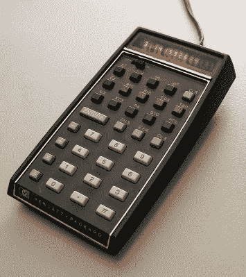

# 这些第一批 Remoticon 扬声器只是未来的一个尝试

> 原文：<https://hackaday.com/2021/10/14/these-first-remoticon-speakers-are-just-a-taste-of-whats-to-come/>

随着 2021 Hackaday Remoticon 的迅速临近，我们一直在努力制定一个时间表，其中充满了来自知识渊博的演讲者的发人深省的演讲；这正是你从我们的活动中所期待的，无论是虚拟的还是其他的。我们已经宣布，激光干涉仪引力波天文台(LIGO)的天体物理学家 Keith Thorne 将发表一篇*字面上的*来自这个世界的主题演讲，讲述用有史以来最高精度的干涉仪探测引力波所需要的令人难以置信的工程，但这仅仅是个开始。

为了确保我们能够在第二集的每一分钟都有精彩的内容，我们决定[将谈话提案的截止日期](https://form.jotform.com/212315522449148)延长几天，看看大器晚成的人能带来什么。如果你曾经想参加黑客日活动，但不能去帕萨迪纳或贝尔格莱德，这是你在虚拟舞台上展示你所热爱的东西的机会。

与此同时，我们已经通过了足够多的早期提案，从而错过了我们将在 11 月 19 日至 20 日之间播出的前四场会谈。在接下来的几周里，我们还会发布更多的内容，但希望这能让你了解我们为全球硬件黑客观众准备了什么。所以[现在就去拿你的车票吧](https://www.eventbrite.com/e/hackaday-remoticon-2021-tickets-172183193567?aff=talks20211014)！

### 黛布拉·安塞尔

**形式即功能:模块化 PCB 构建模块**

PCB 制造的低成本使得 PCB 成为构成大型模块化电子项目的结构元件的合理选择。2020 年 6 月，我首次创建了一个基于 PCB 的纳米叶风格的瓷砖系统。我的目标是用定制的印刷电路板和现成的零件建造一个便宜的、可重新配置的、美观的、坚固的系统。

模块化系统中的问题可能不同于更典型的 PCB 项目中的问题。例如，组件中电路板上的物理应力可以产生足够的扭矩来将压力连接器与触点分离。我花了很多时间在 Mouser 和 Digi-Key 上搜索“板对板连接器”的结果，并投入更多时间尝试设计自己的 PCB 连接器。

我将介绍哪些连接器在不同的版本中最适合我，哪些连接器如果稍微便宜一点我会喜欢使用，以及为什么玩具屋铰链实际上不是一个很好的 PCB 连接器，尽管它们提供了很好的结构支持。任何对 PCB 设计感兴趣的人，以及对将 PCB 扩展到标准用例之外感兴趣的人，都可能会对这个演讲感兴趣。

### 罗布·温斯坦

**显而易见——将一项 45 年前的专利逆向工程成功能齐全的 HP-35 复制品**

HP-35, the first scientific calculator, by Seth Morabito CC BY 2.0

我是一名电气工程师，在过去的 30 年里，我一直从事无线通信领域的 FPGAs 设计工作。当我还是一名年轻的工程师时，我只关心最新最棒的东西，对旧东西不屑一顾。现在我是老东西了，我对以前的东西很着迷——技术的基础是如何由杰出的人只用石刀和熊皮建立起来的。

2018 年万圣节，我开始对美国专利 4，001，569 进行逆向工程，其中公开了 HP-45 袖珍科学计算器。使用‘569 专利作为我的主要来源，我为专利中描述的七个 IC 中的每一个使用小型 FPGA 构建了 HP-35 计算器的全功能副本。我试图按照‘569 中的描述忠实地实现 FPGA 设计。这七个 IC 共同组成一个 56 位串行 CPU 和显示子系统，运行存储在其中三个 IC 中的计算器程序。这里没有微处理器仿真。该复制品于 2021 年 6 月 9 日全面投入使用。

在这次演讲中，我将尝试解释我一路走来所学到的一切。

### 马特·文

**开源 ASICs 一年展望**

Drawing N-channel MOSFET in silicon

紧随 Remoticon 2020 的 [*零到 ASIC* 研讨会之后，Matt Venn 回来了，回顾了专用集成电路领域的主要发展，并展望了未来。去年发布了](https://hackaday.com/2020/12/29/remoticon-video-from-zero-to-asic-how-to-design-in-silicon/) [SkyWater:世界上第一个可制造的开源工艺设计套件](https://github.com/google/skywater-pdk) (PDK)，这是设计定制 ASICs 所需的关键部分。

从那时起，已经有两艘“航天飞机”，由谷歌和 SkyWater 建立的 ASIC 制造服务，第三艘将于 10 月发射。这个免费程序允许任何拥有完全开源设计的人试验定制芯片，而不需要与制造相关的通常成本。

这个演讲将与任何对制造自己的芯片的新机会感兴趣的人相关，并且还有四次免费穿梭机会，仍然有足够的时间参与进来，而不必支付很多钱。

### Voja Antonic

**40 分钟成为硬件专家**

An original Galaksija computer.

如果有人能在一小时内给你掌握硬件所需的知识，那就是沃佳·安东尼克。在 100 张幻灯片中，他将以任何人都能理解的方式展示微处理器架构。这包括基本逻辑门、组合逻辑、触发器、时序逻辑、寄存器、CPU 结构、存储器、I/O 和外设。

Voja，[在 1983 年开发了著名的 Galaksija 计算机](https://hackaday.com/2020/10/25/iconic-yugoslavian-galaksija-computer-reborn-with-a-documentary-too/)，他说这个演讲对初学者和有经验的工程师都有意义；虽然它确实是针对那些想要窥探 CPU“黑箱”的硬件黑客和爱好者的。他认为，如果程序员知道 CPU 内部是如何工作的，他们就能写出更好、更高效的程序。

## 还会有更多

这前四场讲座只是我们为 Remoticon 2021 计划的一小部分，[所以请确保您现在就拿到免费门票](https://hackaday.com/2021/10/04/hackaday-remoticon-tickets-and-t-shirts/)，以便我们在演出时有准确的人数统计。还有一张 25 美元的门票，其中包括一件衬衫，因为如果不是一个为你的赃物收藏添加另一件 t 恤的借口，那是什么黑客骗局？

