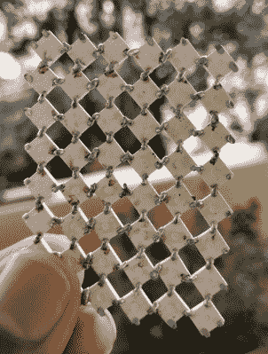

# 这些 LED 灯罩会用科学蒙蔽你

> 原文：<https://hackaday.com/2020/05/08/these-led-shades-will-blind-you-with-science/>

除非你特别喜欢看 88 个单独的 WS2812B LEDs 的背面，[这些来自【Mukesh Sankhla】的“RGB 护目镜”不会给你提供太多的视野](https://hackaday.io/project/171405-diy-rgb-goggles)。但从局外人的角度来看，智能手机控制的眼镜无疑是一种声明。只是不要试图在穿着它们的时候操作任何重型机械。

 建筑开始时有一对足够暗的灯罩，直到通电后灯光才变得明显。[Mukesh]然后在一块透明胶带上小心地将 led 排列成网格图案，这样就可以用尽可能少的跳线将它们焊接在一起。即使你不是在市场上购买一些彩色眼镜，如果你想制作即兴 LED 面板，WS2812B 模块的这种巧妙安排也可以派上用场。

为了控制发光二极管，[Mukesh]正在使用 Arduino Nano 和 HC-06 蓝牙模块，该模块与运行在 Android 智能手机上的应用程序相连。该软件由麻省理工学院应用程序 Inventor 开发，允许用户在飞行中轻松切换各种模式和动画。有了这样一个易于使用的界面，RGB 护目镜看起来离一个商业产品并不远；除了不能真正看透这东西。

事实上，这些年来我们已经看到了许多定制眼镜项目，因为似乎[一副廉价的墨镜为头戴式黑客提供了一个理想的平台](https://hackaday.com/2019/08/15/home-automation-at-a-glance-using-ai-glasses/)。我们甚至发现了对他们来说最理想的能源可能是。

 [https://www.youtube.com/embed/yMi15hjzdFM?version=3&rel=1&showsearch=0&showinfo=1&iv_load_policy=1&fs=1&hl=en-US&autohide=2&wmode=transparent](https://www.youtube.com/embed/yMi15hjzdFM?version=3&rel=1&showsearch=0&showinfo=1&iv_load_policy=1&fs=1&hl=en-US&autohide=2&wmode=transparent)

