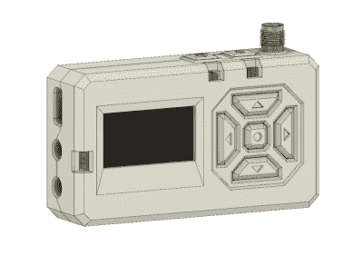
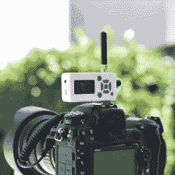

# 这些经验教训是从外壳设计中学到的，但远远不止于此

> 原文：<https://hackaday.com/2019/12/18/these-lessons-were-learned-in-enclosure-design-but-go-far-beyond/>

[Foaly]一直在努力制作开源的远程相机遥控器，最近[分享了一篇深思熟虑的帖子，讲述了如何考虑设计的所有方面永远不会太早，以免最终让你付出代价](https://silica.io/silver-project-update-making-the-case-then-throwing-everything-out-and-starting-again-from-scratch/)。这一切都始于为工作原型设计外壳，并导致从头开始重新设计 PCB。这需要很大的勇气，我们建议你花点时间点击那个链接，仔细阅读他分享的内容。当他确认你已经知道的事情时，你要么学习一些有价值的技巧，要么只是享受睿智的点头。这是双赢。

Note the awkward buttons right next to the antenna connector, for example.

这个有问题的项目是银色的，称它为相机遥控器有点言过其实。无论如何，[Foaly]有一套完全可用的原型，只需要一小批外壳。到目前为止一切正常，但在设计可能的解决方案的过程中，[Foaly]遇到了一个项目陷入困境的可靠迹象:到处都出现了问题，总的来说，一切似乎都比它应该的要困难。牢牢抓住无安装孔的 PCB 似乎从来都不太正确。按钮很难够到，比例失调，用起来感觉不好。有机发光二极管屏幕的*组件*实际上是居中的，但是*显示器*是偏离中心的，无论边框的线条如何雕刻，看起来都是错误的。PCB 是一个整洁的矩形，但显示器最终有点小，外壳看起来总是很大。最大的努力显示在这里，它只是没有满足。

【Foaly】说真正的问题是他设计了电子设备并做了布局，同时给了*一些*的想法(但没有*太多*的想法)以使它们最终集成到一个外壳中。这不一定是一次性的问题，但从产品设计的角度来看，它导致了如此多的问题，以至于最好从头开始，这一次要从一开始就注意一切是如何集成的:布局、组件、机械零件、组装和最终的用户体验。最终结果非常棒，我们很高兴[Foaly]花时间记录了他的发现。

外壳设计是一件大事，有许多不同的方法去做。为了更独特的旋转，请务必[查看我们如何从 PCB 本身制作外壳](https://hackaday.com/2015/06/03/how-to-build-beautiful-enclosures-from-fr4-aka-pcbs/)。对于更传统的外壳制造和设计的初级读本，请花几分钟时间[熟悉注塑](https://hackaday.com/2016/11/04/tools-of-the-trade-injection-molding/)。