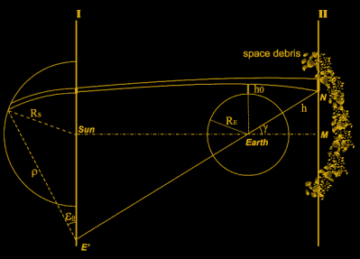
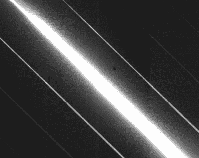
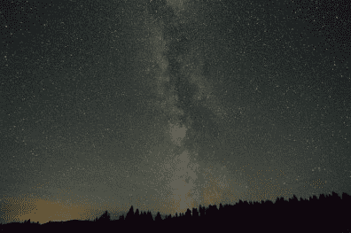
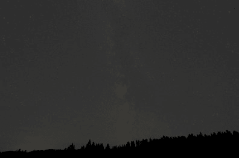

# 事情越来越明朗了！但不是星星

> 原文：<https://hackaday.com/2021/10/11/things-are-looking-brighter-but-not-the-stars/>

我在蒙大拿长大，我记得夜晚望向窗外，看到银河，提醒我在宇宙中的渺小。现在我住在城市里，这样的反省不再容易，就像 1/2 的人也住在城市一样，我必须依靠卫星来提供图像。然而卫星是问题的一部分。几十年来，光污染已经变得越来越严重，随着最近卫星发射和亿万富翁驾车兜风的稳定流，我们有了一个相对新的干扰源。那么情况有多糟，会变得多糟呢？

仰望夜空，通常可以分辨出各种人造物体的区别。飞机穿过天空的速度相当慢，有时你可以看到它们闪烁着绿色和红色。流星速度很快，很难看到。地球同步卫星似乎根本不会移动，因为它们的轨道运行速度与地球自转速度相同，而其他轨道类型会快速通过。

SpaceX 已经承诺降低卫星亮度，一些观察已经证实[新型号暗了整整一个数量级](https://www.scientificamerican.com/article/spacexs-dark-satellites-are-still-too-bright-for-astronomers/)，就在肉眼观察的门槛上。不幸的是，这只是朝着正确方向迈出的一步，还不足以让天文学家满意，他们自然不会用肉眼仰望夜空。

卫星本身不会发光。它们仅仅是将太阳光反射回地球，就像月球一样。因此，直接处于地球阴影中的东西不会反射任何光，但是在地平线附近，来自卫星的反射可能是显著的。仅仅将我们的观测站聚焦在夜晚地球阴影的狭窄区域是不实际的，所以我们必须更靠近地平线，捕捉卫星的反射。

## 什么能让天文学家满意？

阳光被太空垃圾和卫星反射，反射到地球的黑夜面。[[https://arxiv.org/abs/2103.17125](https://arxiv.org/abs/2103.17125)]

尽管把天文学家想象成朝天空挥舞拳头、对着经过的卫星大喊“离开我的草坪”的古怪老头很有趣，但他们的担忧是有道理的，而且影响是可以衡量的，可能是灾难性的。

拍摄星星时，银河狗仔队使用复杂而敏感的设备。为了收集足够的光，曝光时间非常长。但是当卫星经过时，它的亮度会使 CCD 饱和，这不只是破坏图像中的一个像素，而是卫星穿过镜头时的一整条线。此外，相机的焦距远远超出了低地球轨道，所以卫星是模糊的，使得图像上的细线变成了一个宽的裂缝。因此，在任何给定的图像中，图像的效率，或者有多少像素是可用的，会受到任何从头顶上经过的卫星的显著影响。

卫星的条纹不仅使像素饱和，而且焦点会中断附近的像素，CCD 间的串扰会产生额外的误差。[[https://arxiv.org/abs/2006.12417](https://arxiv.org/abs/2006.12417)]

即使卫星是全黑的，但是，它们在恒星面前经过会导致恒星出现短暂的亮度下降。与其说图像上有一个明亮的裂缝，不如说是一个黑暗的裂缝。天文学家利用亮度下降进行从系外行星探测到估计星云密度的各种工作。

所有天体的相对运动、地球的自转和天文台的位置都是由一个调度程序计算出来的，它决定了拍摄天空特定部分的最佳时间。当然可以将卫星的位置加入到计算中，以确定在没有干扰的情况下拍摄照片的最佳时间。但是随着数以千计的卫星已经进入太空，以及数以万计的更多计划中的卫星，窗口越来越短，直到合适的时间可用的延迟越来越长，计算变得不仅仅是避免卫星图像，而是减少裂缝的数量。

天文学家可以计算出卫星造成的确切效率损失。在 LSST 鲁宾天文台，他们发现在轨道上有 48000 颗低地球轨道卫星，大约 30%的 LSST 图像会包含至少一个卫星踪迹，而至少 1%的像素会丢失。此外，因为必须拍摄多幅图像进行比较，并且必须对像素应用更多的数学运算才能从数学上消除痕迹(只要像素没有达到饱和)，所以所需的额外工作会将调查延长几个月。

影响可能是灾难性的。当这里太亮，我们看不到外面时，我们就无法识别外部威胁，比如接近小行星。我们已经知道许多附近恒星的位置和它们的运动机制，但我们不经常知道那些小得多、暗得多的小行星，它们可能有我们不知道的路径，可能与我们的相交。能够探测到它们需要持续关注我们周围的广阔空间，它们很容易被经过的卫星掩盖，从而延迟对它们的探测。

那么对于天文学家来说，什么才是合适的量呢？理想主义者可能会说只有他们的。务实派希望与航天公司合作，采取措施减少它们的影响。可怕的担心是，如果不从一开始就努力，那么它将成为一场混战，没有人会费心投入工作来减少他们的影响。

## 我们这些平民呢？

单个卫星肉眼可见是一回事，但即使它们变暗了，数万颗卫星的累积效应也会散射足够的光，使夜空整体变得更加明亮。考虑到目前天空中的所有物体，估计它已经比 70 年代亮了大约 10%。如果你住在城市里，已经看不到星星了，也许这根本不影响你。但对于其他人来说，这可能意味着看到银河系和看不到银河系的区别。能够在蒙大拿州看到它是意义深远的；对于整个世界被否定，让一些人可以得到更好的互联网是令人失望的。

  This is how I remember Montana. NPS Photo / Milky Way over Big Prairie, Glacier National Park  After some digital manipulation, this is what it would look like if the sky was brighter. Everything looks more washed out.

[横幅照片:“城堡间歇泉&乳白色 Way"，NPS 照片，尼尔·赫伯特，公共领域]