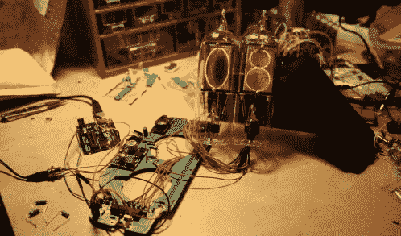
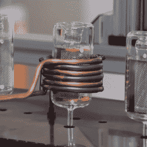

# 觉得 18s 很酷？了解一下这款必备的定制数码管

> 原文：<https://hackaday.com/2019/10/02/think-in18s-are-cool-get-a-load-of-this-must-have-custom-nixie-tube/>

> 美国:“亚历克斯，我要 200 美元的复古风格的展示品。”
> 
> Trebek:“这个数码管不像你以前见过的任何传统管子，是手工制造的，不是数字或字母。”
> 
> 美国:“FriendlyWire 的新 logo 管是什么？”
> 
> 特雷贝克:“见鬼，是啊。”

谢妮电子管是一种真空技术，它的功能远不及图形液晶显示器，但看起来却要酷一百万倍。一般来说，这些管子已经不再生产，你能得到的旧库存通常包含一组形状像数字的细丝。但是， [@FriendlyWire 关于[Dalibor Farny]](https://twitter.com/FriendlyWire/status/1178097849365491712?s=20) 这个数码管的推文打破了这两个规则。这种手工制作的管子不仅仅是一个数字显示或冒号显示(标点符号，让你的头离开排水沟)。是定制的 logo，很好看。

## 定制谢妮电子管简史

    

[Dalibor Farny]又做了一次。2013 年秋天，我们报道了[Dalibor]制作 DIY 谢妮管的爱好，并对它们看起来有多专业表示钦佩。然后在 2016 年，我们发现[达利博]升级了工艺，[制作定制的数码管制造他的实际职业](https://hackaday.com/2016/10/04/the-art-of-making-a-nixie-tube/)，并有一个过程的视频，它本身就是一件艺术作品(说真的，如果你还没有看过，就停止阅读并去看吧)。我们检查了我们的日历，现在是 2019 年秋季。这意味着只有一件事。嗯，可能有很多事情，但这肯定意味着是时候更新了。我们会通知你的。

2016-2019 年版本的[达利博]谢妮电子管的一个大问题是，它们仍然只是被输入时钟的数字。在易贝，18s 测试的葡萄酒价格从 35 美元到 100 美元不等，但[Dalibor]的定制数字显示虽然比 18s 大，但每个更像 150 美元。这是一个豪华管，但不可否认的是，对于本质上是 18 英寸的东西来说，这是一个奢侈的价格。

## 定制谢妮管是定制的

> 是 [@DaliborFarny](https://twitter.com/DaliborFarny?ref_src=twsrc%5Etfw) 做的数码管！多酷啊。！pic.twitter.com/MaInmE5At2
> 
> — FriendlyWire (@FriendlyWire) [September 29, 2019](https://twitter.com/FriendlyWire/status/1178097849365491712?ref_src=twsrc%5Etfw)

[Dalibor]终于给了我们一个考虑走豪华路线的理由——定制。现在，世界是我们的了，谢妮地铁终于可以成为我们想要的样子了。你可以得到一个带有猫形元素的数码管，或者你的脸，或者一个鬼魂。或者一只猫的鬼魂和你的脸。我们不会评判。

同样值得指出的是，这个例子只是一层。一个正常的数字显示管有十层(0-9)。因此，理论上你可以用 10 种不同的自定义形状来构建一个管，或者构建动画。神圣的冷阴极，蝙蝠侠！

虽然这一选择没有在 daliborfarny.com 发表或公开宣布，但如果你友好地询问，它显然是存在的。证据就在推特布丁里。我们会处于另一场数码管革命的边缘吗？寻找我们 2022 年秋季的文章，了解一下。