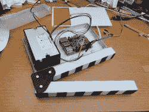

# 这个快板印刷电影海报

> 原文：<https://hackaday.com/2019/06/10/this-clapperboard-prints-movie-posters/>

响板是一种在视频中用于同步音频和视频的设备。它在电影中的角色是众所周知的，它的使用可以追溯到 20 世纪 20 年代。[Gocivici]是一个超级电影迷，他开发了一个[拍板，当拍板响起时，它能够打印出最近上映的电影的海报。](https://www.instructables.com/id/Movie-Tracker-Raspberry-Pi-Powered-Theatrical-Rele/)

这张海报并不是一张大的全彩色作品，而是黑白的，大概有一张电影票那么大。[Gocivici]把他的电影票放在一个日记本里，希望能够把小海报也放在里面。热敏打印机用于打印海报以及标题、上映日期和一些关于电影的信息。除了打印机之外，所涉及的硬件还有一个 Raspberry Pi、一个开关和一个 LED。快板本身是 3d 打印，然后再上色。一点金属被用来保持阀瓣分开，并在将它们压在一起时提供一点阻力。一个不错的选择是金属面板，所以你可以用磁铁把你的海报固定在板上。

[Gocivici]提供了详细的构建说明，以及一段展示打印机运行情况的视频(广告后提供)。从 TMDb 获取数据后，可以获得 3d 模型以及用于创建海报的代码。如果你需要你的响板尽可能精确，看看[这个原子钟响板](https://hackaday.com/2012/08/02/atomic-clapperboard/)。

 [https://www.youtube.com/embed/Q-e9M304Fjo?version=3&rel=1&showsearch=0&showinfo=1&iv_load_policy=1&fs=1&hl=en-US&autohide=2&wmode=transparent](https://www.youtube.com/embed/Q-e9M304Fjo?version=3&rel=1&showsearch=0&showinfo=1&iv_load_policy=1&fs=1&hl=en-US&autohide=2&wmode=transparent)

