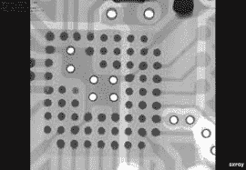
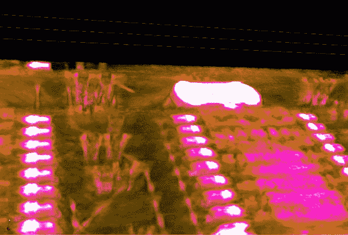

# 这个 PCB 的 CT 扫描是我们不知道我们需要的偶然的 ASMR

> 原文：<https://hackaday.com/2019/09/09/this-ct-scan-of-a-pcb-is-the-accidental-asmr-we-didnt-know-we-needed/>

冒着可能会因为没有音频而导致任何 ASMR 爱好者阅读暴躁的风险，Twitter 上的[Chris]或[@no1089]给了我们这张他的 Maxim MAX86160 入耳式心脏监护仪的[视觉震撼扫描图](https://twitter.com/no1089/status/1169981327556435970)，它安装在一个刚性柔性 PCB 上。你可以看看，在视频下面的休息。

如果你想知道除了无聊，为什么有人会扫描一个公告板，要知道这其实很常见。x 射线机通常被用作快速、被动地检查刚从生产线上下来的电路板的方法。这些不是你(希望不是太)习惯看到的骨折 X 射线，它们是计算机断层扫描(CT 扫描，CAT 扫描)，实际上只是 3D X 射线。

对于电子产品制造商和装配工来说，CT 扫描非常有用，因为它提供了一种非破坏性的方法来检查错误。例如，您如何知道中间的 BGA 引脚是否*实际上*焊接正确？你可以运行一个功能测试，确保一切正常(至少，你检查的一切)，但是这需要时间。验证时间越长，制造成本越高。用经理的话说:“成本太低了。快好了。”

使用 CT 扫描来创建电路板的完整 3D 模型也很常见。这有助于检查每一个细节，尤其是被表面贴装器件或埋在电路板层下的关键信号路径所掩盖的细节。

Highlight of solder joints on small-outline integrated circuit (SOIC) to a PCB’s pads.

如果你想研究 CT 扫描，你可以了解更多关于进行扫描的实验室的信息，或者阅读澳大利亚网络和电子战部门的非机密研究论文。

但我们知道你真的想要更多，更好的视频。我们已经拿到货了。对于你们当中怕冷的人，这里有一个 55 分钟的版本，没有所有的 CT 扫描信息塞满屏幕。对于那些目前在耳机中播放 eDM 的人，这里有一个 30 秒的片段，它以大约 5 倍的速度循环播放。伤心欲绝:

 [https://www.youtube.com/embed/2XT2uftjFpw?version=3&rel=1&showsearch=0&showinfo=1&iv_load_policy=1&fs=1&hl=en-US&autohide=2&wmode=transparent](https://www.youtube.com/embed/2XT2uftjFpw?version=3&rel=1&showsearch=0&showinfo=1&iv_load_policy=1&fs=1&hl=en-US&autohide=2&wmode=transparent)

 [https://www.youtube.com/embed/HeUMjSZO8gs?version=3&rel=1&showsearch=0&showinfo=1&iv_load_policy=1&fs=1&hl=en-US&autohide=2&wmode=transparent](https://www.youtube.com/embed/HeUMjSZO8gs?version=3&rel=1&showsearch=0&showinfo=1&iv_load_policy=1&fs=1&hl=en-US&autohide=2&wmode=transparent)

因为 YouTube 的压缩算法对这些做了一些丑陋的工作，[这里也有一个关于 Vimeo](https://vimeo.com/358721273) 的剪辑。