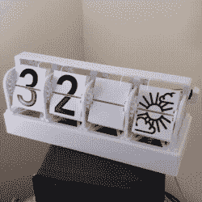

# 这种 DIY 的翻盖显示器既能显示时间，又能显示天气

> 原文：<https://hackaday.com/2021/04/29/this-diy-split-flap-display-does-both-time-and-weather/>

凭借四个经济型步进电机、一个 Raspberry Pi Zero 和一台 3D 打印机，[Thomas Barlow]为自己制作了一个非常精巧的智能翻转时钟，不仅可以显示时间，还可以显示天气数据。这是通过在一些对开翻盖上添加一些额外的图形来实现的，因此数字也可以用来简洁地指示温度和天气情况。显示时间不需要冒号(因此 **5:18** 显示为 **518** )，但是能够显示温度和天气状况就足以弥补这一点了。

32 degrees and a mix of sun and cloud

根据该项目的 GitHub 库的说法，看起来好像每个对开襟都有十三个独特的位置。前十个是数字 0 到 9，其余的要么是空白的，要么是用来组成几个不同组合的不同天气图标。一个 Python 脚本在 Raspberry Pi 上运行，并从 [OpenWeather](https://openweathermap.org/api) 检索天气数据，GPIO 头通过四个齿轮步进电机和驱动板驱动显示器。硬件的其余部分是 3D 打印的，[Thomas]在 STL 文件旁边提供了 STEP 格式的 CAD 模型。

分离式翻盖显示器的基本设计非常通用，多年来，有事业心的黑客们一直在对其进行令人愉快的创新。已经有了作为一种翻书动画使用的对开显示，我们也很高兴看到了用于深奥的自动阅读的整个塔罗牌。