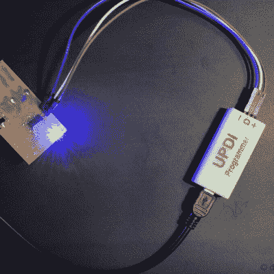

# 这个 DIY 的 UPDI 程序员又好又便宜

> 原文：<https://hackaday.com/2022/04/15/this-diy-updi-programmer-is-nice-and-cheap/>

[Daumemo]喜欢尝试 DIY 电子产品，和许多人一样，最终偶然发现了一个具有统一程序和调试接口(UPDI)的 AVR 微控制器。一个选择当然是购买一个 UPDI 编程器，但是一个更好的解决方案是用漂亮、便宜的零件做一个自己动手的 USB 版本。

Programming an Attiny404 over the UPDI interface.

UPDI 是微控制器外部编程和片上调试的接口，【Daumemo】的解决方案基于 [jtag2updi](https://github.com/ElTangas/jtag2updi) 项目。它将一个 Arduino Nano(在这种情况下，是一个克隆)与一个电阻、一个电容和一个六引脚斜角接头(带有一个巧妙弯曲的引脚)相结合，从而能够通过 USB 连接对 UPDI 设备进行编程。[Daumemo]很高兴地报告说，该设备在带有 AVRDUDE 的 Microchip Studio 或 [PlatformIO](https://platformio.org/) 中运行良好。

一个 Arduino Nano 演这个角色是不是有点力不从心？也许吧，但是价格肯定是合适的。也不需要定制 PCB，因为一切都可以直接焊接到纳米板上。一个[匹配的 3D 打印外壳](https://www.thingiverse.com/thing:5208737)是用少量零件制作一个健壮可靠的 DIY USB UPDI 编程器所需要的一切，这对我们来说听起来不错。

另一方面，如果你确实发现自己在制作定制的 PCB，你可能会对[Daumemo]的另一个 DIY 项目感兴趣:一个将旋转工具变成 PCB 钻床的[可打印结构。](https://hackaday.com/2019/09/05/print-a-drill-press-for-your-printed-circuit-boards/)