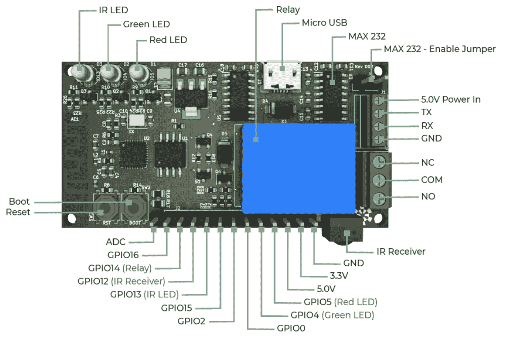

# 这款 ESP8266 开发板背后有一个令人惊讶的故事

> 原文：<https://hackaday.com/2021/04/23/this-esp8266-dev-board-has-a-surprising-story-behind-it/>

如果您希望开始使用 ESP8266，这里有很多开发板可供选择。但是我们不认为你会找到一个比开源 ME-ESP8266 更独特的背景故事。这是因为制造 20 美元纸板的 Malouf 公司是一家以枕头和床架闻名的家居用品公司。

那么，如何从床垫套到微控制器呢？虽然看起来不太可能，但缺少的元素是玩具反斗城。或者更确切地说，玩具反斗城的清算。从标志性玩具零售商处购买的德克萨斯州配送中心 Malouf 包括一个自动传送带系统，用于在庞大的建筑中运送产品，但不幸的是，他们无法让它与现有系统配合工作。该公司决定使用他们内部的工程师团队来解决这个问题，[于是 ME-ESP8266 诞生了](https://www.maloufelectronics.com/story)。

原来，为在旧玩具反斗城仓库周围移动床上用品而开发的 ESP8266 板对黑客和制造商来说有很多有用的功能。它有一个集成的继电器，16 MB 的闪存，一个红外接收器，结实的螺丝端子和一个 2.54 毫米间距的 GPIO 引脚接头。板上甚至有一个 MAX232，因此它可以与 RS-232 设备通信。硬件作为“通用的 ESP8266 模块”与标准的 Arduino IDE 兼容，因此使用现有的库和示例代码没有问题。

正常情况下，公众永远不会知道这种幕后工程。但是，Malouf 的团队并没有对他们的新 ESP 板保密，而是获得了公司首席技术官(CTO)的许可，将其作为开源项目发布。更令人印象深刻的是，他们让公司将该板投入生产，以便向公众销售。所以今天我们不仅了解到床上用品公司有首席技术官，而且他们可以非常开明。

我们向 Malouf 的工程师们和那些为 ME-ESP8266 的生产开绿灯的有远见的高管们致敬。这并不是杰弗里王国清算后第一个有趣的发展，但它可能是最有用的。