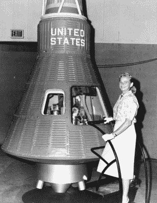
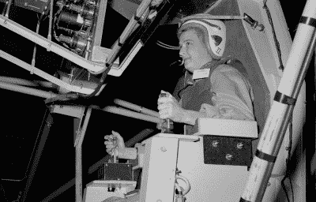
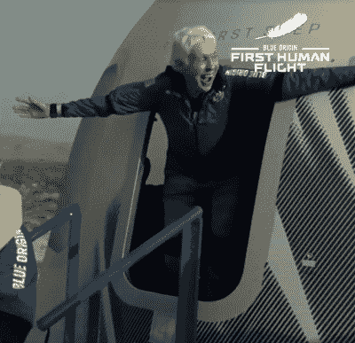

# 这群女性在 20 世纪 60 年代试图闯入宇航员计划；一个刚刚成功了

> 原文：<https://hackaday.com/2021/07/20/this-group-of-women-tried-to-break-into-astronaut-program-in-1960s-one-just-made-it/>

今天早些时候，当玛丽·华莱士·沃利·芬克乘坐蓝色起源的新谢泼德太空舱首次载人飞行到达太空边界时，这标志着她 60 年前开始的旅程的结束。1961 年，她成为后来被称为“水星 13”的最年轻成员，这是一个由多才多艺的女性飞行员组成的团体，她们自愿接受与美国宇航局水星宇航员相同的身体和心理资格测试。但是，由于航天局对潜在宇航员的严格要求，以及约翰·格里恩在科学和航天委员会的证词中所称的当时美国的“社会秩序”，这个有希望的实验被打断了。

## 精英中的精英

在美国宇航局将第一个美国人送入太空之前，他们必须决定他们理想的宇航员应该具备什么样的资格。早期的想法是，该机构应该追逐寻求刺激的人，如赛车手或极限运动爱好者，鉴于其中涉及的巨大风险，这在一定程度上是合理的，但最终决定，如果这些早期航天器的乘员是具有科学或工程背景的经验丰富的飞行员，这对该计划将更有用。希望这些人能够对飞船的设计和性能提供有价值的反馈，如果需要的话，可以自己诊断甚至解决飞船上的问题。

Eisenhower wanted military pilots to be the first astronauts.

因此，除了满足年龄和健康要求之外，水星计划的申请人需要接受 STEM 学科的大学教育，并有驾驶喷气式飞机的经验。虽然这些早期的航天器没有什么传统意义上的驾驶，但拥有与飞行喷气式飞机相关的速度、高度和复杂性的经验被视为一个重要的先决条件。

艾森豪威尔总统本人在陆军时就学会了飞行，他坚持最终的选拔应进一步限于现役军事试飞员；这种想法是，这些人不仅身体状况良好，而且有独特的资格操作实验车辆，并具有高于平均水平的风险承受能力。

虽然用来选择第一批水星宇航员的极其狭隘的标准可以说是合理的，但它确实使许多优秀的候选人无效。传说中的试飞员查克·叶格，从各方面来说都应该在美国宇航局人类太空计划的候选名单上，[因为他从未上过大学而被淘汰。尼尔·阿姆斯特朗此时已经驾驶 X-15 达到了令人难以置信的速度和高度，他也被排除在外，因为他自 1952 年以来就没有服过役。](https://hackaday.com/2020/12/10/remembering-chuck-yeager-the-supersonic-legend-whose-wings-were-clipped-by-a-high-school-diploma/)

## 正确的东西

虽然没有美国宇航局的文件明确规定水星计划宇航员必须是男性，但兵役要求使得女性不可能通过选拔过程。美国当然有非常优秀的女飞行员，许多人在第二次世界大战期间作为空军女飞行员(黄蜂)为国家服务，测试和运输军用飞机，但她们都是平民。当然，这并不令人惊讶，因为空军在接下来的 15 年里不会开始接受女飞行员。

Jerrie Cobb examining a Mercury capsule

这种事实上的歧视没有被杰奎琳·科克伦忽视，她是一位杰出的女飞行员，也是战时 WASP 项目的负责人。科克伦不仅是一位有相当影响力和财富的女性，而且与美国国家航空航天局生命科学特别顾问委员会主席威廉·伦道夫·洛夫莱斯私交甚笃。两人深信，只要给她们机会，女性也可以成为出色的宇航员，于是他们启动了一个私人资助的项目，旨在让女性志愿者通过与美国宇航局水星计划相同的严格资格审查程序。

1960 年，Geraldyn“Jerrie”Cobb 不仅被邀请成为第一位接受严格测试的女性，还被邀请帮助确定被称为第一女宇航员实习生(FLATs)的其他潜在候选人。科布之前创造了耐力、海拔和速度记录，是该计划的理想选择，并能够完成美国宇航局宇航员资格考试的所有三个阶段。事实上，她的成绩使她在候选人中名列前 2%;这个数字比最终被选中参加水星计划的一些人要好。

受到这一早期成功的鼓舞，洛夫莱斯和科布又邀请了 19 名女性参加测试。几位候选人在飞行竞赛界都很有名，他们都是有超过 1000 小时飞行经验的优秀飞行员。

## 中断的实验

被邀请成为平底鞋的女性中有 12 人通过了在新墨西哥州阿尔伯克基 Lovelace 诊所进行的第一阶段试验。然而，由于家庭和职业的原因，只有两个候选人，Wally Funk 和 Rhea Hurrle，能够继续进行第二阶段的测试。该计划的这一部分包括心理和神经检查，包括长时间呆在感觉剥夺池中，据说在那里女性比男性表现得好得多。

不幸的是，两位女士都没能进入测试的最后阶段。就在佛罗里达州的海军航空医学院准备开始测试的前几天，该项目被叫停了。如果没有美国国家航空航天局或军方的支持，洛夫莱斯被告知，候选人将不被允许使用政府设施、飞机和设备，而这些都是女性获得资格所必需的。

Cobb was the only FLAT to complete all phases of the training.

为了使洛夫莱斯的计划得到适当的批准，杰里·科布和其他一些人向约翰·肯尼迪总统和林登·约翰逊副总统请愿。1962 年 7 月，安排了一次国会听证会，称为宇航员选拔特别小组委员会，旨在确定性别歧视是否在 NASA 的宇航员选拔过程中发挥了作用。

当被传唤作证时，宇航员约翰·格里恩和斯科特·卡彭特指出，无论平底船在身体和心理测试中表现如何，他们都不符合成为现役军事试飞员的要求。但格伦也承认，美国宇航局要求候选人持有 STEM 学位的规定在他的案例中实际上被取消了，因为该机构愿意将他的工程经验作为同等条件。作为回应，宾夕法尼亚州的国会议员詹姆斯·富尔顿(James Fulton)质疑为什么美国宇航局不能为非军事飞行员的申请人建立民用飞行经历同等学历。

但令许多人惊讶的是，反对 Lovelace 项目的最有力的证词竟然来自帮助启动该项目的女人杰奎琳·科克伦。虽然她坚持认为探索女性的思想和身体如何应对太空飞行的严酷考验是一项有价值的努力，但她认为公寓和围绕它们的辩论已经对 NASA 的主要关注点产生了不利影响。科克伦说，如果美国要在登月方面击败苏联，那么从“一群已经通过飞机测试和高速精确飞行证明他们有经验、有能力和有资格应对新环境中可能出现的紧急情况的男飞行员中挑选国家宇航员是“自然和恰当的”

## 持久的印象

尽管 Lovelace 进行了开创性的研究，FLATs 进行了艰苦的工作，Jerrie Cobb 在宇航员选拔特别小组委员会上发表了热情的证词，但没有女性入选美国宇航局的双子座或阿波罗计划。最终是苏联将第一位女性送入太空，瓦伦蒂娜·捷列什科娃在 1963 年执行了她的单人任务。在 NASA 将萨莉·赖德送上 STS-7 的 20 年前。

Wally Funk exits the Blue Origin capsule.

但是这些女性在美国太空计划中留下的印记没有被忘记。1995 年，第一位驾驶航天飞机的女性艾琳·柯林斯邀请幸存的弗拉茨参加她的发射。媒体称之为“水星 13 号”,这些女性被邀请参观肯尼迪航天中心和航天飞机发射设施。

直到沃利·芬克陪同杰夫·贝索斯进行了他公司的亚轨道宇宙飞船的首次载人飞行，历史书上才会记载，没有一个扁平人实现过他们遨游太空的目标。商业使命不仅有助于验证这些先锋女性所做的工作，还让 Funk 完全开辟了一条新的道路。她可能错过了成为美国第一批女宇航员之一的机会，但 82 岁的她现在创造了最年长的纪录。

虽然这可能不是官方记录，但在人类航天史上，没有一个宇航员为了将他们的训练付诸实践而等待的时间更长。恭喜你，沃利·芬克。