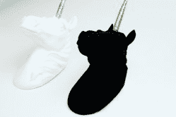

# 这是一个 Kickstarter 为没有更多的黑人

> 原文：<https://hackaday.com/2019/01/31/this-is-a-kickstarter-for-none-more-black/>

Vantablack 是有史以来最黑的颜料，能够吸收 99.96%的可见光。如果你用 Vantablack 盖住某样东西，它就会变成一个黑洞。没有细节呈现，实物变成了剪影。Vantablack 覆盖的对象不在人类的经验范围内。哺乳动物的头脑无法理解一个有利的黑色物体。

Vantablack 很酷，但也很贵。它还被[安尼施·卡普尔]的工作室独家授权用于艺术用途。可以理解的是，艺术家们已经反叛了，他们正在制作他们自己的类似于黑色的颜料。现在，[世界上最黑的黑在 Kickstarter](https://www.kickstarter.com/projects/culturehustle/the-blackest-black-paint-in-the-world-black-30) 上。你可以花 10 英镑买到一瓶 150 毫升的 Black 3.0，几乎和 Vantablack 一样黑的东西。

Is this a photoshop? Who knows.

Black 3.0 的颜料被称为 Black Magick，是的，有一个 2.0 版本。早期版本的问题是，尽管颜料比几乎所有其他东西都黑，但颜料不仅仅是颜料。你需要粘合剂。新配方使用一种新的丙烯酸聚合物来保持颜料，并使用“纳米消光剂”来使油漆不再无光泽。

你能用你见过的最黑的黑漆做什么？嗯，给一个被最黑的东西拍照有点傻。这是必须亲身经历的事情。你可以用它来画一辆车，这是我非常想看到的。你可以在暗处跟着安尼施·卡普尔。将其用作校准目标。谁知道当每个人都有这个几乎有利可图的东西时，我们会拿它怎么办。