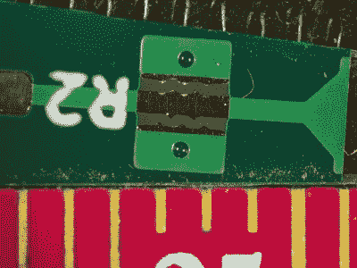

# 这款模块化差分探头非常注重细节

> 原文：<https://hackaday.com/2021/08/25/this-modular-differential-probe-shows-great-attention-to-detail/>

[Petteri Aimonen]为我们展示了一款[模块化差分探头](https://hackaday.io/project/181065-modular-differential-probe)，作为他参加 2021 年 Hackaday 奖的参赛作品。

这个项目展示了一个简单而完美的差分转单端前置放大器的实现，它允许探测差分信号，并通过 BNC 电缆将其馈入示波器。

PCB Spark gap for primary ESD protection

它实现了一个经典的仪表放大器，其中有两个放大级。第一级为我们提供增益为 1 或 10 的选项(如果需要)，第二级的增益为 2。

剩下的电路是一个电源，产生必要的双轨电源，为运算放大器供电。这些输出轨和 USB 电源输入端有大量滤波，以尽量将所有开关模式电源噪声排除在信号路径之外。

有几个有趣的设计选择，包括将 PCB 材料用于长的可拆卸探针臂，集成 PCB 火花隙，为 ESD 到达系统更精密的部分提供第一道防线。

## 为什么这很有用

我们电子工程师主要关心两类信号:单端信号和差模信号。

在第一种情况下，信号通过一根导线传输，该导线以公共系统地为参考。电流沿着导线流动，并沿着电阻最小的路径返回其源头，至少在低频时是这样。在较高频率下，电感最小的路径更相关。只要 PCB 设计正确，这一切都很好。

相邻导线的互电容和互感耦合，以及参考地中的噪声，都会破坏我们想要通过导线传递的信号。

随着频率的增加，特别是如果你在处理尖锐边缘，以及所有额外的奇次谐波功率，情况会变得非常糟糕。我们处理这个问题的方法是利用[差模信号](https://en.wikipedia.org/wiki/Differential_signaling)。在这里，我们不是用一根导线，而是用一些接地的概念，将信号发送到一对导线上，导线之间的电压差*形成信号。任何泄漏到线对中的外部噪声都将(希望如此！)同等地影响两根导线，形成我们所说的共模分量。当您观察差异时，这种共模噪声消失了。(我们自己的【Bil 牛群】[前段时间报道过这个](https://hackaday.com/2016/03/29/when-difference-matters/)。)*

当探测一个电路时，需要有合适的探测器，并了解探测器对电路运行的影响。如果你有一个单端信号，并且你想在你的示波器上观察它，你可以选择被动或主动探头。通常某种被动探头是最有效的。这些器件通常有 50ω和 1mω两种型号，您需要针对您的应用小心使用正确的探头类型。

为了探测差分信号，可以使用一对探针，每根信号线一个，然后利用示波器的数学差分功能来显示信号。这通常是一种绝望的措施，而你真正想要的是硬件中的差分前端。你需要一个差分有源探头。

电路可能很简单，但不要低估需要多少调整才能获得良好的性能——正如作者所述，PCB 布局的一个小失误会引起一些令人讨厌的谐振，很难追查。

该项目仍在积极开发中，作者展示了项目进展的过程，但如果你问我们，它看起来已经很好了。

可以在他的 GitHib 上找到资源，git Hib 使用了所有开源工具，所以也很容易访问。

The [HackadayPrize2021](https://prize.supplyframe.com) is Sponsored by: