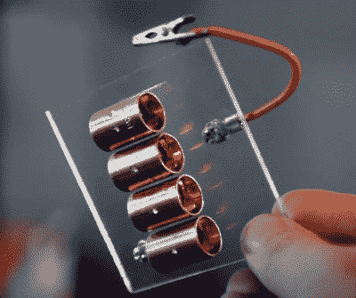

# 这个(大部分)透明的特斯拉线圈说明了一切

> 原文：<https://hackaday.com/2020/10/20/this-mostly-transparent-tesla-coil-shows-it-all/>

如果你认为特斯拉线圈是某种荒谬复杂的高压诡计，那也情有可原。克拉克第三定律指出“任何足够先进的技术都和魔术没什么区别”，从房间的另一边点亮一个霓虹灯看起来确实很像魔术。但是在他最新的*等离子频道*视频中，【杰伊·鲍尔斯】试图通过[展示一个透明的特斯拉线圈来澄清事实，没有留下任何想象的余地](https://www.youtube.com/watch?v=jMgG3qrt-JM)。

 当然，我们还没有掌握生产透明铜线所需的技术，所以你实际上无法看透初级和次级线圈本身。但是[杰伊]确实把它们缠绕在丙烯酸管上来证明没有任何小精灵藏在里面。线圈的底部也是由丙烯酸制成的，这让每个人都看到整个事情是多么简单。

除了线圈之外，这个建筑还利用了几个月前[Jay]详述的 [DIY 高压电源](https://hackaday.com/2020/08/23/a-miniature-power-supply-for-high-voltage-hacking/)。还有一组安装在一小块丙烯酸树脂上的电容器，以及一个巧妙的可调火花隙，它只不过是由一些战略上放置的铜管和鳄鱼夹组成。除了一些乍一看可能不明显的小细节，如将次级线圈接地到底座底部的一层铝带，一切都在明处。没有魔法，只有科学。

[Jay]估计这种美可以产生超过 100，000 伏的电压，并在休息后的视频中展示了它的能力。不幸的是，在他真正测试新的透明线圈之前，它摔了一跤，被毁了。提醒人们，丙烯酸外壳可能很漂亮，但它们肯定不是无懈可击的。事后看来，我们确信重建后的版本会比原来的更好。

如果你不想让你的幻想破灭，[我们已经看到了很多复杂的特斯拉线圈](https://hackaday.com/2017/09/14/tesla-coil-uses-vintage-tube/)来平衡这个。[有了 PCB 线圈](https://hackaday.com/2017/10/30/pcb-tesla-coil-is-perfect-desk-toy/)和 SMD 元件[这样的巫术，其中一些看起来还是很神奇的](https://hackaday.com/2017/10/30/pcb-tesla-coil-is-perfect-desk-toy/)。

 [https://www.youtube.com/embed/jMgG3qrt-JM?version=3&rel=1&showsearch=0&showinfo=1&iv_load_policy=1&fs=1&hl=en-US&autohide=2&wmode=transparent](https://www.youtube.com/embed/jMgG3qrt-JM?version=3&rel=1&showsearch=0&showinfo=1&iv_load_policy=1&fs=1&hl=en-US&autohide=2&wmode=transparent)

