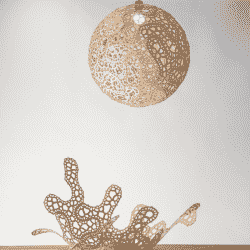

# 多亏了数学，这种球形灯的零件是扁平的

> 原文：<https://hackaday.com/2022/05/07/this-spherical-lamps-pieces-ship-flat-thanks-to-math/>

[神经系统]销售各种独特的产品，我们非常感谢他们在分享设计和制造过程中所付出的努力。这一次，是设计豪华灯罩的工作细节引起了我们的注意。

Top: Finished lamp. Bottom: Partially-assembled.

成品灯罩是球形的，但完全由激光切割的扁平木材制成，这些木材经过特别设计，在组装成弯曲形状时可以最大限度地减少变形。这些碎片本身让人想起了*拼图单元*；在许多植物中发现的复杂、连锁的细胞形状。

像往常一样，[神经系统]应用了大量的数学和计算设计来达成解决方案。灯的每个独特面板都是部分实施[工艺的结果，这种技术被称为针对零件形状的变化表面切割](https://www.cs.cmu.edu/~kmcrane/Projects/VariationalCuts/)。他们还提供了几个漂亮的动画，演示了在组成每盏灯的 18 个独特的部件中生成部件边界和孔图案。

至于制作零件本身，它们是用激光从木材单板上切割下来的，最终用户需要一两个小时来组装。观看视频概述，嵌入在分页符下方。

我们很高兴[神经系统]花时间来分享这样的细节，就像那次他们发现了激光切割他们独特拼图的最佳木材类型[并且没有保密](https://hackaday.com/2017/10/22/seeking-and-making-the-best-plywood-for-laser-cutting-puzzles/)。

[https://player.vimeo.com/video/680481078](https://player.vimeo.com/video/680481078)