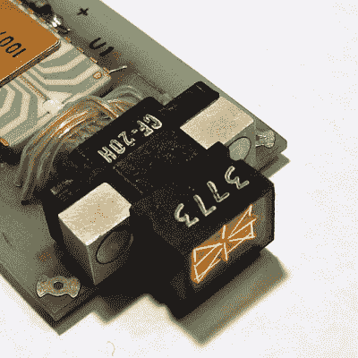

# 这个老式的字母数字显示器又大又热，又重又贵

> 原文：<https://hackaday.com/2022/09/04/this-vintage-alphanumeric-display-was-huge-hot-heavy-and-expensive/>

如今，人们很容易将显示技术视为理所当然，但以人类可读的方式显示数据的能力并不总是那么容易。这在 [Pinlite 30003 字母数字显示模块](http://www.industrialalchemy.org/articleview.php?item=3199)中得到了很好的证明，这是一种四字符显示器，在当时是纯粹的奢侈品。

Each display is a rectangular vacuum tube containing 17 incandescent light filaments.

组成每个显示器的 17 个部分不仅能够显示任何字母或数字，而且它们甚至在白天也是可读的！这 17 个部分中的每一个都是白炽灯丝，这就是实现所需亮度的方式。这里显示的坚固模块包含四个这样的显示器，每个显示器都在自己的可插拔板上，后面直接有一个专用的字符解码器芯片。

正如[AnubisTTL]所指出的，最终的单元体积庞大，字符间距可怕，而且毫无疑问非常昂贵。以今天的标准来看，它几乎难以想象的重、热、不实用。但是在高亮度发光二极管出现之前，日光下可读的字母数字显示器是非常特别的。这对合适的人来说绝对是物有所值的。

在小而高效的显示器变得普遍之前，解决如何高效地以易读的格式显示数据的问题经历了许多真正不寻常的(和聪明的)转折，因为工程师们在努力克服时间的限制。这导致了像 SD-11 球形显示器这样的奇怪现象[，其内部大部分是空的空间。另一个很好的例子是](https://hackaday.com/2018/01/21/the-sd-11-sphericular-display-pixels-that-arent-pixels/) [Eidophor，这是一个在投影仪出现之前的投影仪](https://hackaday.com/2016/03/15/retrotechtacular-eidophor-an-unknown-widely-used-projector/)。